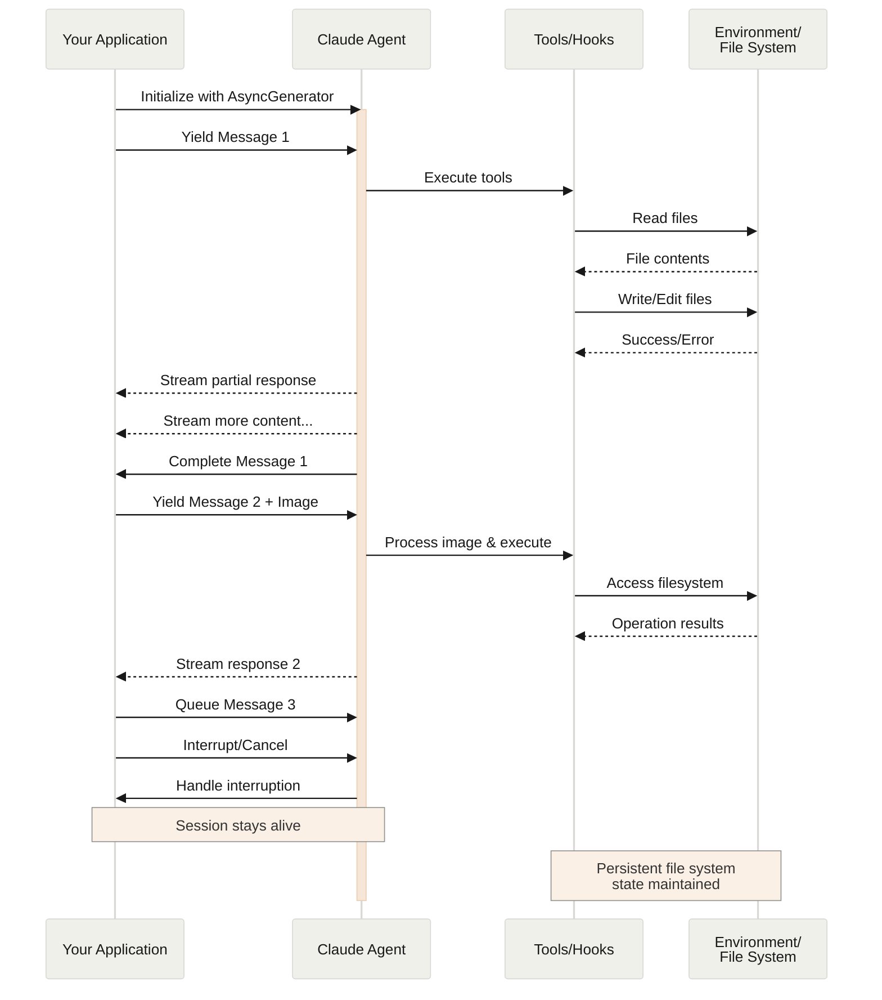
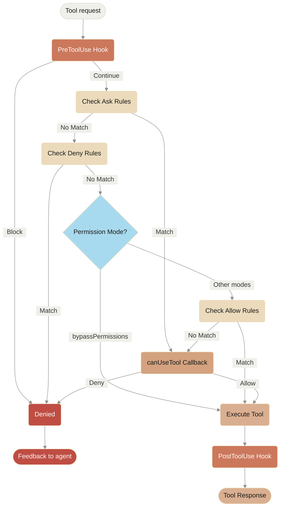

# anthropic-sdk
The anthropic SDK agent docs
# Migrate to Claude Agent SDK

> Guide for migrating the Claude Code TypeScript and Python SDKs to the Claude Agent SDK

## Overview

The Claude Code SDK has been renamed to the **Claude Agent SDK** and its documentation has been reorganized. This change reflects the SDK's broader capabilities for building AI agents beyond just coding tasks.

## What's Changed

| Aspect                     | Old                            | New                              |
| :------------------------- | :----------------------------- | :------------------------------- |
| **Package Name (TS/JS)**   | `@anthropic-ai/claude-code`    | `@anthropic-ai/claude-agent-sdk` |
| **Python Package**         | `claude-code-sdk`              | `claude-agent-sdk`               |
| **Documentation Location** | Claude Code docs → SDK section | API Guide → Agent SDK section    |

<Note>
  **Documentation Changes:** The Agent SDK documentation has moved from the Claude Code docs to the API Guide under a dedicated [Agent SDK](/en/api/agent-sdk/overview) section. The Claude Code docs now focus on the CLI tool and automation features.
</Note>

## Migration Steps

### For TypeScript/JavaScript Projects

**1. Uninstall the old package:**

```bash
npm uninstall @anthropic-ai/claude-code
```

**2. Install the new package:**

```bash
npm install @anthropic-ai/claude-agent-sdk
```

**3. Update your imports:**

Change all imports from `@anthropic-ai/claude-code` to `@anthropic-ai/claude-agent-sdk`:

```typescript
// Before
import { query, tool, createSdkMcpServer } from "@anthropic-ai/claude-code";

// After
import {
  query,
  tool,
  createSdkMcpServer,
} from "@anthropic-ai/claude-agent-sdk";
```

**4. Update package.json dependencies:**

If you have the package listed in your `package.json`, update it:

```json
// Before
{
  "dependencies": {
    "@anthropic-ai/claude-code": "^1.0.0"
  }
}

// After
{
  "dependencies": {
    "@anthropic-ai/claude-agent-sdk": "^0.1.0"
  }
}
```

That's it! No other code changes are required.

### For Python Projects

**1. Uninstall the old package:**

```bash
pip uninstall claude-code-sdk
```

**2. Install the new package:**

```bash
pip install claude-agent-sdk
```

**3. Update your imports:**

Change all imports from `claude_code_sdk` to `claude_agent_sdk`:

```python
# Before
from claude_code_sdk import query, ClaudeCodeOptions

# After
from claude_agent_sdk import query, ClaudeAgentOptions
```

**4. Update type names:**

Change `ClaudeCodeOptions` to `ClaudeAgentOptions`:

```python
# Before
from claude_agent_sdk import query, ClaudeCodeOptions

options = ClaudeCodeOptions(
    model="claude-sonnet-4-5"
)

# After
from claude_agent_sdk import query, ClaudeAgentOptions

options = ClaudeAgentOptions(
    model="claude-sonnet-4-5"
)
```

**5. Review [breaking changes](#breaking-changes)**

Make any code changes needed to complete the migration.

## Breaking changes

<Warning>
  To improve isolation and explicit configuration, Claude Agent SDK v0.1.0 introduces breaking changes for users migrating from Claude Code SDK. Review this section carefully before migrating.
</Warning>

### Python: ClaudeCodeOptions renamed to ClaudeAgentOptions

**What changed:** The Python SDK type `ClaudeCodeOptions` has been renamed to `ClaudeAgentOptions`.

**Migration:**

```python
# BEFORE (v0.0.x)
from claude_agent_sdk import query, ClaudeCodeOptions

options = ClaudeCodeOptions(
    model="claude-sonnet-4-5",
    permission_mode="acceptEdits"
)

# AFTER (v0.1.0)
from claude_agent_sdk import query, ClaudeAgentOptions

options = ClaudeAgentOptions(
    model="claude-sonnet-4-5",
    permission_mode="acceptEdits"
)
```

**Why this changed:** The type name now matches the "Claude Agent SDK" branding and provides consistency across the SDK's naming conventions.

### System prompt no longer default

**What changed:** The SDK no longer uses Claude Code's system prompt by default.

**Migration:**

<CodeGroup>
  ```typescript TypeScript
  // BEFORE (v0.0.x) - Used Claude Code's system prompt by default
  const result = query({ prompt: "Hello" });

  // AFTER (v0.1.0) - Uses empty system prompt by default
  // To get the old behavior, explicitly request Claude Code's preset:
  const result = query({
    prompt: "Hello",
    options: {
      systemPrompt: { type: "preset", preset: "claude_code" }
    }
  });

  // Or use a custom system prompt:
  const result = query({
    prompt: "Hello",
    options: {
      systemPrompt: "You are a helpful coding assistant"
    }
  });
  ```

  ```python Python
  # BEFORE (v0.0.x) - Used Claude Code's system prompt by default
  async for message in query(prompt="Hello"):
      print(message)

  # AFTER (v0.1.0) - Uses empty system prompt by default
  # To get the old behavior, explicitly request Claude Code's preset:
  from claude_agent_sdk import query, ClaudeAgentOptions

  async for message in query(
      prompt="Hello",
      options=ClaudeAgentOptions(
          system_prompt={"type": "preset", "preset": "claude_code"}  # Use the preset
      )
  ):
      print(message)

  # Or use a custom system prompt:
  async for message in query(
      prompt="Hello",
      options=ClaudeAgentOptions(
          system_prompt="You are a helpful coding assistant"
      )
  ):
      print(message)
  ```
</CodeGroup>

**Why this changed:** Provides better control and isolation for SDK applications. You can now build agents with custom behavior without inheriting Claude Code's CLI-focused instructions.

### Settings Sources No Longer Loaded by Default

**What changed:** The SDK no longer reads from filesystem settings (CLAUDE.md, settings.json, slash commands, etc.) by default.

**Migration:**

<CodeGroup>
  ```typescript TypeScript
  // BEFORE (v0.0.x) - Loaded all settings automatically
  const result = query({ prompt: "Hello" });
  // Would read from:
  // - ~/.claude/settings.json (user)
  // - .claude/settings.json (project)
  // - .claude/settings.local.json (local)
  // - CLAUDE.md files
  // - Custom slash commands

  // AFTER (v0.1.0) - No settings loaded by default
  // To get the old behavior:
  const result = query({
    prompt: "Hello",
    options: {
      settingSources: ["user", "project", "local"]
    }
  });

  // Or load only specific sources:
  const result = query({
    prompt: "Hello",
    options: {
      settingSources: ["project"]  // Only project settings
    }
  });
  ```

  ```python Python
  # BEFORE (v0.0.x) - Loaded all settings automatically
  async for message in query(prompt="Hello"):
      print(message)
  # Would read from:
  # - ~/.claude/settings.json (user)
  # - .claude/settings.json (project)
  # - .claude/settings.local.json (local)
  # - CLAUDE.md files
  # - Custom slash commands

  # AFTER (v0.1.0) - No settings loaded by default
  # To get the old behavior:
  from claude_agent_sdk import query, ClaudeAgentOptions

  async for message in query(
      prompt="Hello",
      options=ClaudeAgentOptions(
          setting_sources=["user", "project", "local"]
      )
  ):
      print(message)

  # Or load only specific sources:
  async for message in query(
      prompt="Hello",
      options=ClaudeAgentOptions(
          setting_sources=["project"]  # Only project settings
      )
  ):
      print(message)
  ```
</CodeGroup>

**Why this changed:** Ensures SDK applications have predictable behavior independent of local filesystem configurations. This is especially important for:

* **CI/CD environments** - Consistent behavior without local customizations
* **Deployed applications** - No dependency on filesystem settings
* **Testing** - Isolated test environments
* **Multi-tenant systems** - Prevent settings leakage between users

<Note>
  **Backward compatibility:** If your application relied on filesystem settings (custom slash commands, CLAUDE.md instructions, etc.), add `settingSources: ['user', 'project', 'local']` to your options.
</Note>

## Why the Rename?

The Claude Code SDK was originally designed for coding tasks, but it has evolved into a powerful framework for building all types of AI agents. The new name "Claude Agent SDK" better reflects its capabilities:

* Building business agents (legal assistants, finance advisors, customer support)
* Creating specialized coding agents (SRE bots, security reviewers, code review agents)
* Developing custom agents for any domain with tool use, MCP integration, and more

## Getting Help

If you encounter any issues during migration:

**For TypeScript/JavaScript:**

1. Check that all imports are updated to use `@anthropic-ai/claude-agent-sdk`
2. Verify your package.json has the new package name
3. Run `npm install` to ensure dependencies are updated

**For Python:**

1. Check that all imports are updated to use `claude_agent_sdk`
2. Verify your requirements.txt or pyproject.toml has the new package name
3. Run `pip install claude-agent-sdk` to ensure the package is installed

See the [Troubleshooting](/en/docs/claude-code/troubleshooting) guide for common issues.

## Next Steps

* Explore the [Agent SDK Overview](/en/api/agent-sdk/overview) to learn about available features
* Check out the [TypeScript SDK Reference](/en/api/agent-sdk/typescript) for detailed API documentation
* Review the [Python SDK Reference](/en/api/agent-sdk/python) for Python-specific documentation
* Learn about [Custom Tools](/en/api/agent-sdk/custom-tools) and [MCP Integration](/en/api/agent-sdk/mcp)
-------------------------------------------------------------------------------------------------------------------------------------------

# Agent SDK overview

> Build custom AI agents with the Claude Agent SDK

<Note>
  The Claude Code SDK has been renamed to the **Claude Agent SDK**. If you're migrating from the old SDK, see the [Migration Guide](/en/docs/claude-code/sdk/migration-guide).
</Note>

## Installation

<CodeGroup>
  ```bash TypeScript
  npm install @anthropic-ai/claude-agent-sdk
  ```

  ```bash Python
  pip install claude-agent-sdk
  ```
</CodeGroup>

## SDK Options

The Claude Agent SDK is available in multiple forms to suit different use cases:

* **[TypeScript SDK](/en/api/agent-sdk/typescript)** - For Node.js and web applications
* **[Python SDK](/en/api/agent-sdk/python)** - For Python applications and data science
* **[Streaming vs Single Mode](/en/api/agent-sdk/streaming-vs-single-mode)** - Understanding input modes and best practices

## Why use the Claude Agent SDK?

Built on top of the agent harness that powers Claude Code, the Claude Agent SDK provides all the building blocks you need to build production-ready agents.

Taking advantage of the work we've done on Claude Code including:

* **Context Management**: Automatic compaction and context management to ensure your agent doesn't run out of context.
* **Rich tool ecosystem**: File operations, code execution, web search, and MCP extensibility
* **Advanced permissions**: Fine-grained control over agent capabilities
* **Production essentials**: Built-in error handling, session management, and monitoring
* **Optimized Claude integration**: Automatic prompt caching and performance optimizations

## What can you build with the SDK?

Here are some example agent types you can create:

**Coding agents:**

* SRE agents that diagnose and fix production issues
* Security review bots that audit code for vulnerabilities
* Oncall engineering assistants that triage incidents
* Code review agents that enforce style and best practices

**Business agents:**

* Legal assistants that review contracts and compliance
* Finance advisors that analyze reports and forecasts
* Customer support agents that resolve technical issues
* Content creation assistants for marketing teams

## Core Concepts

### Authentication

For basic authentication, retrieve an Claude API key from the [Claude Console](https://console.anthropic.com/) and set the `ANTHROPIC_API_KEY` environment variable.

The SDK also supports authentication via third-party API providers:

* **Amazon Bedrock**: Set `CLAUDE_CODE_USE_BEDROCK=1` environment variable and configure AWS credentials
* **Google Vertex AI**: Set `CLAUDE_CODE_USE_VERTEX=1` environment variable and configure Google Cloud credentials

For detailed configuration instructions for third-party providers, see the [Amazon Bedrock](/en/docs/claude-code/amazon-bedrock) and [Google Vertex AI](/en/docs/claude-code/google-vertex-ai) documentation.

<Note>
  Unless previously approved, we do not allow third party developers to apply Claude.ai rate limits for their products, including agents built on the Claude Agent SDK. Please use the API key authentication methods described in this document instead.
</Note>

### Full Claude Code Feature Support

The SDK provides access to all the default features available in Claude Code, leveraging the same file system-based configuration:

* **Subagents**: Launch specialized agents stored as Markdown files in `./.claude/agents/`
* **Hooks**: Execute custom commands configured in `./.claude/settings.json` that respond to tool events
* **Slash Commands**: Use custom commands defined as Markdown files in `./.claude/commands/`
* **Memory (CLAUDE.md)**: Maintain project context through `CLAUDE.md` or `.claude/CLAUDE.md` files in your project directory, or `~/.claude/CLAUDE.md` for user-level instructions. To load these files, you must explicitly set `settingSources: ['project']` (TypeScript) or `setting_sources=["project"]` (Python) in your options. See [Modifying system prompts](/en/api/agent-sdk/modifying-system-prompts#method-1-claudemd-files-project-level-instructions) for details.

These features work identically to their Claude Code counterparts by reading from the same file system locations.

### System Prompts

System prompts define your agent's role, expertise, and behavior. This is where you specify what kind of agent you're building.

### Tool Permissions

Control which tools your agent can use with fine-grained permissions:

* `allowedTools` - Explicitly allow specific tools
* `disallowedTools` - Block specific tools
* `permissionMode` - Set overall permission strategy

### Model Context Protocol (MCP)

Extend your agents with custom tools and integrations through MCP servers. This allows you to connect to databases, APIs, and other external services.

## Reporting Bugs

If you encounter bugs or issues with the Agent SDK:

* **TypeScript SDK**: [Report issues on GitHub](https://github.com/anthropics/claude-agent-sdk-typescript/issues)
* **Python SDK**: [Report issues on GitHub](https://github.com/anthropics/claude-agent-sdk-python/issues)

## Related Resources

* [CLI Reference](/en/docs/claude-code/cli-reference) - Complete CLI documentation
* [GitHub Actions Integration](/en/docs/claude-code/github-actions) - Automate your GitHub workflow
* [MCP Documentation](/en/docs/claude-code/mcp) - Extend Claude with custom tools
* [Common Workflows](/en/docs/claude-code/common-workflows) - Step-by-step guides
* [Troubleshooting](/en/docs/claude-code/troubleshooting) - Common issues and solutions
----------------------------------------------------------------------------------------------------------------------------------------

# Agent SDK reference - TypeScript

> Complete API reference for the TypeScript Agent SDK, including all functions, types, and interfaces.

<script src="/components/typescript-sdk-type-links.js" defer />

## Installation

```bash
npm install @anthropic-ai/claude-agent-sdk
```

## Functions

### `query()`

The primary function for interacting with Claude Code. Creates an async generator that streams messages as they arrive.

```ts
function query({
  prompt,
  options
}: {
  prompt: string | AsyncIterable<SDKUserMessage>;
  options?: Options;
}): Query
```

#### Parameters

| Parameter | Type                                                             | Description                                                       |
| :-------- | :--------------------------------------------------------------- | :---------------------------------------------------------------- |
| `prompt`  | `string \| AsyncIterable<`[`SDKUserMessage`](#sdkusermessage)`>` | The input prompt as a string or async iterable for streaming mode |
| `options` | [`Options`](#options)                                            | Optional configuration object (see Options type below)            |

#### Returns

Returns a [`Query`](#query-1) object that extends `AsyncGenerator<`[`SDKMessage`](#sdkmessage)`, void>` with additional methods.

### `tool()`

Creates a type-safe MCP tool definition for use with SDK MCP servers.

```ts
function tool<Schema extends ZodRawShape>(
  name: string,
  description: string,
  inputSchema: Schema,
  handler: (args: z.infer<ZodObject<Schema>>, extra: unknown) => Promise<CallToolResult>
): SdkMcpToolDefinition<Schema>
```

#### Parameters

| Parameter     | Type                                                              | Description                                     |
| :------------ | :---------------------------------------------------------------- | :---------------------------------------------- |
| `name`        | `string`                                                          | The name of the tool                            |
| `description` | `string`                                                          | A description of what the tool does             |
| `inputSchema` | `Schema extends ZodRawShape`                                      | Zod schema defining the tool's input parameters |
| `handler`     | `(args, extra) => Promise<`[`CallToolResult`](#calltoolresult)`>` | Async function that executes the tool logic     |

### `createSdkMcpServer()`

Creates an MCP server instance that runs in the same process as your application.

```ts
function createSdkMcpServer(options: {
  name: string;
  version?: string;
  tools?: Array<SdkMcpToolDefinition<any>>;
}): McpSdkServerConfigWithInstance
```

#### Parameters

| Parameter         | Type                          | Description                                              |
| :---------------- | :---------------------------- | :------------------------------------------------------- |
| `options.name`    | `string`                      | The name of the MCP server                               |
| `options.version` | `string`                      | Optional version string                                  |
| `options.tools`   | `Array<SdkMcpToolDefinition>` | Array of tool definitions created with [`tool()`](#tool) |

## Types

### `Options`

Configuration object for the `query()` function.

| Property                     | Type                                                                                              | Default                    | Description                                                                                                                                                                                                                                               |
| :--------------------------- | :------------------------------------------------------------------------------------------------ | :------------------------- | :-------------------------------------------------------------------------------------------------------------------------------------------------------------------------------------------------------------------------------------------------------- |
| `abortController`            | `AbortController`                                                                                 | `new AbortController()`    | Controller for cancelling operations                                                                                                                                                                                                                      |
| `additionalDirectories`      | `string[]`                                                                                        | `[]`                       | Additional directories Claude can access                                                                                                                                                                                                                  |
| `agents`                     | `Record<string, [`AgentDefinition`](#agentdefinition)>`                                           | `undefined`                | Programmatically define subagents                                                                                                                                                                                                                         |
| `allowedTools`               | `string[]`                                                                                        | All tools                  | List of allowed tool names                                                                                                                                                                                                                                |
| `canUseTool`                 | [`CanUseTool`](#canusetool)                                                                       | `undefined`                | Custom permission function for tool usage                                                                                                                                                                                                                 |
| `continue`                   | `boolean`                                                                                         | `false`                    | Continue the most recent conversation                                                                                                                                                                                                                     |
| `cwd`                        | `string`                                                                                          | `process.cwd()`            | Current working directory                                                                                                                                                                                                                                 |
| `disallowedTools`            | `string[]`                                                                                        | `[]`                       | List of disallowed tool names                                                                                                                                                                                                                             |
| `env`                        | `Dict<string>`                                                                                    | `process.env`              | Environment variables                                                                                                                                                                                                                                     |
| `executable`                 | `'bun' \| 'deno' \| 'node'`                                                                       | Auto-detected              | JavaScript runtime to use                                                                                                                                                                                                                                 |
| `executableArgs`             | `string[]`                                                                                        | `[]`                       | Arguments to pass to the executable                                                                                                                                                                                                                       |
| `extraArgs`                  | `Record<string, string \| null>`                                                                  | `{}`                       | Additional arguments                                                                                                                                                                                                                                      |
| `fallbackModel`              | `string`                                                                                          | `undefined`                | Model to use if primary fails                                                                                                                                                                                                                             |
| `forkSession`                | `boolean`                                                                                         | `false`                    | When resuming with `resume`, fork to a new session ID instead of continuing the original session                                                                                                                                                          |
| `hooks`                      | `Partial<Record<`[`HookEvent`](#hookevent)`, `[`HookCallbackMatcher`](#hookcallbackmatcher)`[]>>` | `{}`                       | Hook callbacks for events                                                                                                                                                                                                                                 |
| `includePartialMessages`     | `boolean`                                                                                         | `false`                    | Include partial message events                                                                                                                                                                                                                            |
| `maxThinkingTokens`          | `number`                                                                                          | `undefined`                | Maximum tokens for thinking process                                                                                                                                                                                                                       |
| `maxTurns`                   | `number`                                                                                          | `undefined`                | Maximum conversation turns                                                                                                                                                                                                                                |
| `mcpServers`                 | `Record<string, [`McpServerConfig`](#mcpserverconfig)>`                                           | `{}`                       | MCP server configurations                                                                                                                                                                                                                                 |
| `model`                      | `string`                                                                                          | Default from CLI           | Claude model to use                                                                                                                                                                                                                                       |
| `pathToClaudeCodeExecutable` | `string`                                                                                          | Auto-detected              | Path to Claude Code executable                                                                                                                                                                                                                            |
| `permissionMode`             | [`PermissionMode`](#permissionmode)                                                               | `'default'`                | Permission mode for the session                                                                                                                                                                                                                           |
| `permissionPromptToolName`   | `string`                                                                                          | `undefined`                | MCP tool name for permission prompts                                                                                                                                                                                                                      |
| `resume`                     | `string`                                                                                          | `undefined`                | Session ID to resume                                                                                                                                                                                                                                      |
| `settingSources`             | [`SettingSource`](#settingsource)`[]`                                                             | `[]` (no settings)         | Control which filesystem settings to load. When omitted, no settings are loaded. **Note:** Must include `'project'` to load CLAUDE.md files                                                                                                               |
| `stderr`                     | `(data: string) => void`                                                                          | `undefined`                | Callback for stderr output                                                                                                                                                                                                                                |
| `strictMcpConfig`            | `boolean`                                                                                         | `false`                    | Enforce strict MCP validation                                                                                                                                                                                                                             |
| `systemPrompt`               | `string \| { type: 'preset'; preset: 'claude_code'; append?: string }`                            | `undefined` (empty prompt) | System prompt configuration. Pass a string for custom prompt, or `{ type: 'preset', preset: 'claude_code' }` to use Claude Code's system prompt. When using the preset object form, add `append` to extend the system prompt with additional instructions |

### `Query`

Interface returned by the `query()` function.

```ts
interface Query extends AsyncGenerator<SDKMessage, void> {
  interrupt(): Promise<void>;
  setPermissionMode(mode: PermissionMode): Promise<void>;
}
```

#### Methods

| Method                | Description                                                          |
| :-------------------- | :------------------------------------------------------------------- |
| `interrupt()`         | Interrupts the query (only available in streaming input mode)        |
| `setPermissionMode()` | Changes the permission mode (only available in streaming input mode) |

### `AgentDefinition`

Configuration for a subagent defined programmatically.

```ts
type AgentDefinition = {
  description: string;
  tools?: string[];
  prompt: string;
  model?: 'sonnet' | 'opus' | 'haiku' | 'inherit';
}
```

| Field         | Required | Description                                                    |
| :------------ | :------- | :------------------------------------------------------------- |
| `description` | Yes      | Natural language description of when to use this agent         |
| `tools`       | No       | Array of allowed tool names. If omitted, inherits all tools    |
| `prompt`      | Yes      | The agent's system prompt                                      |
| `model`       | No       | Model override for this agent. If omitted, uses the main model |

### `SettingSource`

Controls which filesystem-based configuration sources the SDK loads settings from.

```ts
type SettingSource = 'user' | 'project' | 'local';
```

| Value       | Description                                  | Location                      |
| :---------- | :------------------------------------------- | :---------------------------- |
| `'user'`    | Global user settings                         | `~/.claude/settings.json`     |
| `'project'` | Shared project settings (version controlled) | `.claude/settings.json`       |
| `'local'`   | Local project settings (gitignored)          | `.claude/settings.local.json` |

#### Default behavior

When `settingSources` is **omitted** or **undefined**, the SDK does **not** load any filesystem settings. This provides isolation for SDK applications.

#### Why use settingSources?

**Load all filesystem settings (legacy behavior):**

```typescript
// Load all settings like SDK v0.0.x did
const result = query({
  prompt: "Analyze this code",
  options: {
    settingSources: ['user', 'project', 'local']  // Load all settings
  }
});
```

**Load only specific setting sources:**

```typescript
// Load only project settings, ignore user and local
const result = query({
  prompt: "Run CI checks",
  options: {
    settingSources: ['project']  // Only .claude/settings.json
  }
});
```

**Testing and CI environments:**

```typescript
// Ensure consistent behavior in CI by excluding local settings
const result = query({
  prompt: "Run tests",
  options: {
    settingSources: ['project'],  // Only team-shared settings
    permissionMode: 'bypassPermissions'
  }
});
```

**SDK-only applications:**

```typescript
// Define everything programmatically (default behavior)
// No filesystem dependencies - settingSources defaults to []
const result = query({
  prompt: "Review this PR",
  options: {
    // settingSources: [] is the default, no need to specify
    agents: { /* ... */ },
    mcpServers: { /* ... */ },
    allowedTools: ['Read', 'Grep', 'Glob']
  }
});
```

**Loading CLAUDE.md project instructions:**

```typescript
// Load project settings to include CLAUDE.md files
const result = query({
  prompt: "Add a new feature following project conventions",
  options: {
    systemPrompt: {
      type: 'preset',
      preset: 'claude_code'  // Required to use CLAUDE.md
    },
    settingSources: ['project'],  // Loads CLAUDE.md from project directory
    allowedTools: ['Read', 'Write', 'Edit']
  }
});
```

#### Settings precedence

When multiple sources are loaded, settings are merged with this precedence (highest to lowest):

1. Local settings (`.claude/settings.local.json`)
2. Project settings (`.claude/settings.json`)
3. User settings (`~/.claude/settings.json`)

Programmatic options (like `agents`, `allowedTools`) always override filesystem settings.

### `PermissionMode`

```ts
type PermissionMode =
  | 'default'           // Standard permission behavior
  | 'acceptEdits'       // Auto-accept file edits
  | 'bypassPermissions' // Bypass all permission checks
  | 'plan'              // Planning mode - no execution
```

### `CanUseTool`

Custom permission function type for controlling tool usage.

```ts
type CanUseTool = (
  toolName: string,
  input: ToolInput,
  options: {
    signal: AbortSignal;
    suggestions?: PermissionUpdate[];
  }
) => Promise<PermissionResult>;
```

### `PermissionResult`

Result of a permission check.

```ts
type PermissionResult = 
  | {
      behavior: 'allow';
      updatedInput: ToolInput;
      updatedPermissions?: PermissionUpdate[];
    }
  | {
      behavior: 'deny';
      message: string;
      interrupt?: boolean;
    }
```

### `McpServerConfig`

Configuration for MCP servers.

```ts
type McpServerConfig = 
  | McpStdioServerConfig
  | McpSSEServerConfig
  | McpHttpServerConfig
  | McpSdkServerConfigWithInstance;
```

#### `McpStdioServerConfig`

```ts
type McpStdioServerConfig = {
  type?: 'stdio';
  command: string;
  args?: string[];
  env?: Record<string, string>;
}
```

#### `McpSSEServerConfig`

```ts
type McpSSEServerConfig = {
  type: 'sse';
  url: string;
  headers?: Record<string, string>;
}
```

#### `McpHttpServerConfig`

```ts
type McpHttpServerConfig = {
  type: 'http';
  url: string;
  headers?: Record<string, string>;
}
```

#### `McpSdkServerConfigWithInstance`

```ts
type McpSdkServerConfigWithInstance = {
  type: 'sdk';
  name: string;
  instance: McpServer;
}
```

## Message Types

### `SDKMessage`

Union type of all possible messages returned by the query.

```ts
type SDKMessage = 
  | SDKAssistantMessage
  | SDKUserMessage
  | SDKUserMessageReplay
  | SDKResultMessage
  | SDKSystemMessage
  | SDKPartialAssistantMessage
  | SDKCompactBoundaryMessage;
```

### `SDKAssistantMessage`

Assistant response message.

```ts
type SDKAssistantMessage = {
  type: 'assistant';
  uuid: UUID;
  session_id: string;
  message: APIAssistantMessage; // From Anthropic SDK
  parent_tool_use_id: string | null;
}
```

### `SDKUserMessage`

User input message.

```ts
type SDKUserMessage = {
  type: 'user';
  uuid?: UUID;
  session_id: string;
  message: APIUserMessage; // From Anthropic SDK
  parent_tool_use_id: string | null;
}
```

### `SDKUserMessageReplay`

Replayed user message with required UUID.

```ts
type SDKUserMessageReplay = {
  type: 'user';
  uuid: UUID;
  session_id: string;
  message: APIUserMessage;
  parent_tool_use_id: string | null;
}
```

### `SDKResultMessage`

Final result message.

```ts
type SDKResultMessage = 
  | {
      type: 'result';
      subtype: 'success';
      uuid: UUID;
      session_id: string;
      duration_ms: number;
      duration_api_ms: number;
      is_error: boolean;
      num_turns: number;
      result: string;
      total_cost_usd: number;
      usage: NonNullableUsage;
      permission_denials: SDKPermissionDenial[];
    }
  | {
      type: 'result';
      subtype: 'error_max_turns' | 'error_during_execution';
      uuid: UUID;
      session_id: string;
      duration_ms: number;
      duration_api_ms: number;
      is_error: boolean;
      num_turns: number;
      total_cost_usd: number;
      usage: NonNullableUsage;
      permission_denials: SDKPermissionDenial[];
    }
```

### `SDKSystemMessage`

System initialization message.

```ts
type SDKSystemMessage = {
  type: 'system';
  subtype: 'init';
  uuid: UUID;
  session_id: string;
  apiKeySource: ApiKeySource;
  cwd: string;
  tools: string[];
  mcp_servers: {
    name: string;
    status: string;
  }[];
  model: string;
  permissionMode: PermissionMode;
  slash_commands: string[];
  output_style: string;
}
```

### `SDKPartialAssistantMessage`

Streaming partial message (only when `includePartialMessages` is true).

```ts
type SDKPartialAssistantMessage = {
  type: 'stream_event';
  event: RawMessageStreamEvent; // From Anthropic SDK
  parent_tool_use_id: string | null;
  uuid: UUID;
  session_id: string;
}
```

### `SDKCompactBoundaryMessage`

Message indicating a conversation compaction boundary.

```ts
type SDKCompactBoundaryMessage = {
  type: 'system';
  subtype: 'compact_boundary';
  uuid: UUID;
  session_id: string;
  compact_metadata: {
    trigger: 'manual' | 'auto';
    pre_tokens: number;
  };
}
```

### `SDKPermissionDenial`

Information about a denied tool use.

```ts
type SDKPermissionDenial = {
  tool_name: string;
  tool_use_id: string;
  tool_input: ToolInput;
}
```

## Hook Types

### `HookEvent`

Available hook events.

```ts
type HookEvent = 
  | 'PreToolUse'
  | 'PostToolUse'
  | 'Notification'
  | 'UserPromptSubmit'
  | 'SessionStart'
  | 'SessionEnd'
  | 'Stop'
  | 'SubagentStop'
  | 'PreCompact';
```

### `HookCallback`

Hook callback function type.

```ts
type HookCallback = (
  input: HookInput, // Union of all hook input types
  toolUseID: string | undefined,
  options: { signal: AbortSignal }
) => Promise<HookJSONOutput>;
```

### `HookCallbackMatcher`

Hook configuration with optional matcher.

```ts
interface HookCallbackMatcher {
  matcher?: string;
  hooks: HookCallback[];
}
```

### `HookInput`

Union type of all hook input types.

```ts
type HookInput = 
  | PreToolUseHookInput
  | PostToolUseHookInput
  | NotificationHookInput
  | UserPromptSubmitHookInput
  | SessionStartHookInput
  | SessionEndHookInput
  | StopHookInput
  | SubagentStopHookInput
  | PreCompactHookInput;
```

### `BaseHookInput`

Base interface that all hook input types extend.

```ts
type BaseHookInput = {
  session_id: string;
  transcript_path: string;
  cwd: string;
  permission_mode?: string;
}
```

#### `PreToolUseHookInput`

```ts
type PreToolUseHookInput = BaseHookInput & {
  hook_event_name: 'PreToolUse';
  tool_name: string;
  tool_input: ToolInput;
}
```

#### `PostToolUseHookInput`

```ts
type PostToolUseHookInput = BaseHookInput & {
  hook_event_name: 'PostToolUse';
  tool_name: string;
  tool_input: ToolInput;
  tool_response: ToolOutput;
}
```

#### `NotificationHookInput`

```ts
type NotificationHookInput = BaseHookInput & {
  hook_event_name: 'Notification';
  message: string;
  title?: string;
}
```

#### `UserPromptSubmitHookInput`

```ts
type UserPromptSubmitHookInput = BaseHookInput & {
  hook_event_name: 'UserPromptSubmit';
  prompt: string;
}
```

#### `SessionStartHookInput`

```ts
type SessionStartHookInput = BaseHookInput & {
  hook_event_name: 'SessionStart';
  source: 'startup' | 'resume' | 'clear' | 'compact';
}
```

#### `SessionEndHookInput`

```ts
type SessionEndHookInput = BaseHookInput & {
  hook_event_name: 'SessionEnd';
  reason: 'clear' | 'logout' | 'prompt_input_exit' | 'other';
}
```

#### `StopHookInput`

```ts
type StopHookInput = BaseHookInput & {
  hook_event_name: 'Stop';
  stop_hook_active: boolean;
}
```

#### `SubagentStopHookInput`

```ts
type SubagentStopHookInput = BaseHookInput & {
  hook_event_name: 'SubagentStop';
  stop_hook_active: boolean;
}
```

#### `PreCompactHookInput`

```ts
type PreCompactHookInput = BaseHookInput & {
  hook_event_name: 'PreCompact';
  trigger: 'manual' | 'auto';
  custom_instructions: string | null;
}
```

### `HookJSONOutput`

Hook return value.

```ts
type HookJSONOutput = AsyncHookJSONOutput | SyncHookJSONOutput;
```

#### `AsyncHookJSONOutput`

```ts
type AsyncHookJSONOutput = {
  async: true;
  asyncTimeout?: number;
}
```

#### `SyncHookJSONOutput`

```ts
type SyncHookJSONOutput = {
  continue?: boolean;
  suppressOutput?: boolean;
  stopReason?: string;
  decision?: 'approve' | 'block';
  systemMessage?: string;
  reason?: string;
  hookSpecificOutput?:
    | {
        hookEventName: 'PreToolUse';
        permissionDecision?: 'allow' | 'deny' | 'ask';
        permissionDecisionReason?: string;
      }
    | {
        hookEventName: 'UserPromptSubmit';
        additionalContext?: string;
      }
    | {
        hookEventName: 'SessionStart';
        additionalContext?: string;
      }
    | {
        hookEventName: 'PostToolUse';
        additionalContext?: string;
      };
}
```

## Tool Input Types

Documentation of input schemas for all built-in Claude Code tools. These types are exported from `@anthropic-ai/claude-agent-sdk` and can be used for type-safe tool interactions.

### `ToolInput`

**Note:** This is a documentation-only type for clarity. It represents the union of all tool input types.

```ts
type ToolInput = 
  | AgentInput
  | BashInput
  | BashOutputInput
  | FileEditInput
  | FileMultiEditInput
  | FileReadInput
  | FileWriteInput
  | GlobInput
  | GrepInput
  | KillShellInput
  | NotebookEditInput
  | WebFetchInput
  | WebSearchInput
  | TodoWriteInput
  | ExitPlanModeInput
  | ListMcpResourcesInput
  | ReadMcpResourceInput;
```

### Task

**Tool name:** `Task`

```ts
interface AgentInput {
  /**
   * A short (3-5 word) description of the task
   */
  description: string;
  /**
   * The task for the agent to perform
   */
  prompt: string;
  /**
   * The type of specialized agent to use for this task
   */
  subagent_type: string;
}
```

Launches a new agent to handle complex, multi-step tasks autonomously.

### Bash

**Tool name:** `Bash`

```ts
interface BashInput {
  /**
   * The command to execute
   */
  command: string;
  /**
   * Optional timeout in milliseconds (max 600000)
   */
  timeout?: number;
  /**
   * Clear, concise description of what this command does in 5-10 words
   */
  description?: string;
  /**
   * Set to true to run this command in the background
   */
  run_in_background?: boolean;
}
```

Executes bash commands in a persistent shell session with optional timeout and background execution.

### BashOutput

**Tool name:** `BashOutput`

```ts
interface BashOutputInput {
  /**
   * The ID of the background shell to retrieve output from
   */
  bash_id: string;
  /**
   * Optional regex to filter output lines
   */
  filter?: string;
}
```

Retrieves output from a running or completed background bash shell.

### Edit

**Tool name:** `Edit`

```ts
interface FileEditInput {
  /**
   * The absolute path to the file to modify
   */
  file_path: string;
  /**
   * The text to replace
   */
  old_string: string;
  /**
   * The text to replace it with (must be different from old_string)
   */
  new_string: string;
  /**
   * Replace all occurrences of old_string (default false)
   */
  replace_all?: boolean;
}
```

Performs exact string replacements in files.

### MultiEdit

**Tool name:** `MultiEdit`

```ts
interface FileMultiEditInput {
  /**
   * The absolute path to the file to modify
   */
  file_path: string;
  /**
   * Array of edit operations to perform sequentially
   */
  edits: Array<{
    /**
     * The text to replace
     */
    old_string: string;
    /**
     * The text to replace it with
     */
    new_string: string;
    /**
     * Replace all occurrences (default false)
     */
    replace_all?: boolean;
  }>;
}
```

Makes multiple edits to a single file in one operation.

### Read

**Tool name:** `Read`

```ts
interface FileReadInput {
  /**
   * The absolute path to the file to read
   */
  file_path: string;
  /**
   * The line number to start reading from
   */
  offset?: number;
  /**
   * The number of lines to read
   */
  limit?: number;
}
```

Reads files from the local filesystem, including text, images, PDFs, and Jupyter notebooks.

### Write

**Tool name:** `Write`

```ts
interface FileWriteInput {
  /**
   * The absolute path to the file to write
   */
  file_path: string;
  /**
   * The content to write to the file
   */
  content: string;
}
```

Writes a file to the local filesystem, overwriting if it exists.

### Glob

**Tool name:** `Glob`

```ts
interface GlobInput {
  /**
   * The glob pattern to match files against
   */
  pattern: string;
  /**
   * The directory to search in (defaults to cwd)
   */
  path?: string;
}
```

Fast file pattern matching that works with any codebase size.

### Grep

**Tool name:** `Grep`

```ts
interface GrepInput {
  /**
   * The regular expression pattern to search for
   */
  pattern: string;
  /**
   * File or directory to search in (defaults to cwd)
   */
  path?: string;
  /**
   * Glob pattern to filter files (e.g. "*.js")
   */
  glob?: string;
  /**
   * File type to search (e.g. "js", "py", "rust")
   */
  type?: string;
  /**
   * Output mode: "content", "files_with_matches", or "count"
   */
  output_mode?: 'content' | 'files_with_matches' | 'count';
  /**
   * Case insensitive search
   */
  '-i'?: boolean;
  /**
   * Show line numbers (for content mode)
   */
  '-n'?: boolean;
  /**
   * Lines to show before each match
   */
  '-B'?: number;
  /**
   * Lines to show after each match
   */
  '-A'?: number;
  /**
   * Lines to show before and after each match
   */
  '-C'?: number;
  /**
   * Limit output to first N lines/entries
   */
  head_limit?: number;
  /**
   * Enable multiline mode
   */
  multiline?: boolean;
}
```

Powerful search tool built on ripgrep with regex support.

### KillBash

**Tool name:** `KillBash`

```ts
interface KillShellInput {
  /**
   * The ID of the background shell to kill
   */
  shell_id: string;
}
```

Kills a running background bash shell by its ID.

### NotebookEdit

**Tool name:** `NotebookEdit`

```ts
interface NotebookEditInput {
  /**
   * The absolute path to the Jupyter notebook file
   */
  notebook_path: string;
  /**
   * The ID of the cell to edit
   */
  cell_id?: string;
  /**
   * The new source for the cell
   */
  new_source: string;
  /**
   * The type of the cell (code or markdown)
   */
  cell_type?: 'code' | 'markdown';
  /**
   * The type of edit (replace, insert, delete)
   */
  edit_mode?: 'replace' | 'insert' | 'delete';
}
```

Edits cells in Jupyter notebook files.

### WebFetch

**Tool name:** `WebFetch`

```ts
interface WebFetchInput {
  /**
   * The URL to fetch content from
   */
  url: string;
  /**
   * The prompt to run on the fetched content
   */
  prompt: string;
}
```

Fetches content from a URL and processes it with an AI model.

### WebSearch

**Tool name:** `WebSearch`

```ts
interface WebSearchInput {
  /**
   * The search query to use
   */
  query: string;
  /**
   * Only include results from these domains
   */
  allowed_domains?: string[];
  /**
   * Never include results from these domains
   */
  blocked_domains?: string[];
}
```

Searches the web and returns formatted results.

### TodoWrite

**Tool name:** `TodoWrite`

```ts
interface TodoWriteInput {
  /**
   * The updated todo list
   */
  todos: Array<{
    /**
     * The task description
     */
    content: string;
    /**
     * The task status
     */
    status: 'pending' | 'in_progress' | 'completed';
    /**
     * Active form of the task description
     */
    activeForm: string;
  }>;
}
```

Creates and manages a structured task list for tracking progress.

### ExitPlanMode

**Tool name:** `ExitPlanMode`

```ts
interface ExitPlanModeInput {
  /**
   * The plan to run by the user for approval
   */
  plan: string;
}
```

Exits planning mode and prompts the user to approve the plan.

### ListMcpResources

**Tool name:** `ListMcpResources`

```ts
interface ListMcpResourcesInput {
  /**
   * Optional server name to filter resources by
   */
  server?: string;
}
```

Lists available MCP resources from connected servers.

### ReadMcpResource

**Tool name:** `ReadMcpResource`

```ts
interface ReadMcpResourceInput {
  /**
   * The MCP server name
   */
  server: string;
  /**
   * The resource URI to read
   */
  uri: string;
}
```

Reads a specific MCP resource from a server.

## Tool Output Types

Documentation of output schemas for all built-in Claude Code tools. These types represent the actual response data returned by each tool.

### `ToolOutput`

**Note:** This is a documentation-only type for clarity. It represents the union of all tool output types.

```ts
type ToolOutput = 
  | TaskOutput
  | BashOutput
  | BashOutputToolOutput
  | EditOutput
  | MultiEditOutput
  | ReadOutput
  | WriteOutput
  | GlobOutput
  | GrepOutput
  | KillBashOutput
  | NotebookEditOutput
  | WebFetchOutput
  | WebSearchOutput
  | TodoWriteOutput
  | ExitPlanModeOutput
  | ListMcpResourcesOutput
  | ReadMcpResourceOutput;
```

### Task

**Tool name:** `Task`

```ts
interface TaskOutput {
  /**
   * Final result message from the subagent
   */
  result: string;
  /**
   * Token usage statistics
   */
  usage?: {
    input_tokens: number;
    output_tokens: number;
    cache_creation_input_tokens?: number;
    cache_read_input_tokens?: number;
  };
  /**
   * Total cost in USD
   */
  total_cost_usd?: number;
  /**
   * Execution duration in milliseconds
   */
  duration_ms?: number;
}
```

Returns the final result from the subagent after completing the delegated task.

### Bash

**Tool name:** `Bash`

```ts
interface BashOutput {
  /**
   * Combined stdout and stderr output
   */
  output: string;
  /**
   * Exit code of the command
   */
  exitCode: number;
  /**
   * Whether the command was killed due to timeout
   */
  killed?: boolean;
  /**
   * Shell ID for background processes
   */
  shellId?: string;
}
```

Returns command output with exit status. Background commands return immediately with a shellId.

### BashOutput

**Tool name:** `BashOutput`

```ts
interface BashOutputToolOutput {
  /**
   * New output since last check
   */
  output: string;
  /**
   * Current shell status
   */
  status: 'running' | 'completed' | 'failed';
  /**
   * Exit code (when completed)
   */
  exitCode?: number;
}
```

Returns incremental output from background shells.

### Edit

**Tool name:** `Edit`

```ts
interface EditOutput {
  /**
   * Confirmation message
   */
  message: string;
  /**
   * Number of replacements made
   */
  replacements: number;
  /**
   * File path that was edited
   */
  file_path: string;
}
```

Returns confirmation of successful edits with replacement count.

### MultiEdit

**Tool name:** `MultiEdit`

```ts
interface MultiEditOutput {
  /**
   * Success message
   */
  message: string;
  /**
   * Total number of edits applied
   */
  edits_applied: number;
  /**
   * File path that was edited
   */
  file_path: string;
}
```

Returns confirmation after applying all edits sequentially.

### Read

**Tool name:** `Read`

```ts
type ReadOutput = 
  | TextFileOutput
  | ImageFileOutput
  | PDFFileOutput
  | NotebookFileOutput;

interface TextFileOutput {
  /**
   * File contents with line numbers
   */
  content: string;
  /**
   * Total number of lines in file
   */
  total_lines: number;
  /**
   * Lines actually returned
   */
  lines_returned: number;
}

interface ImageFileOutput {
  /**
   * Base64 encoded image data
   */
  image: string;
  /**
   * Image MIME type
   */
  mime_type: string;
  /**
   * File size in bytes
   */
  file_size: number;
}

interface PDFFileOutput {
  /**
   * Array of page contents
   */
  pages: Array<{
    page_number: number;
    text?: string;
    images?: Array<{
      image: string;
      mime_type: string;
    }>;
  }>;
  /**
   * Total number of pages
   */
  total_pages: number;
}

interface NotebookFileOutput {
  /**
   * Jupyter notebook cells
   */
  cells: Array<{
    cell_type: 'code' | 'markdown';
    source: string;
    outputs?: any[];
    execution_count?: number;
  }>;
  /**
   * Notebook metadata
   */
  metadata?: Record<string, any>;
}
```

Returns file contents in format appropriate to file type.

### Write

**Tool name:** `Write`

```ts
interface WriteOutput {
  /**
   * Success message
   */
  message: string;
  /**
   * Number of bytes written
   */
  bytes_written: number;
  /**
   * File path that was written
   */
  file_path: string;
}
```

Returns confirmation after successfully writing the file.

### Glob

**Tool name:** `Glob`

```ts
interface GlobOutput {
  /**
   * Array of matching file paths
   */
  matches: string[];
  /**
   * Number of matches found
   */
  count: number;
  /**
   * Search directory used
   */
  search_path: string;
}
```

Returns file paths matching the glob pattern, sorted by modification time.

### Grep

**Tool name:** `Grep`

```ts
type GrepOutput = 
  | GrepContentOutput
  | GrepFilesOutput
  | GrepCountOutput;

interface GrepContentOutput {
  /**
   * Matching lines with context
   */
  matches: Array<{
    file: string;
    line_number?: number;
    line: string;
    before_context?: string[];
    after_context?: string[];
  }>;
  /**
   * Total number of matches
   */
  total_matches: number;
}

interface GrepFilesOutput {
  /**
   * Files containing matches
   */
  files: string[];
  /**
   * Number of files with matches
   */
  count: number;
}

interface GrepCountOutput {
  /**
   * Match counts per file
   */
  counts: Array<{
    file: string;
    count: number;
  }>;
  /**
   * Total matches across all files
   */
  total: number;
}
```

Returns search results in the format specified by output\_mode.

### KillBash

**Tool name:** `KillBash`

```ts
interface KillBashOutput {
  /**
   * Success message
   */
  message: string;
  /**
   * ID of the killed shell
   */
  shell_id: string;
}
```

Returns confirmation after terminating the background shell.

### NotebookEdit

**Tool name:** `NotebookEdit`

```ts
interface NotebookEditOutput {
  /**
   * Success message
   */
  message: string;
  /**
   * Type of edit performed
   */
  edit_type: 'replaced' | 'inserted' | 'deleted';
  /**
   * Cell ID that was affected
   */
  cell_id?: string;
  /**
   * Total cells in notebook after edit
   */
  total_cells: number;
}
```

Returns confirmation after modifying the Jupyter notebook.

### WebFetch

**Tool name:** `WebFetch`

```ts
interface WebFetchOutput {
  /**
   * AI model's response to the prompt
   */
  response: string;
  /**
   * URL that was fetched
   */
  url: string;
  /**
   * Final URL after redirects
   */
  final_url?: string;
  /**
   * HTTP status code
   */
  status_code?: number;
}
```

Returns the AI's analysis of the fetched web content.

### WebSearch

**Tool name:** `WebSearch`

```ts
interface WebSearchOutput {
  /**
   * Search results
   */
  results: Array<{
    title: string;
    url: string;
    snippet: string;
    /**
     * Additional metadata if available
     */
    metadata?: Record<string, any>;
  }>;
  /**
   * Total number of results
   */
  total_results: number;
  /**
   * The query that was searched
   */
  query: string;
}
```

Returns formatted search results from the web.

### TodoWrite

**Tool name:** `TodoWrite`

```ts
interface TodoWriteOutput {
  /**
   * Success message
   */
  message: string;
  /**
   * Current todo statistics
   */
  stats: {
    total: number;
    pending: number;
    in_progress: number;
    completed: number;
  };
}
```

Returns confirmation with current task statistics.

### ExitPlanMode

**Tool name:** `ExitPlanMode`

```ts
interface ExitPlanModeOutput {
  /**
   * Confirmation message
   */
  message: string;
  /**
   * Whether user approved the plan
   */
  approved?: boolean;
}
```

Returns confirmation after exiting plan mode.

### ListMcpResources

**Tool name:** `ListMcpResources`

```ts
interface ListMcpResourcesOutput {
  /**
   * Available resources
   */
  resources: Array<{
    uri: string;
    name: string;
    description?: string;
    mimeType?: string;
    server: string;
  }>;
  /**
   * Total number of resources
   */
  total: number;
}
```

Returns list of available MCP resources.

### ReadMcpResource

**Tool name:** `ReadMcpResource`

```ts
interface ReadMcpResourceOutput {
  /**
   * Resource contents
   */
  contents: Array<{
    uri: string;
    mimeType?: string;
    text?: string;
    blob?: string;
  }>;
  /**
   * Server that provided the resource
   */
  server: string;
}
```

Returns the contents of the requested MCP resource.

## Permission Types

### `PermissionUpdate`

Operations for updating permissions.

```ts
type PermissionUpdate = 
  | {
      type: 'addRules';
      rules: PermissionRuleValue[];
      behavior: PermissionBehavior;
      destination: PermissionUpdateDestination;
    }
  | {
      type: 'replaceRules';
      rules: PermissionRuleValue[];
      behavior: PermissionBehavior;
      destination: PermissionUpdateDestination;
    }
  | {
      type: 'removeRules';
      rules: PermissionRuleValue[];
      behavior: PermissionBehavior;
      destination: PermissionUpdateDestination;
    }
  | {
      type: 'setMode';
      mode: PermissionMode;
      destination: PermissionUpdateDestination;
    }
  | {
      type: 'addDirectories';
      directories: string[];
      destination: PermissionUpdateDestination;
    }
  | {
      type: 'removeDirectories';
      directories: string[];
      destination: PermissionUpdateDestination;
    }
```

### `PermissionBehavior`

```ts
type PermissionBehavior = 'allow' | 'deny' | 'ask';
```

### `PermissionUpdateDestination`

```ts
type PermissionUpdateDestination = 
  | 'userSettings'     // Global user settings
  | 'projectSettings'  // Per-directory project settings
  | 'localSettings'    // Gitignored local settings
  | 'session'          // Current session only
```

### `PermissionRuleValue`

```ts
type PermissionRuleValue = {
  toolName: string;
  ruleContent?: string;
}
```

## Other Types

### `ApiKeySource`

```ts
type ApiKeySource = 'user' | 'project' | 'org' | 'temporary';
```

### `ConfigScope`

```ts
type ConfigScope = 'local' | 'user' | 'project';
```

### `NonNullableUsage`

A version of [`Usage`](#usage) with all nullable fields made non-nullable.

```ts
type NonNullableUsage = {
  [K in keyof Usage]: NonNullable<Usage[K]>;
}
```

### `Usage`

Token usage statistics (from `@anthropic-ai/sdk`).

```ts
type Usage = {
  input_tokens: number | null;
  output_tokens: number | null;
  cache_creation_input_tokens?: number | null;
  cache_read_input_tokens?: number | null;
}
```

### `CallToolResult`

MCP tool result type (from `@modelcontextprotocol/sdk/types.js`).

```ts
type CallToolResult = {
  content: Array<{
    type: 'text' | 'image' | 'resource';
    // Additional fields vary by type
  }>;
  isError?: boolean;
}
```

### `AbortError`

Custom error class for abort operations.

```ts
class AbortError extends Error {}
```

## See also

* [SDK overview](/en/api/agent-sdk/overview) - General SDK concepts
* [Python SDK reference](/en/api/agent-sdk/python) - Python SDK documentation
* [CLI reference](/en/docs/claude-code/cli-reference) - Command-line interface
* [Common workflows](/en/docs/claude-code/common-workflows) - Step-by-step guides
----------------------------------------------------------------------------------------------------------------------------------------------------------

# Agent SDK reference - Python

> Complete API reference for the Python Agent SDK, including all functions, types, and classes.

## Installation

```bash
pip install claude-agent-sdk
```

## Choosing Between `query()` and `ClaudeSDKClient`

The Python SDK provides two ways to interact with Claude Code:

### Quick Comparison

| Feature             | `query()`                     | `ClaudeSDKClient`                  |
| :------------------ | :---------------------------- | :--------------------------------- |
| **Session**         | Creates new session each time | Reuses same session                |
| **Conversation**    | Single exchange               | Multiple exchanges in same context |
| **Connection**      | Managed automatically         | Manual control                     |
| **Streaming Input** | ✅ Supported                   | ✅ Supported                        |
| **Interrupts**      | ❌ Not supported               | ✅ Supported                        |
| **Hooks**           | ❌ Not supported               | ✅ Supported                        |
| **Custom Tools**    | ❌ Not supported               | ✅ Supported                        |
| **Continue Chat**   | ❌ New session each time       | ✅ Maintains conversation           |
| **Use Case**        | One-off tasks                 | Continuous conversations           |

### When to Use `query()` (New Session Each Time)

**Best for:**

* One-off questions where you don't need conversation history
* Independent tasks that don't require context from previous exchanges
* Simple automation scripts
* When you want a fresh start each time

### When to Use `ClaudeSDKClient` (Continuous Conversation)

**Best for:**

* **Continuing conversations** - When you need Claude to remember context
* **Follow-up questions** - Building on previous responses
* **Interactive applications** - Chat interfaces, REPLs
* **Response-driven logic** - When next action depends on Claude's response
* **Session control** - Managing conversation lifecycle explicitly

## Functions

### `query()`

Creates a new session for each interaction with Claude Code. Returns an async iterator that yields messages as they arrive. Each call to `query()` starts fresh with no memory of previous interactions.

```python
async def query(
    *,
    prompt: str | AsyncIterable[dict[str, Any]],
    options: ClaudeAgentOptions | None = None
) -> AsyncIterator[Message]
```

#### Parameters

| Parameter | Type                         | Description                                                                |
| :-------- | :--------------------------- | :------------------------------------------------------------------------- |
| `prompt`  | `str \| AsyncIterable[dict]` | The input prompt as a string or async iterable for streaming mode          |
| `options` | `ClaudeAgentOptions \| None` | Optional configuration object (defaults to `ClaudeAgentOptions()` if None) |

#### Returns

Returns an `AsyncIterator[Message]` that yields messages from the conversation.

#### Example - With options

```python

import asyncio
from claude_agent_sdk import query, ClaudeAgentOptions

async def main():
    options = ClaudeAgentOptions(
        system_prompt="You are an expert Python developer",
        permission_mode='acceptEdits',
        cwd="/home/user/project"
    )

    async for message in query(
        prompt="Create a Python web server",
        options=options
    ):
        print(message)


asyncio.run(main())
```

### `tool()`

Decorator for defining MCP tools with type safety.

```python
def tool(
    name: str,
    description: str,
    input_schema: type | dict[str, Any]
) -> Callable[[Callable[[Any], Awaitable[dict[str, Any]]]], SdkMcpTool[Any]]
```

#### Parameters

| Parameter      | Type                     | Description                                             |
| :------------- | :----------------------- | :------------------------------------------------------ |
| `name`         | `str`                    | Unique identifier for the tool                          |
| `description`  | `str`                    | Human-readable description of what the tool does        |
| `input_schema` | `type \| dict[str, Any]` | Schema defining the tool's input parameters (see below) |

#### Input Schema Options

1. **Simple type mapping** (recommended):
   ```python
   {"text": str, "count": int, "enabled": bool}
   ```

2. **JSON Schema format** (for complex validation):
   ```python
   {
       "type": "object",
       "properties": {
           "text": {"type": "string"},
           "count": {"type": "integer", "minimum": 0}
       },
       "required": ["text"]
   }
   ```

#### Returns

A decorator function that wraps the tool implementation and returns an `SdkMcpTool` instance.

#### Example

```python
from claude_agent_sdk import tool
from typing import Any

@tool("greet", "Greet a user", {"name": str})
async def greet(args: dict[str, Any]) -> dict[str, Any]:
    return {
        "content": [{
            "type": "text",
            "text": f"Hello, {args['name']}!"
        }]
    }
```

### `create_sdk_mcp_server()`

Create an in-process MCP server that runs within your Python application.

```python
def create_sdk_mcp_server(
    name: str,
    version: str = "1.0.0",
    tools: list[SdkMcpTool[Any]] | None = None
) -> McpSdkServerConfig
```

#### Parameters

| Parameter | Type                            | Default   | Description                                           |
| :-------- | :------------------------------ | :-------- | :---------------------------------------------------- |
| `name`    | `str`                           | -         | Unique identifier for the server                      |
| `version` | `str`                           | `"1.0.0"` | Server version string                                 |
| `tools`   | `list[SdkMcpTool[Any]] \| None` | `None`    | List of tool functions created with `@tool` decorator |

#### Returns

Returns an `McpSdkServerConfig` object that can be passed to `ClaudeAgentOptions.mcp_servers`.

#### Example

```python
from claude_agent_sdk import tool, create_sdk_mcp_server

@tool("add", "Add two numbers", {"a": float, "b": float})
async def add(args):
    return {
        "content": [{
            "type": "text",
            "text": f"Sum: {args['a'] + args['b']}"
        }]
    }

@tool("multiply", "Multiply two numbers", {"a": float, "b": float})
async def multiply(args):
    return {
        "content": [{
            "type": "text",
            "text": f"Product: {args['a'] * args['b']}"
        }]
    }

calculator = create_sdk_mcp_server(
    name="calculator",
    version="2.0.0",
    tools=[add, multiply]  # Pass decorated functions
)

# Use with Claude
options = ClaudeAgentOptions(
    mcp_servers={"calc": calculator},
    allowed_tools=["mcp__calc__add", "mcp__calc__multiply"]
)
```

## Classes

### `ClaudeSDKClient`

**Maintains a conversation session across multiple exchanges.** This is the Python equivalent of how the TypeScript SDK's `query()` function works internally - it creates a client object that can continue conversations.

#### Key Features

* **Session Continuity**: Maintains conversation context across multiple `query()` calls
* **Same Conversation**: Claude remembers previous messages in the session
* **Interrupt Support**: Can stop Claude mid-execution
* **Explicit Lifecycle**: You control when the session starts and ends
* **Response-driven Flow**: Can react to responses and send follow-ups
* **Custom Tools & Hooks**: Supports custom tools (created with `@tool` decorator) and hooks

```python
class ClaudeSDKClient:
    def __init__(self, options: ClaudeAgentOptions | None = None)
    async def connect(self, prompt: str | AsyncIterable[dict] | None = None) -> None
    async def query(self, prompt: str | AsyncIterable[dict], session_id: str = "default") -> None
    async def receive_messages(self) -> AsyncIterator[Message]
    async def receive_response(self) -> AsyncIterator[Message]
    async def interrupt(self) -> None
    async def disconnect(self) -> None
```

#### Methods

| Method                      | Description                                                         |
| :-------------------------- | :------------------------------------------------------------------ |
| `__init__(options)`         | Initialize the client with optional configuration                   |
| `connect(prompt)`           | Connect to Claude with an optional initial prompt or message stream |
| `query(prompt, session_id)` | Send a new request in streaming mode                                |
| `receive_messages()`        | Receive all messages from Claude as an async iterator               |
| `receive_response()`        | Receive messages until and including a ResultMessage                |
| `interrupt()`               | Send interrupt signal (only works in streaming mode)                |
| `disconnect()`              | Disconnect from Claude                                              |

#### Context Manager Support

The client can be used as an async context manager for automatic connection management:

```python
async with ClaudeSDKClient() as client:
    await client.query("Hello Claude")
    async for message in client.receive_response():
        print(message)
```

> **Important:** When iterating over messages, avoid using `break` to exit early as this can cause asyncio cleanup issues. Instead, let the iteration complete naturally or use flags to track when you've found what you need.

#### Example - Continuing a conversation

```python
import asyncio
from claude_agent_sdk import ClaudeSDKClient, AssistantMessage, TextBlock, ResultMessage

async def main():
    async with ClaudeSDKClient() as client:
        # First question
        await client.query("What's the capital of France?")
        
        # Process response
        async for message in client.receive_response():
            if isinstance(message, AssistantMessage):
                for block in message.content:
                    if isinstance(block, TextBlock):
                        print(f"Claude: {block.text}")
        
        # Follow-up question - Claude remembers the previous context
        await client.query("What's the population of that city?")
        
        async for message in client.receive_response():
            if isinstance(message, AssistantMessage):
                for block in message.content:
                    if isinstance(block, TextBlock):
                        print(f"Claude: {block.text}")
        
        # Another follow-up - still in the same conversation
        await client.query("What are some famous landmarks there?")
        
        async for message in client.receive_response():
            if isinstance(message, AssistantMessage):
                for block in message.content:
                    if isinstance(block, TextBlock):
                        print(f"Claude: {block.text}")

asyncio.run(main())
```

#### Example - Streaming input with ClaudeSDKClient

```python
import asyncio
from claude_agent_sdk import ClaudeSDKClient

async def message_stream():
    """Generate messages dynamically."""
    yield {"type": "text", "text": "Analyze the following data:"}
    await asyncio.sleep(0.5)
    yield {"type": "text", "text": "Temperature: 25°C"}
    await asyncio.sleep(0.5)
    yield {"type": "text", "text": "Humidity: 60%"}
    await asyncio.sleep(0.5)
    yield {"type": "text", "text": "What patterns do you see?"}

async def main():
    async with ClaudeSDKClient() as client:
        # Stream input to Claude
        await client.query(message_stream())
        
        # Process response
        async for message in client.receive_response():
            print(message)
        
        # Follow-up in same session
        await client.query("Should we be concerned about these readings?")
        
        async for message in client.receive_response():
            print(message)

asyncio.run(main())
```

#### Example - Using interrupts

```python
import asyncio
from claude_agent_sdk import ClaudeSDKClient, ClaudeAgentOptions

async def interruptible_task():
    options = ClaudeAgentOptions(
        allowed_tools=["Bash"],
        permission_mode="acceptEdits"
    )
    
    async with ClaudeSDKClient(options=options) as client:
        # Start a long-running task
        await client.query("Count from 1 to 100 slowly")
        
        # Let it run for a bit
        await asyncio.sleep(2)
        
        # Interrupt the task
        await client.interrupt()
        print("Task interrupted!")
        
        # Send a new command
        await client.query("Just say hello instead")
        
        async for message in client.receive_response():
            # Process the new response
            pass

asyncio.run(interruptible_task())
```

#### Example - Advanced permission control

```python
from claude_agent_sdk import (
    ClaudeSDKClient,
    ClaudeAgentOptions
)

async def custom_permission_handler(
    tool_name: str,
    input_data: dict,
    context: dict
):
    """Custom logic for tool permissions."""

    # Block writes to system directories
    if tool_name == "Write" and input_data.get("file_path", "").startswith("/system/"):
        return {
            "behavior": "deny",
            "message": "System directory write not allowed",
            "interrupt": True
        }

    # Redirect sensitive file operations
    if tool_name in ["Write", "Edit"] and "config" in input_data.get("file_path", ""):
        safe_path = f"./sandbox/{input_data['file_path']}"
        return {
            "behavior": "allow",
            "updatedInput": {**input_data, "file_path": safe_path}
        }

    # Allow everything else
    return {
        "behavior": "allow",
        "updatedInput": input_data
    }

async def main():
    options = ClaudeAgentOptions(
        can_use_tool=custom_permission_handler,
        allowed_tools=["Read", "Write", "Edit"]
    )
    
    async with ClaudeSDKClient(options=options) as client:
        await client.query("Update the system config file")
        
        async for message in client.receive_response():
            # Will use sandbox path instead
            print(message)

asyncio.run(main())
```

## Types

### `SdkMcpTool`

Definition for an SDK MCP tool created with the `@tool` decorator.

```python
@dataclass
class SdkMcpTool(Generic[T]):
    name: str
    description: str
    input_schema: type[T] | dict[str, Any]
    handler: Callable[[T], Awaitable[dict[str, Any]]]
```

| Property       | Type                                       | Description                                |
| :------------- | :----------------------------------------- | :----------------------------------------- |
| `name`         | `str`                                      | Unique identifier for the tool             |
| `description`  | `str`                                      | Human-readable description                 |
| `input_schema` | `type[T] \| dict[str, Any]`                | Schema for input validation                |
| `handler`      | `Callable[[T], Awaitable[dict[str, Any]]]` | Async function that handles tool execution |

### `ClaudeAgentOptions`

Configuration dataclass for Claude Code queries.

```python
@dataclass
class ClaudeAgentOptions:
    allowed_tools: list[str] = field(default_factory=list)
    system_prompt: str | SystemPromptPreset | None = None
    mcp_servers: dict[str, McpServerConfig] | str | Path = field(default_factory=dict)
    permission_mode: PermissionMode | None = None
    continue_conversation: bool = False
    resume: str | None = None
    max_turns: int | None = None
    disallowed_tools: list[str] = field(default_factory=list)
    model: str | None = None
    permission_prompt_tool_name: str | None = None
    cwd: str | Path | None = None
    settings: str | None = None
    add_dirs: list[str | Path] = field(default_factory=list)
    env: dict[str, str] = field(default_factory=dict)
    extra_args: dict[str, str | None] = field(default_factory=dict)
    max_buffer_size: int | None = None
    debug_stderr: Any = sys.stderr  # Deprecated
    stderr: Callable[[str], None] | None = None
    can_use_tool: CanUseTool | None = None
    hooks: dict[HookEvent, list[HookMatcher]] | None = None
    user: str | None = None
    include_partial_messages: bool = False
    fork_session: bool = False
    agents: dict[str, AgentDefinition] | None = None
    setting_sources: list[SettingSource] | None = None
```

| Property                      | Type                                         | Default              | Description                                                                                                                                                                             |
| :---------------------------- | :------------------------------------------- | :------------------- | :-------------------------------------------------------------------------------------------------------------------------------------------------------------------------------------- |
| `allowed_tools`               | `list[str]`                                  | `[]`                 | List of allowed tool names                                                                                                                                                              |
| `system_prompt`               | `str \| SystemPromptPreset \| None`          | `None`               | System prompt configuration. Pass a string for custom prompt, or use `{"type": "preset", "preset": "claude_code"}` for Claude Code's system prompt. Add `"append"` to extend the preset |
| `mcp_servers`                 | `dict[str, McpServerConfig] \| str \| Path`  | `{}`                 | MCP server configurations or path to config file                                                                                                                                        |
| `permission_mode`             | `PermissionMode \| None`                     | `None`               | Permission mode for tool usage                                                                                                                                                          |
| `continue_conversation`       | `bool`                                       | `False`              | Continue the most recent conversation                                                                                                                                                   |
| `resume`                      | `str \| None`                                | `None`               | Session ID to resume                                                                                                                                                                    |
| `max_turns`                   | `int \| None`                                | `None`               | Maximum conversation turns                                                                                                                                                              |
| `disallowed_tools`            | `list[str]`                                  | `[]`                 | List of disallowed tool names                                                                                                                                                           |
| `model`                       | `str \| None`                                | `None`               | Claude model to use                                                                                                                                                                     |
| `permission_prompt_tool_name` | `str \| None`                                | `None`               | MCP tool name for permission prompts                                                                                                                                                    |
| `cwd`                         | `str \| Path \| None`                        | `None`               | Current working directory                                                                                                                                                               |
| `settings`                    | `str \| None`                                | `None`               | Path to settings file                                                                                                                                                                   |
| `add_dirs`                    | `list[str \| Path]`                          | `[]`                 | Additional directories Claude can access                                                                                                                                                |
| `env`                         | `dict[str, str]`                             | `{}`                 | Environment variables                                                                                                                                                                   |
| `extra_args`                  | `dict[str, str \| None]`                     | `{}`                 | Additional CLI arguments to pass directly to the CLI                                                                                                                                    |
| `max_buffer_size`             | `int \| None`                                | `None`               | Maximum bytes when buffering CLI stdout                                                                                                                                                 |
| `debug_stderr`                | `Any`                                        | `sys.stderr`         | *Deprecated* - File-like object for debug output. Use `stderr` callback instead                                                                                                         |
| `stderr`                      | `Callable[[str], None] \| None`              | `None`               | Callback function for stderr output from CLI                                                                                                                                            |
| `can_use_tool`                | `CanUseTool \| None`                         | `None`               | Tool permission callback function                                                                                                                                                       |
| `hooks`                       | `dict[HookEvent, list[HookMatcher]] \| None` | `None`               | Hook configurations for intercepting events                                                                                                                                             |
| `user`                        | `str \| None`                                | `None`               | User identifier                                                                                                                                                                         |
| `include_partial_messages`    | `bool`                                       | `False`              | Include partial message streaming events                                                                                                                                                |
| `fork_session`                | `bool`                                       | `False`              | When resuming with `resume`, fork to a new session ID instead of continuing the original session                                                                                        |
| `agents`                      | `dict[str, AgentDefinition] \| None`         | `None`               | Programmatically defined subagents                                                                                                                                                      |
| `setting_sources`             | `list[SettingSource] \| None`                | `None` (no settings) | Control which filesystem settings to load. When omitted, no settings are loaded. **Note:** Must include `"project"` to load CLAUDE.md files                                             |

### `SystemPromptPreset`

Configuration for using Claude Code's preset system prompt with optional additions.

```python
class SystemPromptPreset(TypedDict):
    type: Literal["preset"]
    preset: Literal["claude_code"]
    append: NotRequired[str]
```

| Field    | Required | Description                                                   |
| :------- | :------- | :------------------------------------------------------------ |
| `type`   | Yes      | Must be `"preset"` to use a preset system prompt              |
| `preset` | Yes      | Must be `"claude_code"` to use Claude Code's system prompt    |
| `append` | No       | Additional instructions to append to the preset system prompt |

### `SettingSource`

Controls which filesystem-based configuration sources the SDK loads settings from.

```python
SettingSource = Literal["user", "project", "local"]
```

| Value       | Description                                  | Location                      |
| :---------- | :------------------------------------------- | :---------------------------- |
| `"user"`    | Global user settings                         | `~/.claude/settings.json`     |
| `"project"` | Shared project settings (version controlled) | `.claude/settings.json`       |
| `"local"`   | Local project settings (gitignored)          | `.claude/settings.local.json` |

#### Default behavior

When `setting_sources` is **omitted** or **`None`**, the SDK does **not** load any filesystem settings. This provides isolation for SDK applications.

#### Why use setting\_sources?

**Load all filesystem settings (legacy behavior):**

```python
# Load all settings like SDK v0.0.x did
from claude_agent_sdk import query, ClaudeAgentOptions

async for message in query(
    prompt="Analyze this code",
    options=ClaudeAgentOptions(
        setting_sources=["user", "project", "local"]  # Load all settings
    )
):
    print(message)
```

**Load only specific setting sources:**

```python
# Load only project settings, ignore user and local
async for message in query(
    prompt="Run CI checks",
    options=ClaudeAgentOptions(
        setting_sources=["project"]  # Only .claude/settings.json
    )
):
    print(message)
```

**Testing and CI environments:**

```python
# Ensure consistent behavior in CI by excluding local settings
async for message in query(
    prompt="Run tests",
    options=ClaudeAgentOptions(
        setting_sources=["project"],  # Only team-shared settings
        permission_mode="bypassPermissions"
    )
):
    print(message)
```

**SDK-only applications:**

```python
# Define everything programmatically (default behavior)
# No filesystem dependencies - setting_sources defaults to None
async for message in query(
    prompt="Review this PR",
    options=ClaudeAgentOptions(
        # setting_sources=None is the default, no need to specify
        agents={ /* ... */ },
        mcp_servers={ /* ... */ },
        allowed_tools=["Read", "Grep", "Glob"]
    )
):
    print(message)
```

**Loading CLAUDE.md project instructions:**

```python
# Load project settings to include CLAUDE.md files
async for message in query(
    prompt="Add a new feature following project conventions",
    options=ClaudeAgentOptions(
        system_prompt={
            "type": "preset",
            "preset": "claude_code"  # Use Claude Code's system prompt
        },
        setting_sources=["project"],  # Required to load CLAUDE.md from project
        allowed_tools=["Read", "Write", "Edit"]
    )
):
    print(message)
```

#### Settings precedence

When multiple sources are loaded, settings are merged with this precedence (highest to lowest):

1. Local settings (`.claude/settings.local.json`)
2. Project settings (`.claude/settings.json`)
3. User settings (`~/.claude/settings.json`)

Programmatic options (like `agents`, `allowed_tools`) always override filesystem settings.

### `AgentDefinition`

Configuration for a subagent defined programmatically.

```python
@dataclass
class AgentDefinition:
    description: str
    prompt: str
    tools: list[str] | None = None
    model: Literal["sonnet", "opus", "haiku", "inherit"] | None = None
```

| Field         | Required | Description                                                    |
| :------------ | :------- | :------------------------------------------------------------- |
| `description` | Yes      | Natural language description of when to use this agent         |
| `tools`       | No       | Array of allowed tool names. If omitted, inherits all tools    |
| `prompt`      | Yes      | The agent's system prompt                                      |
| `model`       | No       | Model override for this agent. If omitted, uses the main model |

### `PermissionMode`

Permission modes for controlling tool execution.

```python
PermissionMode = Literal[
    "default",           # Standard permission behavior
    "acceptEdits",       # Auto-accept file edits
    "plan",              # Planning mode - no execution
    "bypassPermissions"  # Bypass all permission checks (use with caution)
]
```

### `McpSdkServerConfig`

Configuration for SDK MCP servers created with `create_sdk_mcp_server()`.

```python
class McpSdkServerConfig(TypedDict):
    type: Literal["sdk"]
    name: str
    instance: Any  # MCP Server instance
```

### `McpServerConfig`

Union type for MCP server configurations.

```python
McpServerConfig = McpStdioServerConfig | McpSSEServerConfig | McpHttpServerConfig | McpSdkServerConfig
```

#### `McpStdioServerConfig`

```python
class McpStdioServerConfig(TypedDict):
    type: NotRequired[Literal["stdio"]]  # Optional for backwards compatibility
    command: str
    args: NotRequired[list[str]]
    env: NotRequired[dict[str, str]]
```

#### `McpSSEServerConfig`

```python
class McpSSEServerConfig(TypedDict):
    type: Literal["sse"]
    url: str
    headers: NotRequired[dict[str, str]]
```

#### `McpHttpServerConfig`

```python
class McpHttpServerConfig(TypedDict):
    type: Literal["http"]
    url: str
    headers: NotRequired[dict[str, str]]
```

## Message Types

### `Message`

Union type of all possible messages.

```python
Message = UserMessage | AssistantMessage | SystemMessage | ResultMessage
```

### `UserMessage`

User input message.

```python
@dataclass
class UserMessage:
    content: str | list[ContentBlock]
```

### `AssistantMessage`

Assistant response message with content blocks.

```python
@dataclass
class AssistantMessage:
    content: list[ContentBlock]
    model: str
```

### `SystemMessage`

System message with metadata.

```python
@dataclass
class SystemMessage:
    subtype: str
    data: dict[str, Any]
```

### `ResultMessage`

Final result message with cost and usage information.

```python
@dataclass
class ResultMessage:
    subtype: str
    duration_ms: int
    duration_api_ms: int
    is_error: bool
    num_turns: int
    session_id: str
    total_cost_usd: float | None = None
    usage: dict[str, Any] | None = None
    result: str | None = None
```

## Content Block Types

### `ContentBlock`

Union type of all content blocks.

```python
ContentBlock = TextBlock | ThinkingBlock | ToolUseBlock | ToolResultBlock
```

### `TextBlock`

Text content block.

```python
@dataclass
class TextBlock:
    text: str
```

### `ThinkingBlock`

Thinking content block (for models with thinking capability).

```python
@dataclass
class ThinkingBlock:
    thinking: str
    signature: str
```

### `ToolUseBlock`

Tool use request block.

```python
@dataclass
class ToolUseBlock:
    id: str
    name: str
    input: dict[str, Any]
```

### `ToolResultBlock`

Tool execution result block.

```python
@dataclass
class ToolResultBlock:
    tool_use_id: str
    content: str | list[dict[str, Any]] | None = None
    is_error: bool | None = None
```

## Error Types

### `ClaudeSDKError`

Base exception class for all SDK errors.

```python
class ClaudeSDKError(Exception):
    """Base error for Claude SDK."""
```

### `CLINotFoundError`

Raised when Claude Code CLI is not installed or not found.

```python
class CLINotFoundError(CLIConnectionError):
    def __init__(self, message: str = "Claude Code not found", cli_path: str | None = None):
        """
        Args:
            message: Error message (default: "Claude Code not found")
            cli_path: Optional path to the CLI that was not found
        """
```

### `CLIConnectionError`

Raised when connection to Claude Code fails.

```python
class CLIConnectionError(ClaudeSDKError):
    """Failed to connect to Claude Code."""
```

### `ProcessError`

Raised when the Claude Code process fails.

```python
class ProcessError(ClaudeSDKError):
    def __init__(self, message: str, exit_code: int | None = None, stderr: str | None = None):
        self.exit_code = exit_code
        self.stderr = stderr
```

### `CLIJSONDecodeError`

Raised when JSON parsing fails.

```python
class CLIJSONDecodeError(ClaudeSDKError):
    def __init__(self, line: str, original_error: Exception):
        """
        Args:
            line: The line that failed to parse
            original_error: The original JSON decode exception
        """
        self.line = line
        self.original_error = original_error
```

## Hook Types

### `HookEvent`

Supported hook event types. Note that due to setup limitations, the Python SDK does not support SessionStart, SessionEnd, and Notification hooks.

```python
HookEvent = Literal[
    "PreToolUse",      # Called before tool execution
    "PostToolUse",     # Called after tool execution
    "UserPromptSubmit", # Called when user submits a prompt
    "Stop",            # Called when stopping execution
    "SubagentStop",    # Called when a subagent stops
    "PreCompact"       # Called before message compaction
]
```

### `HookCallback`

Type definition for hook callback functions.

```python
HookCallback = Callable[
    [dict[str, Any], str | None, HookContext],
    Awaitable[dict[str, Any]]
]
```

Parameters:

* `input_data`: Hook-specific input data (see [hook documentation](https://docs.claude.com/en/docs/claude-code/hooks#hook-input))
* `tool_use_id`: Optional tool use identifier (for tool-related hooks)
* `context`: Hook context with additional information

Returns a dictionary that may contain:

* `decision`: `"block"` to block the action
* `systemMessage`: System message to add to the transcript
* `hookSpecificOutput`: Hook-specific output data

### `HookContext`

Context information passed to hook callbacks.

```python
@dataclass
class HookContext:
    signal: Any | None = None  # Future: abort signal support
```

### `HookMatcher`

Configuration for matching hooks to specific events or tools.

```python
@dataclass
class HookMatcher:
    matcher: str | None = None        # Tool name or pattern to match (e.g., "Bash", "Write|Edit")
    hooks: list[HookCallback] = field(default_factory=list)  # List of callbacks to execute
```

### Hook Usage Example

```python
from claude_agent_sdk import query, ClaudeAgentOptions, HookMatcher, HookContext
from typing import Any

async def validate_bash_command(
    input_data: dict[str, Any],
    tool_use_id: str | None,
    context: HookContext
) -> dict[str, Any]:
    """Validate and potentially block dangerous bash commands."""
    if input_data['tool_name'] == 'Bash':
        command = input_data['tool_input'].get('command', '')
        if 'rm -rf /' in command:
            return {
                'hookSpecificOutput': {
                    'hookEventName': 'PreToolUse',
                    'permissionDecision': 'deny',
                    'permissionDecisionReason': 'Dangerous command blocked'
                }
            }
    return {}

async def log_tool_use(
    input_data: dict[str, Any],
    tool_use_id: str | None,
    context: HookContext
) -> dict[str, Any]:
    """Log all tool usage for auditing."""
    print(f"Tool used: {input_data.get('tool_name')}")
    return {}

options = ClaudeAgentOptions(
    hooks={
        'PreToolUse': [
            HookMatcher(matcher='Bash', hooks=[validate_bash_command]),
            HookMatcher(hooks=[log_tool_use])  # Applies to all tools
        ],
        'PostToolUse': [
            HookMatcher(hooks=[log_tool_use])
        ]
    }
)

async for message in query(
    prompt="Analyze this codebase",
    options=options
):
    print(message)
```

## Tool Input/Output Types

Documentation of input/output schemas for all built-in Claude Code tools. While the Python SDK doesn't export these as types, they represent the structure of tool inputs and outputs in messages.

### Task

**Tool name:** `Task`

**Input:**

```python
{
    "description": str,      # A short (3-5 word) description of the task
    "prompt": str,           # The task for the agent to perform
    "subagent_type": str     # The type of specialized agent to use
}
```

**Output:**

```python
{
    "result": str,                    # Final result from the subagent
    "usage": dict | None,             # Token usage statistics
    "total_cost_usd": float | None,  # Total cost in USD
    "duration_ms": int | None         # Execution duration in milliseconds
}
```

### Bash

**Tool name:** `Bash`

**Input:**

```python
{
    "command": str,                  # The command to execute
    "timeout": int | None,           # Optional timeout in milliseconds (max 600000)
    "description": str | None,       # Clear, concise description (5-10 words)
    "run_in_background": bool | None # Set to true to run in background
}
```

**Output:**

```python
{
    "output": str,              # Combined stdout and stderr output
    "exitCode": int,            # Exit code of the command
    "killed": bool | None,      # Whether command was killed due to timeout
    "shellId": str | None       # Shell ID for background processes
}
```

### Edit

**Tool name:** `Edit`

**Input:**

```python
{
    "file_path": str,           # The absolute path to the file to modify
    "old_string": str,          # The text to replace
    "new_string": str,          # The text to replace it with
    "replace_all": bool | None  # Replace all occurrences (default False)
}
```

**Output:**

```python
{
    "message": str,      # Confirmation message
    "replacements": int, # Number of replacements made
    "file_path": str     # File path that was edited
}
```

### MultiEdit

**Tool name:** `MultiEdit`

**Input:**

```python
{
    "file_path": str,     # The absolute path to the file to modify
    "edits": [            # Array of edit operations
        {
            "old_string": str,          # The text to replace
            "new_string": str,          # The text to replace it with
            "replace_all": bool | None  # Replace all occurrences
        }
    ]
}
```

**Output:**

```python
{
    "message": str,       # Success message
    "edits_applied": int, # Total number of edits applied
    "file_path": str      # File path that was edited
}
```

### Read

**Tool name:** `Read`

**Input:**

```python
{
    "file_path": str,       # The absolute path to the file to read
    "offset": int | None,   # The line number to start reading from
    "limit": int | None     # The number of lines to read
}
```

**Output (Text files):**

```python
{
    "content": str,         # File contents with line numbers
    "total_lines": int,     # Total number of lines in file
    "lines_returned": int   # Lines actually returned
}
```

**Output (Images):**

```python
{
    "image": str,       # Base64 encoded image data
    "mime_type": str,   # Image MIME type
    "file_size": int    # File size in bytes
}
```

### Write

**Tool name:** `Write`

**Input:**

```python
{
    "file_path": str,  # The absolute path to the file to write
    "content": str     # The content to write to the file
}
```

**Output:**

```python
{
    "message": str,        # Success message
    "bytes_written": int,  # Number of bytes written
    "file_path": str       # File path that was written
}
```

### Glob

**Tool name:** `Glob`

**Input:**

```python
{
    "pattern": str,       # The glob pattern to match files against
    "path": str | None    # The directory to search in (defaults to cwd)
}
```

**Output:**

```python
{
    "matches": list[str],  # Array of matching file paths
    "count": int,          # Number of matches found
    "search_path": str     # Search directory used
}
```

### Grep

**Tool name:** `Grep`

**Input:**

```python
{
    "pattern": str,                    # The regular expression pattern
    "path": str | None,                # File or directory to search in
    "glob": str | None,                # Glob pattern to filter files
    "type": str | None,                # File type to search
    "output_mode": str | None,         # "content", "files_with_matches", or "count"
    "-i": bool | None,                 # Case insensitive search
    "-n": bool | None,                 # Show line numbers
    "-B": int | None,                  # Lines to show before each match
    "-A": int | None,                  # Lines to show after each match
    "-C": int | None,                  # Lines to show before and after
    "head_limit": int | None,          # Limit output to first N lines/entries
    "multiline": bool | None           # Enable multiline mode
}
```

**Output (content mode):**

```python
{
    "matches": [
        {
            "file": str,
            "line_number": int | None,
            "line": str,
            "before_context": list[str] | None,
            "after_context": list[str] | None
        }
    ],
    "total_matches": int
}
```

**Output (files\_with\_matches mode):**

```python
{
    "files": list[str],  # Files containing matches
    "count": int         # Number of files with matches
}
```

### NotebookEdit

**Tool name:** `NotebookEdit`

**Input:**

```python
{
    "notebook_path": str,                     # Absolute path to the Jupyter notebook
    "cell_id": str | None,                    # The ID of the cell to edit
    "new_source": str,                        # The new source for the cell
    "cell_type": "code" | "markdown" | None,  # The type of the cell
    "edit_mode": "replace" | "insert" | "delete" | None  # Edit operation type
}
```

**Output:**

```python
{
    "message": str,                              # Success message
    "edit_type": "replaced" | "inserted" | "deleted",  # Type of edit performed
    "cell_id": str | None,                       # Cell ID that was affected
    "total_cells": int                           # Total cells in notebook after edit
}
```

### WebFetch

**Tool name:** `WebFetch`

**Input:**

```python
{
    "url": str,     # The URL to fetch content from
    "prompt": str   # The prompt to run on the fetched content
}
```

**Output:**

```python
{
    "response": str,           # AI model's response to the prompt
    "url": str,                # URL that was fetched
    "final_url": str | None,   # Final URL after redirects
    "status_code": int | None  # HTTP status code
}
```

### WebSearch

**Tool name:** `WebSearch`

**Input:**

```python
{
    "query": str,                        # The search query to use
    "allowed_domains": list[str] | None, # Only include results from these domains
    "blocked_domains": list[str] | None  # Never include results from these domains
}
```

**Output:**

```python
{
    "results": [
        {
            "title": str,
            "url": str,
            "snippet": str,
            "metadata": dict | None
        }
    ],
    "total_results": int,
    "query": str
}
```

### TodoWrite

**Tool name:** `TodoWrite`

**Input:**

```python
{
    "todos": [
        {
            "content": str,                              # The task description
            "status": "pending" | "in_progress" | "completed",  # Task status
            "activeForm": str                            # Active form of the description
        }
    ]
}
```

**Output:**

```python
{
    "message": str,  # Success message
    "stats": {
        "total": int,
        "pending": int,
        "in_progress": int,
        "completed": int
    }
}
```

### BashOutput

**Tool name:** `BashOutput`

**Input:**

```python
{
    "bash_id": str,       # The ID of the background shell
    "filter": str | None  # Optional regex to filter output lines
}
```

**Output:**

```python
{
    "output": str,                                      # New output since last check
    "status": "running" | "completed" | "failed",       # Current shell status
    "exitCode": int | None                              # Exit code when completed
}
```

### KillBash

**Tool name:** `KillBash`

**Input:**

```python
{
    "shell_id": str  # The ID of the background shell to kill
}
```

**Output:**

```python
{
    "message": str,  # Success message
    "shell_id": str  # ID of the killed shell
}
```

### ExitPlanMode

**Tool name:** `ExitPlanMode`

**Input:**

```python
{
    "plan": str  # The plan to run by the user for approval
}
```

**Output:**

```python
{
    "message": str,          # Confirmation message
    "approved": bool | None  # Whether user approved the plan
}
```

### ListMcpResources

**Tool name:** `ListMcpResources`

**Input:**

```python
{
    "server": str | None  # Optional server name to filter resources by
}
```

**Output:**

```python
{
    "resources": [
        {
            "uri": str,
            "name": str,
            "description": str | None,
            "mimeType": str | None,
            "server": str
        }
    ],
    "total": int
}
```

### ReadMcpResource

**Tool name:** `ReadMcpResource`

**Input:**

```python
{
    "server": str,  # The MCP server name
    "uri": str      # The resource URI to read
}
```

**Output:**

```python
{
    "contents": [
        {
            "uri": str,
            "mimeType": str | None,
            "text": str | None,
            "blob": str | None
        }
    ],
    "server": str
}
```

## Advanced Features with ClaudeSDKClient

### Building a Continuous Conversation Interface

```python
from claude_agent_sdk import ClaudeSDKClient, ClaudeAgentOptions, AssistantMessage, TextBlock
import asyncio

class ConversationSession:
    """Maintains a single conversation session with Claude."""
    
    def __init__(self, options: ClaudeAgentOptions = None):
        self.client = ClaudeSDKClient(options)
        self.turn_count = 0
    
    async def start(self):
        await self.client.connect()
        print("Starting conversation session. Claude will remember context.")
        print("Commands: 'exit' to quit, 'interrupt' to stop current task, 'new' for new session")
        
        while True:
            user_input = input(f"\n[Turn {self.turn_count + 1}] You: ")
            
            if user_input.lower() == 'exit':
                break
            elif user_input.lower() == 'interrupt':
                await self.client.interrupt()
                print("Task interrupted!")
                continue
            elif user_input.lower() == 'new':
                # Disconnect and reconnect for a fresh session
                await self.client.disconnect()
                await self.client.connect()
                self.turn_count = 0
                print("Started new conversation session (previous context cleared)")
                continue
            
            # Send message - Claude remembers all previous messages in this session
            await self.client.query(user_input)
            self.turn_count += 1
            
            # Process response
            print(f"[Turn {self.turn_count}] Claude: ", end="")
            async for message in self.client.receive_response():
                if isinstance(message, AssistantMessage):
                    for block in message.content:
                        if isinstance(block, TextBlock):
                            print(block.text, end="")
            print()  # New line after response
        
        await self.client.disconnect()
        print(f"Conversation ended after {self.turn_count} turns.")

async def main():
    options = ClaudeAgentOptions(
        allowed_tools=["Read", "Write", "Bash"],
        permission_mode="acceptEdits"
    )
    session = ConversationSession(options)
    await session.start()

# Example conversation:
# Turn 1 - You: "Create a file called hello.py"
# Turn 1 - Claude: "I'll create a hello.py file for you..."
# Turn 2 - You: "What's in that file?"  
# Turn 2 - Claude: "The hello.py file I just created contains..." (remembers!)
# Turn 3 - You: "Add a main function to it"
# Turn 3 - Claude: "I'll add a main function to hello.py..." (knows which file!)

asyncio.run(main())
```

### Using Hooks for Behavior Modification

```python
from claude_agent_sdk import (
    ClaudeSDKClient,
    ClaudeAgentOptions,
    HookMatcher,
    HookContext
)
import asyncio
from typing import Any

async def pre_tool_logger(
    input_data: dict[str, Any],
    tool_use_id: str | None,
    context: HookContext
) -> dict[str, Any]:
    """Log all tool usage before execution."""
    tool_name = input_data.get('tool_name', 'unknown')
    print(f"[PRE-TOOL] About to use: {tool_name}")

    # You can modify or block the tool execution here
    if tool_name == "Bash" and "rm -rf" in str(input_data.get('tool_input', {})):
        return {
            'hookSpecificOutput': {
                'hookEventName': 'PreToolUse',
                'permissionDecision': 'deny',
                'permissionDecisionReason': 'Dangerous command blocked'
            }
        }
    return {}

async def post_tool_logger(
    input_data: dict[str, Any],
    tool_use_id: str | None,
    context: HookContext
) -> dict[str, Any]:
    """Log results after tool execution."""
    tool_name = input_data.get('tool_name', 'unknown')
    print(f"[POST-TOOL] Completed: {tool_name}")
    return {}

async def user_prompt_modifier(
    input_data: dict[str, Any],
    tool_use_id: str | None,
    context: HookContext
) -> dict[str, Any]:
    """Add context to user prompts."""
    original_prompt = input_data.get('prompt', '')

    # Add timestamp to all prompts
    from datetime import datetime
    timestamp = datetime.now().strftime("%Y-%m-%d %H:%M:%S")

    return {
        'hookSpecificOutput': {
            'hookEventName': 'UserPromptSubmit',
            'updatedPrompt': f"[{timestamp}] {original_prompt}"
        }
    }

async def main():
    options = ClaudeAgentOptions(
        hooks={
            'PreToolUse': [
                HookMatcher(hooks=[pre_tool_logger]),
                HookMatcher(matcher='Bash', hooks=[pre_tool_logger])
            ],
            'PostToolUse': [
                HookMatcher(hooks=[post_tool_logger])
            ],
            'UserPromptSubmit': [
                HookMatcher(hooks=[user_prompt_modifier])
            ]
        },
        allowed_tools=["Read", "Write", "Bash"]
    )
    
    async with ClaudeSDKClient(options=options) as client:
        await client.query("List files in current directory")
        
        async for message in client.receive_response():
            # Hooks will automatically log tool usage
            pass

asyncio.run(main())
```

### Real-time Progress Monitoring

```python
from claude_agent_sdk import (
    ClaudeSDKClient,
    ClaudeAgentOptions,
    AssistantMessage,
    ToolUseBlock,
    ToolResultBlock,
    TextBlock
)
import asyncio

async def monitor_progress():
    options = ClaudeAgentOptions(
        allowed_tools=["Write", "Bash"],
        permission_mode="acceptEdits"
    )
    
    async with ClaudeSDKClient(options=options) as client:
        await client.query(
            "Create 5 Python files with different sorting algorithms"
        )
        
        # Monitor progress in real-time
        files_created = []
        async for message in client.receive_messages():
            if isinstance(message, AssistantMessage):
                for block in message.content:
                    if isinstance(block, ToolUseBlock):
                        if block.name == "Write":
                            file_path = block.input.get("file_path", "")
                            print(f"🔨 Creating: {file_path}")
                    elif isinstance(block, ToolResultBlock):
                        print(f"✅ Completed tool execution")
                    elif isinstance(block, TextBlock):
                        print(f"💭 Claude says: {block.text[:100]}...")
            
            # Check if we've received the final result
            if hasattr(message, 'subtype') and message.subtype in ['success', 'error']:
                print(f"\n🎯 Task completed!")
                break

asyncio.run(monitor_progress())
```

## Example Usage

### Basic file operations (using query)

```python
from claude_agent_sdk import query, ClaudeAgentOptions, AssistantMessage, ToolUseBlock
import asyncio

async def create_project():
    options = ClaudeAgentOptions(
        allowed_tools=["Read", "Write", "Bash"],
        permission_mode='acceptEdits',
        cwd="/home/user/project"
    )
    
    async for message in query(
        prompt="Create a Python project structure with setup.py",
        options=options
    ):
        if isinstance(message, AssistantMessage):
            for block in message.content:
                if isinstance(block, ToolUseBlock):
                    print(f"Using tool: {block.name}")

asyncio.run(create_project())
```

### Error handling

```python
from claude_agent_sdk import (
    query,
    CLINotFoundError,
    ProcessError,
    CLIJSONDecodeError
)

try:
    async for message in query(prompt="Hello"):
        print(message)
except CLINotFoundError:
    print("Please install Claude Code: npm install -g @anthropic-ai/claude-code")
except ProcessError as e:
    print(f"Process failed with exit code: {e.exit_code}")
except CLIJSONDecodeError as e:
    print(f"Failed to parse response: {e}")
```

### Streaming mode with client

```python
from claude_agent_sdk import ClaudeSDKClient
import asyncio

async def interactive_session():
    async with ClaudeSDKClient() as client:
        # Send initial message
        await client.query("What's the weather like?")
        
        # Process responses
        async for msg in client.receive_response():
            print(msg)
        
        # Send follow-up
        await client.query("Tell me more about that")
        
        # Process follow-up response
        async for msg in client.receive_response():
            print(msg)

asyncio.run(interactive_session())
```

### Using custom tools with ClaudeSDKClient

```python
from claude_agent_sdk import (
    ClaudeSDKClient,
    ClaudeAgentOptions,
    tool,
    create_sdk_mcp_server,
    AssistantMessage,
    TextBlock
)
import asyncio
from typing import Any

# Define custom tools with @tool decorator
@tool("calculate", "Perform mathematical calculations", {"expression": str})
async def calculate(args: dict[str, Any]) -> dict[str, Any]:
    try:
        result = eval(args["expression"], {"__builtins__": {}})
        return {
            "content": [{
                "type": "text",
                "text": f"Result: {result}"
            }]
        }
    except Exception as e:
        return {
            "content": [{
                "type": "text",
                "text": f"Error: {str(e)}"
            }],
            "is_error": True
        }

@tool("get_time", "Get current time", {})
async def get_time(args: dict[str, Any]) -> dict[str, Any]:
    from datetime import datetime
    current_time = datetime.now().strftime("%Y-%m-%d %H:%M:%S")
    return {
        "content": [{
            "type": "text",
            "text": f"Current time: {current_time}"
        }]
    }

async def main():
    # Create SDK MCP server with custom tools
    my_server = create_sdk_mcp_server(
        name="utilities",
        version="1.0.0",
        tools=[calculate, get_time]
    )

    # Configure options with the server
    options = ClaudeAgentOptions(
        mcp_servers={"utils": my_server},
        allowed_tools=[
            "mcp__utils__calculate",
            "mcp__utils__get_time"
        ]
    )
    
    # Use ClaudeSDKClient for interactive tool usage
    async with ClaudeSDKClient(options=options) as client:
        await client.query("What's 123 * 456?")
        
        # Process calculation response
        async for message in client.receive_response():
            if isinstance(message, AssistantMessage):
                for block in message.content:
                    if isinstance(block, TextBlock):
                        print(f"Calculation: {block.text}")
        
        # Follow up with time query
        await client.query("What time is it now?")
        
        async for message in client.receive_response():
            if isinstance(message, AssistantMessage):
                for block in message.content:
                    if isinstance(block, TextBlock):
                        print(f"Time: {block.text}")

asyncio.run(main())
```

## See also

* [Python SDK guide](/en/api/agent-sdk/python) - Tutorial and examples
* [SDK overview](/en/api/agent-sdk/overview) - General SDK concepts
* [TypeScript SDK reference](/en/docs/claude-code/typescript-sdk-reference) - TypeScript SDK documentation
* [CLI reference](/en/docs/claude-code/cli-reference) - Command-line interface
* [Common workflows](/en/docs/claude-code/common-workflows) - Step-by-step guides
-----------------------------------------------------------------------------------------------------------------------------------------------------------------

# Streaming Input

> Understanding the two input modes for Claude Agent SDK and when to use each

## Overview

The Claude Agent SDK supports two distinct input modes for interacting with agents:

* **Streaming Input Mode** (Default & Recommended) - A persistent, interactive session
* **Single Message Input** - One-shot queries that use session state and resuming

This guide explains the differences, benefits, and use cases for each mode to help you choose the right approach for your application.

## Streaming Input Mode (Recommended)

Streaming input mode is the **preferred** way to use the Claude Agent SDK. It provides full access to the agent's capabilities and enables rich, interactive experiences.

It allows the agent to operate as a long lived process that takes in user input, handles interruptions, surfaces permission requests, and handles session management.

### How It Works



### Benefits

<CardGroup cols={2}>
  <Card title="Image Uploads" icon="image">
    Attach images directly to messages for visual analysis and understanding
  </Card>

  <Card title="Queued Messages" icon="layer-group">
    Send multiple messages that process sequentially, with ability to interrupt
  </Card>

  <Card title="Tool Integration" icon="wrench">
    Full access to all tools and custom MCP servers during the session
  </Card>

  <Card title="Hooks Support" icon="link">
    Use lifecycle hooks to customize behavior at various points
  </Card>

  <Card title="Real-time Feedback" icon="bolt">
    See responses as they're generated, not just final results
  </Card>

  <Card title="Context Persistence" icon="database">
    Maintain conversation context across multiple turns naturally
  </Card>
</CardGroup>

### Implementation Example

<CodeGroup>
  ```typescript TypeScript
  import { query } from "@anthropic-ai/claude-agent-sdk";
  import { readFileSync } from "fs";

  async function* generateMessages() {
    // First message
    yield {
      type: "user" as const,
      message: {
        role: "user" as const,
        content: "Analyze this codebase for security issues"
      }
    };
    
    // Wait for conditions or user input
    await new Promise(resolve => setTimeout(resolve, 2000));
    
    // Follow-up with image
    yield {
      type: "user" as const,
      message: {
        role: "user" as const,
        content: [
          {
            type: "text",
            text: "Review this architecture diagram"
          },
          {
            type: "image",
            source: {
              type: "base64",
              media_type: "image/png",
              data: readFileSync("diagram.png", "base64")
            }
          }
        ]
      }
    };
  }

  // Process streaming responses
  for await (const message of query({
    prompt: generateMessages(),
    options: {
      maxTurns: 10,
      allowedTools: ["Read", "Grep"]
    }
  })) {
    if (message.type === "result") {
      console.log(message.result);
    }
  }
  ```

  ```python Python
  from claude_agent_sdk import ClaudeSDKClient, ClaudeAgentOptions, AssistantMessage, TextBlock
  import asyncio
  import base64

  async def streaming_analysis():
      async def message_generator():
          # First message
          yield {
              "type": "user",
              "message": {
                  "role": "user",
                  "content": "Analyze this codebase for security issues"
              }
          }

          # Wait for conditions
          await asyncio.sleep(2)

          # Follow-up with image
          with open("diagram.png", "rb") as f:
              image_data = base64.b64encode(f.read()).decode()

          yield {
              "type": "user",
              "message": {
                  "role": "user",
                  "content": [
                      {
                          "type": "text",
                          "text": "Review this architecture diagram"
                      },
                      {
                          "type": "image",
                          "source": {
                              "type": "base64",
                              "media_type": "image/png",
                              "data": image_data
                          }
                      }
                  ]
              }
          }

      # Use ClaudeSDKClient for streaming input
      options = ClaudeAgentOptions(
          max_turns=10,
          allowed_tools=["Read", "Grep"]
      )

      async with ClaudeSDKClient(options) as client:
          # Send streaming input
          await client.query(message_generator())

          # Process responses
          async for message in client.receive_response():
              if isinstance(message, AssistantMessage):
                  for block in message.content:
                      if isinstance(block, TextBlock):
                          print(block.text)

  asyncio.run(streaming_analysis())
  ```
</CodeGroup>

## Single Message Input

Single message input is simpler but more limited.

### When to Use Single Message Input

Use single message input when:

* You need a one-shot response
* You do not need image attachments, hooks, etc.
* You need to operate in a stateless environment, such as a lambda function

### Limitations

<Warning>
  Single message input mode does **not** support:

  * Direct image attachments in messages
  * Dynamic message queueing
  * Real-time interruption
  * Hook integration
  * Natural multi-turn conversations
</Warning>

### Implementation Example

<CodeGroup>
  ```typescript TypeScript
  import { query } from "@anthropic-ai/claude-agent-sdk";

  // Simple one-shot query
  for await (const message of query({
    prompt: "Explain the authentication flow",
    options: {
      maxTurns: 1,
      allowedTools: ["Read", "Grep"]
    }
  })) {
    if (message.type === "result") {
      console.log(message.result);
    }
  }

  // Continue conversation with session management
  for await (const message of query({
    prompt: "Now explain the authorization process",
    options: {
      continue: true,
      maxTurns: 1
    }
  })) {
    if (message.type === "result") {
      console.log(message.result);
    }
  }
  ```

  ```python Python
  from claude_agent_sdk import query, ClaudeAgentOptions, ResultMessage
  import asyncio

  async def single_message_example():
      # Simple one-shot query using query() function
      async for message in query(
          prompt="Explain the authentication flow",
          options=ClaudeAgentOptions(
              max_turns=1,
              allowed_tools=["Read", "Grep"]
          )
      ):
          if isinstance(message, ResultMessage):
              print(message.result)

      # Continue conversation with session management
      async for message in query(
          prompt="Now explain the authorization process",
          options=ClaudeAgentOptions(
              continue_conversation=True,
              max_turns=1
          )
      ):
          if isinstance(message, ResultMessage):
              print(message.result)

  asyncio.run(single_message_example())
  ```
</CodeGroup>
---------------------------------------------------------------------------------------------------------------------------------------------------------

# Handling Permissions

> Control tool usage and permissions in the Claude Agent SDK

<style>
  {`
    .edgeLabel {
      padding: 8px 12px !important;
    }
    .edgeLabel rect {
      rx: 4;
      ry: 4;
      stroke: #D9D8D5 !important;
      stroke-width: 1px !important;
    }
    /* Add rounded corners to flowchart nodes */
    .node rect {
      rx: 8 !important;
      ry: 8 !important;
    }
    `}
</style>

# SDK Permissions

The Claude Agent SDK provides powerful permission controls that allow you to manage how Claude uses tools in your application.

This guide covers how to implement permission systems using the `canUseTool` callback, hooks, and settings.json permission rules. For complete API documentation, see the [TypeScript SDK reference](/en/docs/claude-code/typescript-sdk-reference).

## Overview

The Claude Agent SDK provides four complementary ways to control tool usage:

1. **[Permission Modes](#permission-modes)** - Global permission behavior settings that affect all tools
2. **[canUseTool callback](/en/docs/claude-code/typescript-sdk-reference#canusetool)** - Runtime permission handler for cases not covered by other rules
3. **[Hooks](/en/docs/claude-code/typescript-sdk-reference#hook-types)** - Fine-grained control over every tool execution with custom logic
4. **[Permission rules (settings.json)](/en/docs/claude-code/settings#permission-settings)** - Declarative allow/deny rules with integrated bash command parsing

Use cases for each approach:

* Permission modes - Set overall permission behavior (planning, auto-accepting edits, bypassing checks)
* `canUseTool` - Dynamic approval for uncovered cases, prompts user for permission
* Hooks - Programmatic control over all tool executions
* Permission rules - Static policies with intelligent bash command parsing

## Permission Flow Diagram



**Processing Order:** PreToolUse Hook → Ask Rules → Deny Rules → Permission Mode Check → Allow Rules → canUseTool Callback → PostToolUse Hook

## Permission Modes

Permission modes provide global control over how Claude uses tools. You can set the permission mode when calling `query()` or change it dynamically during streaming sessions.

### Available Modes

The SDK supports four permission modes, each with different behavior:

| Mode                | Description                  | Tool Behavior                                                                                              |
| :------------------ | :--------------------------- | :--------------------------------------------------------------------------------------------------------- |
| `default`           | Standard permission behavior | Normal permission checks apply                                                                             |
| `plan`              | Planning mode - no execution | Claude can only use read-only tools; presents a plan before execution **(Not currently supported in SDK)** |
| `acceptEdits`       | Auto-accept file edits       | File edits and filesystem operations are automatically approved                                            |
| `bypassPermissions` | Bypass all permission checks | All tools run without permission prompts (use with caution)                                                |

### Setting Permission Mode

You can set the permission mode in two ways:

#### 1. Initial Configuration

Set the mode when creating a query:

<CodeGroup>
  ```typescript TypeScript
  import { query } from "@anthropic-ai/claude-agent-sdk";

  const result = await query({
    prompt: "Help me refactor this code",
    options: {
      permissionMode: 'default'  // Standard permission mode
    }
  });
  ```

  ```python Python
  from claude_agent_sdk import query

  result = await query(
      prompt="Help me refactor this code",
      options={
          "permission_mode": "default"  # Standard permission mode
      }
  )
  ```
</CodeGroup>

#### 2. Dynamic Mode Changes (Streaming Only)

Change the mode during a streaming session:

<CodeGroup>
  ```typescript TypeScript
  import { query } from "@anthropic-ai/claude-agent-sdk";

  // Create an async generator for streaming input
  async function* streamInput() {
    yield { 
      type: 'user',
      message: { 
        role: 'user', 
        content: "Let's start with default permissions" 
      }
    };
    
    // Later in the conversation...
    yield {
      type: 'user',
      message: {
        role: 'user',
        content: "Now let's speed up development"
      }
    };
  }

  const q = query({
    prompt: streamInput(),
    options: {
      permissionMode: 'default'  // Start in default mode
    }
  });

  // Change mode dynamically
  await q.setPermissionMode('acceptEdits');

  // Process messages
  for await (const message of q) {
    console.log(message);
  }
  ```

  ```python Python
  from claude_agent_sdk import query

  async def stream_input():
      """Async generator for streaming input"""
      yield {
          "type": "user",
          "message": {
              "role": "user",
              "content": "Let's start with default permissions"
          }
      }
      
      # Later in the conversation...
      yield {
          "type": "user",
          "message": {
              "role": "user",
              "content": "Now let's speed up development"
          }
      }

  q = query(
      prompt=stream_input(),
      options={
          "permission_mode": "default"  # Start in default mode
      }
  )

  # Change mode dynamically
  await q.set_permission_mode("acceptEdits")

  # Process messages
  async for message in q:
      print(message)
  ```
</CodeGroup>

### Mode-Specific Behaviors

#### Accept Edits Mode (`acceptEdits`)

In accept edits mode:

* All file edits are automatically approved
* Filesystem operations (mkdir, touch, rm, etc.) are auto-approved
* Other tools still require normal permissions
* Speeds up development when you trust Claude's edits
* Useful for rapid prototyping and iterations

Auto-approved operations:

* File edits (Edit, MultiEdit, Write tools)
* Bash filesystem commands (mkdir, touch, rm, mv, cp)
* File creation and deletion

#### Bypass Permissions Mode (`bypassPermissions`)

In bypass permissions mode:

* **ALL tool uses are automatically approved**
* No permission prompts appear
* Hooks still execute (can still block operations)
* **Use with extreme caution** - Claude has full system access
* Recommended only for controlled environments

### Mode Priority in Permission Flow

Permission modes are evaluated at a specific point in the permission flow:

1. **Hooks execute first** - Can override any mode
2. **Deny rules** are checked - Block tools regardless of mode
3. **`bypassPermissions` mode** - If active, allows all remaining tools
4. **Allow rules** are checked
5. **Other modes** affect specific tool behaviors
6. **`canUseTool` callback** - Handles remaining cases

This means:

* Hooks can always block tool use, even in `bypassPermissions` mode
* Explicit deny rules override all permission modes
* `bypassPermissions` mode overrides allow rules and `canUseTool`

### Best Practices

1. **Use default mode** for controlled execution with normal permission checks
2. **Use acceptEdits mode** when working on isolated files or directories
3. **Avoid bypassPermissions** in production or on systems with sensitive data
4. **Combine modes with hooks** for fine-grained control
5. **Switch modes dynamically** based on task progress and confidence

Example of mode progression:

```typescript
// Start in default mode for controlled execution
permissionMode: 'default'

// Switch to acceptEdits for rapid iteration
await q.setPermissionMode('acceptEdits')
```

## canUseTool

The `canUseTool` callback is passed as an option when calling the `query` function. It receives the tool name and input parameters, and must return a decision- either allow or deny.

canUseTool fires whenever Claude Code would show a permission prompt to a user, e.g. hooks and permission rules do not cover it and it is not in autoaccept mode.

Here's a complete example showing how to implement interactive tool approval:

<CodeGroup>
  ```typescript TypeScript
  import { query } from "@anthropic-ai/claude-agent-sdk";

  async function promptForToolApproval(toolName: string, input: any) {
    console.log("\n🔧 Tool Request:");
    console.log(`   Tool: ${toolName}`);
    
    // Display tool parameters
    if (input && Object.keys(input).length > 0) {
      console.log("   Parameters:");
      for (const [key, value] of Object.entries(input)) {
        let displayValue = value;
        if (typeof value === 'string' && value.length > 100) {
          displayValue = value.substring(0, 100) + "...";
        } else if (typeof value === 'object') {
          displayValue = JSON.stringify(value, null, 2);
        }
        console.log(`     ${key}: ${displayValue}`);
      }
    }
    
    // Get user approval (replace with your UI logic)
    const approved = await getUserApproval();
    
    if (approved) {
      console.log("   ✅ Approved\n");
      return {
        behavior: "allow",
        updatedInput: input
      };
    } else {
      console.log("   ❌ Denied\n");
      return {
        behavior: "deny",
        message: "User denied permission for this tool"
      };
    }
  }

  // Use the permission callback
  const result = await query({
    prompt: "Help me analyze this codebase",
    options: {
      canUseTool: async (toolName, input) => {
        return promptForToolApproval(toolName, input);
      }
    }
  });
  ```

  ```python Python
  from claude_agent_sdk import query

  async def prompt_for_tool_approval(tool_name: str, input_params: dict):
      print(f"\n🔧 Tool Request:")
      print(f"   Tool: {tool_name}")
      
      # Display parameters
      if input_params:
          print("   Parameters:")
          for key, value in input_params.items():
              display_value = value
              if isinstance(value, str) and len(value) > 100:
                  display_value = value[:100] + "..."
              elif isinstance(value, (dict, list)):
                  display_value = json.dumps(value, indent=2)
              print(f"     {key}: {display_value}")
      
      # Get user approval
      answer = input("\n   Approve this tool use? (y/n): ")
      
      if answer.lower() in ['y', 'yes']:
          print("   ✅ Approved\n")
          return {
              "behavior": "allow",
              "updatedInput": input_params
          }
      else:
          print("   ❌ Denied\n")
          return {
              "behavior": "deny",
              "message": "User denied permission for this tool"
          }

  # Use the permission callback
  result = await query(
      prompt="Help me analyze this codebase",
      options={
          "can_use_tool": prompt_for_tool_approval
      }
  )
  ```
</CodeGroup>

## Using Hooks for Tool Control

Hooks provide programmatic control over tool execution at various stages. Hooks are called for every tool use, giving you complete control over the permission pipeline.

### Hook Implementation

<CodeGroup>
  ```typescript TypeScript
  import { query } from "@anthropic-ai/claude-agent-sdk";

  const result = await query({
    prompt: "Help me refactor this code",
    options: {
      hooks: {
        PreToolUse: [{
          hooks: [async (input, toolUseId, { signal }) => {
            console.log(`Tool request: ${input.tool_name}`);
            
            // Parse and validate tool input yourself
            if (input.tool_name === "Bash") {
              const command = input.tool_input.command;
              if (command.startsWith("rm -rf")) {
                return {
                  decision: "block",
                  reason: "Dangerous command blocked"
                };
              }
            }
            
            return { continue: true };
          }]
        }],
        PostToolUse: [{
          hooks: [async (input, toolUseId, { signal }) => {
            console.log(`Tool completed: ${input.tool_name}`);
            // Log or audit tool results
            return { continue: true };
          }]
        }]
      }
    }
  });
  ```

  ```python Python
  from claude_agent_sdk import query, ClaudeAgentOptions, HookMatcher, HookContext
  from typing import Any

  async def pre_tool_hook(
      input_data: dict[str, Any],
      tool_use_id: str | None,
      context: HookContext
  ) -> dict[str, Any]:
      print(f"Tool request: {input_data['tool_name']}")

      # Custom validation logic
      if input_data['tool_name'] == 'Bash':
          command = input_data['tool_input'].get('command', '')
          if command.startswith('rm -rf'):
              return {
                  'hookSpecificOutput': {
                      'hookEventName': 'PreToolUse',
                      'permissionDecision': 'deny',
                      'permissionDecisionReason': 'Dangerous command blocked'
                  }
              }

      return {}

  async def post_tool_hook(
      input_data: dict[str, Any],
      tool_use_id: str | None,
      context: HookContext
  ) -> dict[str, Any]:
      print(f"Tool completed: {input_data['tool_name']}")
      # Log or audit tool results
      return {}

  options = ClaudeAgentOptions(
      hooks={
          'PreToolUse': [
              HookMatcher(matcher='Bash', hooks=[pre_tool_hook])
          ],
          'PostToolUse': [
              HookMatcher(hooks=[post_tool_hook])
          ]
      }
  )

  result = await query(
      prompt="Help me refactor this code",
      options=options
  )
  ```
</CodeGroup>

### Key Differences from canUseTool

* **Scope**: Hooks are called for all tool uses; `canUseTool` handles cases not covered by permission rules
* **Control**: Hooks require parsing and validating inputs yourself
* **Events**: Hooks support multiple events (PreToolUse, PostToolUse, etc.) for different stages

## Using Permission Rules (settings.json)

Permission rules in `settings.json` provide declarative control with built-in bash command parsing. These rules are evaluated before `canUseTool` is called. For more details on settings configuration, see the [Claude Code settings documentation](/en/docs/claude-code/settings).

### Configuration Structure

```json
{
  "permissions": {
    "allow": [
      "Bash(npm run lint)",
      "Bash(npm run test:*)",
      "Read(~/.zshrc)"
    ],
    "deny": [
      "Bash(curl:*)",
      "Read(./.env)",
      "Read(./secrets/**)",
      "WebFetch"
    ],
    "ask": [
      "Bash(git push:*)",
      "Write(./production/**)"
    ]
  }
}
```

### Rule Syntax

Permission rules follow the pattern: `ToolName(pattern)`

* **Bash rules**: Use prefix matching (not regex). Example: `Bash(npm:*)` matches any command starting with "npm"
* **File rules**: Support glob patterns. Example: `Read(./src/**/*.ts)` matches TypeScript files in src
* **Tool-only rules**: Omit parentheses to control entire tools. Example: `WebFetch` blocks all web fetches

For more information on configuring permissions, see [Configuring permissions](/en/docs/claude-code/iam#configuring-permissions).

### Using with SDK

While rules cannot be set programtically in the SDK yet, they will be read from the settings.json file in the path that the SDK is loaded in.

### Permission Evaluation Order

1. **Deny rules** are checked first - if matched, tool use is blocked
2. **Allow rules** are checked next - if matched, tool use is permitted
3. **Ask rules** are checked - if matched, user is prompted
4. **canUseTool callback** is invoked for any remaining cases

### Bash Command Parsing

The SDK includes an integrated bash parser that understands command structure:

* Handles pipes, redirects, and command substitution
* Recognizes dangerous patterns like `rm -rf` or `curl | sh`
* Supports wildcards and prefix matching

Example of how bash patterns work:

* `Bash(git:*)` - Matches any git command
* `Bash(npm run test)` - Matches exact command
* `Bash(npm run test:*)` - Matches Bash commands starting with `npm run test` such as `npm run test anyFile.test.ts`

For more information on configuring permissions, see [Configuring permissions](/en/docs/claude-code/iam#configuring-permissions).

## Best Practices

1. **Start with default mode** for standard permission checks
2. **Use permission rules** for static policies, especially bash commands (see [permission settings](/en/docs/claude-code/settings#permission-settings))
3. **Use hooks** to log, audit, or transform all tool uses (see [hook types](/en/docs/claude-code/typescript-sdk-reference#hook-types))
4. **Use canUseTool** for dynamic decisions on uncovered cases (see [CanUseTool type](/en/docs/claude-code/typescript-sdk-reference#canusetool))
5. **Layer defenses** by combining modes, rules, hooks, and callbacks for critical applications
------------------------------------------------------------------------------------------------------------------------------------------------------------------

# Session Management

> Understanding how the Claude Agent SDK handles sessions and session resumption

# Session Management

The Claude Agent SDK provides session management capabilities for handling conversation state and resumption. Sessions allow you to continue conversations across multiple interactions while maintaining full context.

## How Sessions Work

When you start a new query, the SDK automatically creates a session and returns a session ID in the initial system message. You can capture this ID to resume the session later.

### Getting the Session ID

<CodeGroup>
  ```typescript TypeScript
  import { query } from "@anthropic-ai/claude-agent-sdk"

  let sessionId: string | undefined

  const response = query({
    prompt: "Help me build a web application",
    options: {
      model: "claude-sonnet-4-5"
    }
  })

  for await (const message of response) {
    // The first message is a system init message with the session ID
    if (message.type === 'system' && message.subtype === 'init') {
      sessionId = message.session_id
      console.log(`Session started with ID: ${sessionId}`)
      // You can save this ID for later resumption
    }

    // Process other messages...
    console.log(message)
  }

  // Later, you can use the saved sessionId to resume
  if (sessionId) {
    const resumedResponse = query({
      prompt: "Continue where we left off",
      options: {
        resume: sessionId
      }
    })
  }
  ```

  ```python Python
  from claude_agent_sdk import query, ClaudeAgentOptions

  session_id = None

  async for message in query(
      prompt="Help me build a web application",
      options=ClaudeAgentOptions(
          model="claude-sonnet-4-5"
      )
  ):
      # The first message is a system init message with the session ID
      if hasattr(message, 'subtype') and message.subtype == 'init':
          session_id = message.data.get('session_id')
          print(f"Session started with ID: {session_id}")
          # You can save this ID for later resumption

      # Process other messages...
      print(message)

  # Later, you can use the saved session_id to resume
  if session_id:
      async for message in query(
          prompt="Continue where we left off",
          options=ClaudeAgentOptions(
              resume=session_id
          )
      ):
          print(message)
  ```
</CodeGroup>

## Resuming Sessions

The SDK supports resuming sessions from previous conversation states, enabling continuous development workflows. Use the `resume` option with a session ID to continue a previous conversation.

<CodeGroup>
  ```typescript TypeScript
  import { query } from "@anthropic-ai/claude-agent-sdk"

  // Resume a previous session using its ID
  const response = query({
    prompt: "Continue implementing the authentication system from where we left off",
    options: {
      resume: "session-xyz", // Session ID from previous conversation
      model: "claude-sonnet-4-5",
      allowedTools: ["Read", "Edit", "Write", "Glob", "Grep", "Bash"]
    }
  })

  // The conversation continues with full context from the previous session
  for await (const message of response) {
    console.log(message)
  }
  ```

  ```python Python
  from claude_agent_sdk import query, ClaudeAgentOptions

  # Resume a previous session using its ID
  async for message in query(
      prompt="Continue implementing the authentication system from where we left off",
      options=ClaudeAgentOptions(
          resume="session-xyz",  # Session ID from previous conversation
          model="claude-sonnet-4-5",
          allowed_tools=["Read", "Edit", "Write", "Glob", "Grep", "Bash"]
      )
  ):
      print(message)

  # The conversation continues with full context from the previous session
  ```
</CodeGroup>

The SDK automatically handles loading the conversation history and context when you resume a session, allowing Claude to continue exactly where it left off.

## Forking Sessions

When resuming a session, you can choose to either continue the original session or fork it into a new branch. By default, resuming continues the original session. Use the `forkSession` option (TypeScript) or `fork_session` option (Python) to create a new session ID that starts from the resumed state.

### When to Fork a Session

Forking is useful when you want to:

* Explore different approaches from the same starting point
* Create multiple conversation branches without modifying the original
* Test changes without affecting the original session history
* Maintain separate conversation paths for different experiments

### Forking vs Continuing

| Behavior             | `forkSession: false` (default) | `forkSession: true`                  |
| -------------------- | ------------------------------ | ------------------------------------ |
| **Session ID**       | Same as original               | New session ID generated             |
| **History**          | Appends to original session    | Creates new branch from resume point |
| **Original Session** | Modified                       | Preserved unchanged                  |
| **Use Case**         | Continue linear conversation   | Branch to explore alternatives       |

### Example: Forking a Session

<CodeGroup>
  ```typescript TypeScript
  import { query } from "@anthropic-ai/claude-agent-sdk"

  // First, capture the session ID
  let sessionId: string | undefined

  const response = query({
    prompt: "Help me design a REST API",
    options: { model: "claude-sonnet-4-5" }
  })

  for await (const message of response) {
    if (message.type === 'system' && message.subtype === 'init') {
      sessionId = message.session_id
      console.log(`Original session: ${sessionId}`)
    }
  }

  // Fork the session to try a different approach
  const forkedResponse = query({
    prompt: "Now let's redesign this as a GraphQL API instead",
    options: {
      resume: sessionId,
      forkSession: true,  // Creates a new session ID
      model: "claude-sonnet-4-5"
    }
  })

  for await (const message of forkedResponse) {
    if (message.type === 'system' && message.subtype === 'init') {
      console.log(`Forked session: ${message.session_id}`)
      // This will be a different session ID
    }
  }

  // The original session remains unchanged and can still be resumed
  const originalContinued = query({
    prompt: "Add authentication to the REST API",
    options: {
      resume: sessionId,
      forkSession: false,  // Continue original session (default)
      model: "claude-sonnet-4-5"
    }
  })
  ```

  ```python Python
  from claude_agent_sdk import query, ClaudeAgentOptions

  # First, capture the session ID
  session_id = None

  async for message in query(
      prompt="Help me design a REST API",
      options=ClaudeAgentOptions(model="claude-sonnet-4-5")
  ):
      if hasattr(message, 'subtype') and message.subtype == 'init':
          session_id = message.data.get('session_id')
          print(f"Original session: {session_id}")

  # Fork the session to try a different approach
  async for message in query(
      prompt="Now let's redesign this as a GraphQL API instead",
      options=ClaudeAgentOptions(
          resume=session_id,
          fork_session=True,  # Creates a new session ID
          model="claude-sonnet-4-5"
      )
  ):
      if hasattr(message, 'subtype') and message.subtype == 'init':
          forked_id = message.data.get('session_id')
          print(f"Forked session: {forked_id}")
          # This will be a different session ID

  # The original session remains unchanged and can still be resumed
  async for message in query(
      prompt="Add authentication to the REST API",
      options=ClaudeAgentOptions(
          resume=session_id,
          fork_session=False,  # Continue original session (default)
          model="claude-sonnet-4-5"
      )
  ):
      print(message)
  ```
</CodeGroup>
--------------------------------------------------------------------------------------------------------------------------------------------

# Modifying system prompts

> Learn how to customize Claude's behavior by modifying system prompts using three approaches - output styles, systemPrompt with append, and custom system prompts.

System prompts define Claude's behavior, capabilities, and response style. The Claude Agent SDK provides three ways to customize system prompts: using output styles (persistent, file-based configurations), appending to Claude Code's prompt, or using a fully custom prompt.

## Understanding system prompts

A system prompt is the initial instruction set that shapes how Claude behaves throughout a conversation.

<Note>
  **Default behavior:** The Agent SDK uses an **empty system prompt** by default for maximum flexibility. To use Claude Code's system prompt (tool instructions, code guidelines, etc.), specify `systemPrompt: { preset: "claude_code" }` in TypeScript or `system_prompt="claude_code"` in Python.
</Note>

Claude Code's system prompt includes:

* Tool usage instructions and available tools
* Code style and formatting guidelines
* Response tone and verbosity settings
* Security and safety instructions
* Context about the current working directory and environment

## Methods of modification

### Method 1: CLAUDE.md files (project-level instructions)

CLAUDE.md files provide project-specific context and instructions that are automatically read by the Agent SDK when it runs in a directory. They serve as persistent "memory" for your project.

#### How CLAUDE.md works with the SDK

**Location and discovery:**

* **Project-level:** `CLAUDE.md` or `.claude/CLAUDE.md` in your working directory
* **User-level:** `~/.claude/CLAUDE.md` for global instructions across all projects

**IMPORTANT:** The SDK only reads CLAUDE.md files when you explicitly configure `settingSources` (TypeScript) or `setting_sources` (Python):

* Include `'project'` to load project-level CLAUDE.md
* Include `'user'` to load user-level CLAUDE.md (`~/.claude/CLAUDE.md`)

The `claude_code` system prompt preset does NOT automatically load CLAUDE.md - you must also specify setting sources.

**Content format:**
CLAUDE.md files use plain markdown and can contain:

* Coding guidelines and standards
* Project-specific context
* Common commands or workflows
* API conventions
* Testing requirements

#### Example CLAUDE.md

```markdown
# Project Guidelines

## Code Style

- Use TypeScript strict mode
- Prefer functional components in React
- Always include JSDoc comments for public APIs

## Testing

- Run `npm test` before committing
- Maintain >80% code coverage
- Use jest for unit tests, playwright for E2E

## Commands

- Build: `npm run build`
- Dev server: `npm run dev`
- Type check: `npm run typecheck`
```

#### Using CLAUDE.md with the SDK

<CodeGroup>
  ```typescript TypeScript
  import { query } from "@anthropic-ai/claude-agent-sdk";

  // IMPORTANT: You must specify settingSources to load CLAUDE.md
  // The claude_code preset alone does NOT load CLAUDE.md files
  const messages = [];

  for await (const message of query({
    prompt: "Add a new React component for user profiles",
    options: {
      systemPrompt: {
        type: "preset",
        preset: "claude_code", // Use Claude Code's system prompt
      },
      settingSources: ["project"], // Required to load CLAUDE.md from project
    },
  })) {
    messages.push(message);
  }

  // Now Claude has access to your project guidelines from CLAUDE.md
  ```

  ```python Python
  from claude_agent_sdk import query, ClaudeAgentOptions

  # IMPORTANT: You must specify setting_sources to load CLAUDE.md
  # The claude_code preset alone does NOT load CLAUDE.md files
  messages = []

  async for message in query(
      prompt="Add a new React component for user profiles",
      options=ClaudeAgentOptions(
          system_prompt={
              "type": "preset",
              "preset": "claude_code"  # Use Claude Code's system prompt
          },
          setting_sources=["project"]  # Required to load CLAUDE.md from project
      )
  ):
      messages.append(message)

  # Now Claude has access to your project guidelines from CLAUDE.md
  ```
</CodeGroup>

#### When to use CLAUDE.md

**Best for:**

* **Team-shared context** - Guidelines everyone should follow
* **Project conventions** - Coding standards, file structure, naming patterns
* **Common commands** - Build, test, deploy commands specific to your project
* **Long-term memory** - Context that should persist across all sessions
* **Version-controlled instructions** - Commit to git so the team stays in sync

**Key characteristics:**

* ✅ Persistent across all sessions in a project
* ✅ Shared with team via git
* ✅ Automatic discovery (no code changes needed)
* ⚠️ Requires loading settings via `settingSources`

### Method 2: Output styles (persistent configurations)

Output styles are saved configurations that modify Claude's system prompt. They're stored as markdown files and can be reused across sessions and projects.

#### Creating an output style

<CodeGroup>
  ```typescript TypeScript
  import { writeFile, mkdir } from "fs/promises";
  import { join } from "path";
  import { homedir } from "os";

  async function createOutputStyle(
    name: string,
    description: string,
    prompt: string
  ) {
    // User-level: ~/.claude/output-styles
    // Project-level: .claude/output-styles
    const outputStylesDir = join(homedir(), ".claude", "output-styles");

    await mkdir(outputStylesDir, { recursive: true });

    const content = `---
  name: ${name}
  description: ${description}
  ---

  ${prompt}`;

    const filePath = join(
      outputStylesDir,
      `${name.toLowerCase().replace(/\s+/g, "-")}.md`
    );
    await writeFile(filePath, content, "utf-8");
  }

  // Example: Create a code review specialist
  await createOutputStyle(
    "Code Reviewer",
    "Thorough code review assistant",
    `You are an expert code reviewer.

  For every code submission:
  1. Check for bugs and security issues
  2. Evaluate performance
  3. Suggest improvements
  4. Rate code quality (1-10)`
  );
  ```

  ```python Python
  from pathlib import Path

  async def create_output_style(name: str, description: str, prompt: str):
      # User-level: ~/.claude/output-styles
      # Project-level: .claude/output-styles
      output_styles_dir = Path.home() / '.claude' / 'output-styles'

      output_styles_dir.mkdir(parents=True, exist_ok=True)

      content = f"""---
  name: {name}
  description: {description}
  ---

  {prompt}"""

      file_name = name.lower().replace(' ', '-') + '.md'
      file_path = output_styles_dir / file_name
      file_path.write_text(content, encoding='utf-8')

  # Example: Create a code review specialist
  await create_output_style(
      'Code Reviewer',
      'Thorough code review assistant',
      """You are an expert code reviewer.

  For every code submission:
  1. Check for bugs and security issues
  2. Evaluate performance
  3. Suggest improvements
  4. Rate code quality (1-10)"""
  )
  ```
</CodeGroup>

#### Using output styles

Once created, activate output styles via:

* **CLI**: `/output-style [style-name]`
* **Settings**: `.claude/settings.local.json`
* **Create new**: `/output-style:new [description]`

**Note for SDK users:** Output styles are loaded when you include `settingSources: ['user']` or `settingSources: ['project']` (TypeScript) / `setting_sources=["user"]` or `setting_sources=["project"]` (Python) in your options.

### Method 3: Using `systemPrompt` with append

You can use the Claude Code preset with an `append` property to add your custom instructions while preserving all built-in functionality.

<CodeGroup>
  ```typescript TypeScript
  import { query } from "@anthropic-ai/claude-agent-sdk";

  const messages = [];

  for await (const message of query({
    prompt: "Help me write a Python function to calculate fibonacci numbers",
    options: {
      systemPrompt: {
        type: "preset",
        preset: "claude_code",
        append:
          "Always include detailed docstrings and type hints in Python code.",
      },
    },
  })) {
    messages.push(message);
    if (message.type === "assistant") {
      console.log(message.message.content);
    }
  }
  ```

  ```python Python
  from claude_agent_sdk import query, ClaudeAgentOptions

  messages = []

  async for message in query(
      prompt="Help me write a Python function to calculate fibonacci numbers",
      options=ClaudeAgentOptions(
          system_prompt={
              "type": "preset",
              "preset": "claude_code",
              "append": "Always include detailed docstrings and type hints in Python code."
          }
      )
  ):
      messages.append(message)
      if message.type == 'assistant':
          print(message.message.content)
  ```
</CodeGroup>

### Method 4: Custom system prompts

You can provide a custom string as `systemPrompt` to replace the default entirely with your own instructions.

<CodeGroup>
  ```typescript TypeScript
  import { query } from "@anthropic-ai/claude-agent-sdk";

  const customPrompt = `You are a Python coding specialist.
  Follow these guidelines:
  - Write clean, well-documented code
  - Use type hints for all functions
  - Include comprehensive docstrings
  - Prefer functional programming patterns when appropriate
  - Always explain your code choices`;

  const messages = [];

  for await (const message of query({
    prompt: "Create a data processing pipeline",
    options: {
      systemPrompt: customPrompt,
    },
  })) {
    messages.push(message);
    if (message.type === "assistant") {
      console.log(message.message.content);
    }
  }
  ```

  ```python Python
  from claude_agent_sdk import query, ClaudeAgentOptions

  custom_prompt = """You are a Python coding specialist.
  Follow these guidelines:
  - Write clean, well-documented code
  - Use type hints for all functions
  - Include comprehensive docstrings
  - Prefer functional programming patterns when appropriate
  - Always explain your code choices"""

  messages = []

  async for message in query(
      prompt="Create a data processing pipeline",
      options=ClaudeAgentOptions(
          system_prompt=custom_prompt
      )
  ):
      messages.append(message)
      if message.type == 'assistant':
          print(message.message.content)
  ```
</CodeGroup>

## Comparison of all four approaches

| Feature                 | CLAUDE.md        | Output Styles   | `systemPrompt` with append | Custom `systemPrompt`  |
| ----------------------- | ---------------- | --------------- | -------------------------- | ---------------------- |
| **Persistence**         | Per-project file | Saved as files  | Session only               | Session only           |
| **Reusability**         | Per-project      | Across projects | Code duplication           | Code duplication       |
| **Management**          | On filesystem    | CLI + files     | In code                    | In code                |
| **Default tools**       | Preserved        | Preserved       | Preserved                  | Lost (unless included) |
| **Built-in safety**     | Maintained       | Maintained      | Maintained                 | Must be added          |
| **Environment context** | Automatic        | Automatic       | Automatic                  | Must be provided       |
| **Customization level** | Additions only   | Replace default | Additions only             | Complete control       |
| **Version control**     | With project     | Yes             | With code                  | With code              |
| **Scope**               | Project-specific | User or project | Code session               | Code session           |

**Note:** "With append" means using `systemPrompt: { type: "preset", preset: "claude_code", append: "..." }` in TypeScript or `system_prompt={"type": "preset", "preset": "claude_code", "append": "..."}` in Python.

## Use cases and best practices

### When to use CLAUDE.md

**Best for:**

* Project-specific coding standards and conventions
* Documenting project structure and architecture
* Listing common commands (build, test, deploy)
* Team-shared context that should be version controlled
* Instructions that apply to all SDK usage in a project

**Examples:**

* "All API endpoints should use async/await patterns"
* "Run `npm run lint:fix` before committing"
* "Database migrations are in the `migrations/` directory"

**Important:** To load CLAUDE.md files, you must explicitly set `settingSources: ['project']` (TypeScript) or `setting_sources=["project"]` (Python). The `claude_code` system prompt preset does NOT automatically load CLAUDE.md without this setting.

### When to use output styles

**Best for:**

* Persistent behavior changes across sessions
* Team-shared configurations
* Specialized assistants (code reviewer, data scientist, DevOps)
* Complex prompt modifications that need versioning

**Examples:**

* Creating a dedicated SQL optimization assistant
* Building a security-focused code reviewer
* Developing a teaching assistant with specific pedagogy

### When to use `systemPrompt` with append

**Best for:**

* Adding specific coding standards or preferences
* Customizing output formatting
* Adding domain-specific knowledge
* Modifying response verbosity
* Enhancing Claude Code's default behavior without losing tool instructions

### When to use custom `systemPrompt`

**Best for:**

* Complete control over Claude's behavior
* Specialized single-session tasks
* Testing new prompt strategies
* Situations where default tools aren't needed
* Building specialized agents with unique behavior

## Combining approaches

You can combine these methods for maximum flexibility:

### Example: Output style with session-specific additions

<CodeGroup>
  ```typescript TypeScript
  import { query } from "@anthropic-ai/claude-agent-sdk";

  // Assuming "Code Reviewer" output style is active (via /output-style)
  // Add session-specific focus areas
  const messages = [];

  for await (const message of query({
    prompt: "Review this authentication module",
    options: {
      systemPrompt: {
        type: "preset",
        preset: "claude_code",
        append: `
          For this review, prioritize:
          - OAuth 2.0 compliance
          - Token storage security
          - Session management
        `,
      },
    },
  })) {
    messages.push(message);
  }
  ```

  ```python Python
  from claude_agent_sdk import query, ClaudeAgentOptions

  # Assuming "Code Reviewer" output style is active (via /output-style)
  # Add session-specific focus areas
  messages = []

  async for message in query(
      prompt="Review this authentication module",
      options=ClaudeAgentOptions(
          system_prompt={
              "type": "preset",
              "preset": "claude_code",
              "append": """
              For this review, prioritize:
              - OAuth 2.0 compliance
              - Token storage security
              - Session management
              """
          }
      )
  ):
      messages.append(message)
  ```
</CodeGroup>

## See also

* [Output styles](/en/docs/claude-code/output-styles) - Complete output styles documentation
* [TypeScript SDK guide](/en/api/agent-sdk/typescript) - Complete SDK usage guide
* [TypeScript SDK reference](/en/docs/claude-code/typescript-sdk-reference) - Full API documentation
* [Configuration guide](/en/docs/claude-code/configuration) - General configuration options
--------------------------------------------------------------------------------------------------------------------------------------------------------------------

# Modifying system prompts

> Learn how to customize Claude's behavior by modifying system prompts using three approaches - output styles, systemPrompt with append, and custom system prompts.

System prompts define Claude's behavior, capabilities, and response style. The Claude Agent SDK provides three ways to customize system prompts: using output styles (persistent, file-based configurations), appending to Claude Code's prompt, or using a fully custom prompt.

## Understanding system prompts

A system prompt is the initial instruction set that shapes how Claude behaves throughout a conversation.

<Note>
  **Default behavior:** The Agent SDK uses an **empty system prompt** by default for maximum flexibility. To use Claude Code's system prompt (tool instructions, code guidelines, etc.), specify `systemPrompt: { preset: "claude_code" }` in TypeScript or `system_prompt="claude_code"` in Python.
</Note>

Claude Code's system prompt includes:

* Tool usage instructions and available tools
* Code style and formatting guidelines
* Response tone and verbosity settings
* Security and safety instructions
* Context about the current working directory and environment

## Methods of modification

### Method 1: CLAUDE.md files (project-level instructions)

CLAUDE.md files provide project-specific context and instructions that are automatically read by the Agent SDK when it runs in a directory. They serve as persistent "memory" for your project.

#### How CLAUDE.md works with the SDK

**Location and discovery:**

* **Project-level:** `CLAUDE.md` or `.claude/CLAUDE.md` in your working directory
* **User-level:** `~/.claude/CLAUDE.md` for global instructions across all projects

**IMPORTANT:** The SDK only reads CLAUDE.md files when you explicitly configure `settingSources` (TypeScript) or `setting_sources` (Python):

* Include `'project'` to load project-level CLAUDE.md
* Include `'user'` to load user-level CLAUDE.md (`~/.claude/CLAUDE.md`)

The `claude_code` system prompt preset does NOT automatically load CLAUDE.md - you must also specify setting sources.

**Content format:**
CLAUDE.md files use plain markdown and can contain:

* Coding guidelines and standards
* Project-specific context
* Common commands or workflows
* API conventions
* Testing requirements

#### Example CLAUDE.md

```markdown
# Project Guidelines

## Code Style

- Use TypeScript strict mode
- Prefer functional components in React
- Always include JSDoc comments for public APIs

## Testing

- Run `npm test` before committing
- Maintain >80% code coverage
- Use jest for unit tests, playwright for E2E

## Commands

- Build: `npm run build`
- Dev server: `npm run dev`
- Type check: `npm run typecheck`
```

#### Using CLAUDE.md with the SDK

<CodeGroup>
  ```typescript TypeScript
  import { query } from "@anthropic-ai/claude-agent-sdk";

  // IMPORTANT: You must specify settingSources to load CLAUDE.md
  // The claude_code preset alone does NOT load CLAUDE.md files
  const messages = [];

  for await (const message of query({
    prompt: "Add a new React component for user profiles",
    options: {
      systemPrompt: {
        type: "preset",
        preset: "claude_code", // Use Claude Code's system prompt
      },
      settingSources: ["project"], // Required to load CLAUDE.md from project
    },
  })) {
    messages.push(message);
  }

  // Now Claude has access to your project guidelines from CLAUDE.md
  ```

  ```python Python
  from claude_agent_sdk import query, ClaudeAgentOptions

  # IMPORTANT: You must specify setting_sources to load CLAUDE.md
  # The claude_code preset alone does NOT load CLAUDE.md files
  messages = []

  async for message in query(
      prompt="Add a new React component for user profiles",
      options=ClaudeAgentOptions(
          system_prompt={
              "type": "preset",
              "preset": "claude_code"  # Use Claude Code's system prompt
          },
          setting_sources=["project"]  # Required to load CLAUDE.md from project
      )
  ):
      messages.append(message)

  # Now Claude has access to your project guidelines from CLAUDE.md
  ```
</CodeGroup>

#### When to use CLAUDE.md

**Best for:**

* **Team-shared context** - Guidelines everyone should follow
* **Project conventions** - Coding standards, file structure, naming patterns
* **Common commands** - Build, test, deploy commands specific to your project
* **Long-term memory** - Context that should persist across all sessions
* **Version-controlled instructions** - Commit to git so the team stays in sync

**Key characteristics:**

* ✅ Persistent across all sessions in a project
* ✅ Shared with team via git
* ✅ Automatic discovery (no code changes needed)
* ⚠️ Requires loading settings via `settingSources`

### Method 2: Output styles (persistent configurations)

Output styles are saved configurations that modify Claude's system prompt. They're stored as markdown files and can be reused across sessions and projects.

#### Creating an output style

<CodeGroup>
  ```typescript TypeScript
  import { writeFile, mkdir } from "fs/promises";
  import { join } from "path";
  import { homedir } from "os";

  async function createOutputStyle(
    name: string,
    description: string,
    prompt: string
  ) {
    // User-level: ~/.claude/output-styles
    // Project-level: .claude/output-styles
    const outputStylesDir = join(homedir(), ".claude", "output-styles");

    await mkdir(outputStylesDir, { recursive: true });

    const content = `---
  name: ${name}
  description: ${description}
  ---

  ${prompt}`;

    const filePath = join(
      outputStylesDir,
      `${name.toLowerCase().replace(/\s+/g, "-")}.md`
    );
    await writeFile(filePath, content, "utf-8");
  }

  // Example: Create a code review specialist
  await createOutputStyle(
    "Code Reviewer",
    "Thorough code review assistant",
    `You are an expert code reviewer.

  For every code submission:
  1. Check for bugs and security issues
  2. Evaluate performance
  3. Suggest improvements
  4. Rate code quality (1-10)`
  );
  ```

  ```python Python
  from pathlib import Path

  async def create_output_style(name: str, description: str, prompt: str):
      # User-level: ~/.claude/output-styles
      # Project-level: .claude/output-styles
      output_styles_dir = Path.home() / '.claude' / 'output-styles'

      output_styles_dir.mkdir(parents=True, exist_ok=True)

      content = f"""---
  name: {name}
  description: {description}
  ---

  {prompt}"""

      file_name = name.lower().replace(' ', '-') + '.md'
      file_path = output_styles_dir / file_name
      file_path.write_text(content, encoding='utf-8')

  # Example: Create a code review specialist
  await create_output_style(
      'Code Reviewer',
      'Thorough code review assistant',
      """You are an expert code reviewer.

  For every code submission:
  1. Check for bugs and security issues
  2. Evaluate performance
  3. Suggest improvements
  4. Rate code quality (1-10)"""
  )
  ```
</CodeGroup>

#### Using output styles

Once created, activate output styles via:

* **CLI**: `/output-style [style-name]`
* **Settings**: `.claude/settings.local.json`
* **Create new**: `/output-style:new [description]`

**Note for SDK users:** Output styles are loaded when you include `settingSources: ['user']` or `settingSources: ['project']` (TypeScript) / `setting_sources=["user"]` or `setting_sources=["project"]` (Python) in your options.

### Method 3: Using `systemPrompt` with append

You can use the Claude Code preset with an `append` property to add your custom instructions while preserving all built-in functionality.

<CodeGroup>
  ```typescript TypeScript
  import { query } from "@anthropic-ai/claude-agent-sdk";

  const messages = [];

  for await (const message of query({
    prompt: "Help me write a Python function to calculate fibonacci numbers",
    options: {
      systemPrompt: {
        type: "preset",
        preset: "claude_code",
        append:
          "Always include detailed docstrings and type hints in Python code.",
      },
    },
  })) {
    messages.push(message);
    if (message.type === "assistant") {
      console.log(message.message.content);
    }
  }
  ```

  ```python Python
  from claude_agent_sdk import query, ClaudeAgentOptions

  messages = []

  async for message in query(
      prompt="Help me write a Python function to calculate fibonacci numbers",
      options=ClaudeAgentOptions(
          system_prompt={
              "type": "preset",
              "preset": "claude_code",
              "append": "Always include detailed docstrings and type hints in Python code."
          }
      )
  ):
      messages.append(message)
      if message.type == 'assistant':
          print(message.message.content)
  ```
</CodeGroup>

### Method 4: Custom system prompts

You can provide a custom string as `systemPrompt` to replace the default entirely with your own instructions.

<CodeGroup>
  ```typescript TypeScript
  import { query } from "@anthropic-ai/claude-agent-sdk";

  const customPrompt = `You are a Python coding specialist.
  Follow these guidelines:
  - Write clean, well-documented code
  - Use type hints for all functions
  - Include comprehensive docstrings
  - Prefer functional programming patterns when appropriate
  - Always explain your code choices`;

  const messages = [];

  for await (const message of query({
    prompt: "Create a data processing pipeline",
    options: {
      systemPrompt: customPrompt,
    },
  })) {
    messages.push(message);
    if (message.type === "assistant") {
      console.log(message.message.content);
    }
  }
  ```

  ```python Python
  from claude_agent_sdk import query, ClaudeAgentOptions

  custom_prompt = """You are a Python coding specialist.
  Follow these guidelines:
  - Write clean, well-documented code
  - Use type hints for all functions
  - Include comprehensive docstrings
  - Prefer functional programming patterns when appropriate
  - Always explain your code choices"""

  messages = []

  async for message in query(
      prompt="Create a data processing pipeline",
      options=ClaudeAgentOptions(
          system_prompt=custom_prompt
      )
  ):
      messages.append(message)
      if message.type == 'assistant':
          print(message.message.content)
  ```
</CodeGroup>

## Comparison of all four approaches

| Feature                 | CLAUDE.md        | Output Styles   | `systemPrompt` with append | Custom `systemPrompt`  |
| ----------------------- | ---------------- | --------------- | -------------------------- | ---------------------- |
| **Persistence**         | Per-project file | Saved as files  | Session only               | Session only           |
| **Reusability**         | Per-project      | Across projects | Code duplication           | Code duplication       |
| **Management**          | On filesystem    | CLI + files     | In code                    | In code                |
| **Default tools**       | Preserved        | Preserved       | Preserved                  | Lost (unless included) |
| **Built-in safety**     | Maintained       | Maintained      | Maintained                 | Must be added          |
| **Environment context** | Automatic        | Automatic       | Automatic                  | Must be provided       |
| **Customization level** | Additions only   | Replace default | Additions only             | Complete control       |
| **Version control**     | With project     | Yes             | With code                  | With code              |
| **Scope**               | Project-specific | User or project | Code session               | Code session           |

**Note:** "With append" means using `systemPrompt: { type: "preset", preset: "claude_code", append: "..." }` in TypeScript or `system_prompt={"type": "preset", "preset": "claude_code", "append": "..."}` in Python.

## Use cases and best practices

### When to use CLAUDE.md

**Best for:**

* Project-specific coding standards and conventions
* Documenting project structure and architecture
* Listing common commands (build, test, deploy)
* Team-shared context that should be version controlled
* Instructions that apply to all SDK usage in a project

**Examples:**

* "All API endpoints should use async/await patterns"
* "Run `npm run lint:fix` before committing"
* "Database migrations are in the `migrations/` directory"

**Important:** To load CLAUDE.md files, you must explicitly set `settingSources: ['project']` (TypeScript) or `setting_sources=["project"]` (Python). The `claude_code` system prompt preset does NOT automatically load CLAUDE.md without this setting.

### When to use output styles

**Best for:**

* Persistent behavior changes across sessions
* Team-shared configurations
* Specialized assistants (code reviewer, data scientist, DevOps)
* Complex prompt modifications that need versioning

**Examples:**

* Creating a dedicated SQL optimization assistant
* Building a security-focused code reviewer
* Developing a teaching assistant with specific pedagogy

### When to use `systemPrompt` with append

**Best for:**

* Adding specific coding standards or preferences
* Customizing output formatting
* Adding domain-specific knowledge
* Modifying response verbosity
* Enhancing Claude Code's default behavior without losing tool instructions

### When to use custom `systemPrompt`

**Best for:**

* Complete control over Claude's behavior
* Specialized single-session tasks
* Testing new prompt strategies
* Situations where default tools aren't needed
* Building specialized agents with unique behavior

## Combining approaches

You can combine these methods for maximum flexibility:

### Example: Output style with session-specific additions

<CodeGroup>
  ```typescript TypeScript
  import { query } from "@anthropic-ai/claude-agent-sdk";

  // Assuming "Code Reviewer" output style is active (via /output-style)
  // Add session-specific focus areas
  const messages = [];

  for await (const message of query({
    prompt: "Review this authentication module",
    options: {
      systemPrompt: {
        type: "preset",
        preset: "claude_code",
        append: `
          For this review, prioritize:
          - OAuth 2.0 compliance
          - Token storage security
          - Session management
        `,
      },
    },
  })) {
    messages.push(message);
  }
  ```

  ```python Python
  from claude_agent_sdk import query, ClaudeAgentOptions

  # Assuming "Code Reviewer" output style is active (via /output-style)
  # Add session-specific focus areas
  messages = []

  async for message in query(
      prompt="Review this authentication module",
      options=ClaudeAgentOptions(
          system_prompt={
              "type": "preset",
              "preset": "claude_code",
              "append": """
              For this review, prioritize:
              - OAuth 2.0 compliance
              - Token storage security
              - Session management
              """
          }
      )
  ):
      messages.append(message)
  ```
</CodeGroup>

## See also

* [Output styles](/en/docs/claude-code/output-styles) - Complete output styles documentation
* [TypeScript SDK guide](/en/api/agent-sdk/typescript) - Complete SDK usage guide
* [TypeScript SDK reference](/en/docs/claude-code/typescript-sdk-reference) - Full API documentation
* [Configuration guide](/en/docs/claude-code/configuration) - General configuration options
-----------------------------------------------------------------------------------------------------------------------------------------------

# MCP in the SDK

> Extend Claude Code with custom tools using Model Context Protocol servers

## Overview

Model Context Protocol (MCP) servers extend Claude Code with custom tools and capabilities. MCPs can run as external processes, connect via HTTP/SSE, or execute directly within your SDK application.

## Configuration

### Basic Configuration

Configure MCP servers in `.mcp.json` at your project root:

<CodeGroup>
  ```json TypeScript
  {
    "mcpServers": {
      "filesystem": {
        "command": "npx",
        "args": ["@modelcontextprotocol/server-filesystem"],
        "env": {
          "ALLOWED_PATHS": "/Users/me/projects"
        }
      }
    }
  }
  ```

  ```json Python
  {
    "mcpServers": {
      "filesystem": {
        "command": "python",
        "args": ["-m", "mcp_server_filesystem"],
        "env": {
          "ALLOWED_PATHS": "/Users/me/projects"
        }
      }
    }
  }
  ```
</CodeGroup>

### Using MCP Servers in SDK

<CodeGroup>
  ```typescript TypeScript
  import { query } from "@anthropic-ai/claude-agent-sdk";

  for await (const message of query({
    prompt: "List files in my project",
    options: {
      mcpServers: {
        "filesystem": {
          command: "npx",
          args: ["@modelcontextprotocol/server-filesystem"],
          env: {
            ALLOWED_PATHS: "/Users/me/projects"
          }
        }
      },
      allowedTools: ["mcp__filesystem__list_files"]
    }
  })) {
    if (message.type === "result" && message.subtype === "success") {
      console.log(message.result);
    }
  }
  ```

  ```python Python
  from claude_agent_sdk import query

  async for message in query(
      prompt="List files in my project",
      options={
          "mcpServers": {
              "filesystem": {
                  "command": "python",
                  "args": ["-m", "mcp_server_filesystem"],
                  "env": {
                      "ALLOWED_PATHS": "/Users/me/projects"
                  }
              }
          },
          "allowedTools": ["mcp__filesystem__list_files"]
      }
  ):
      if message["type"] == "result" and message["subtype"] == "success":
          print(message["result"])
  ```
</CodeGroup>

## Transport Types

### stdio Servers

External processes communicating via stdin/stdout:

<CodeGroup>
  ```typescript TypeScript
  // .mcp.json configuration
  {
    "mcpServers": {
      "my-tool": {
        "command": "node",
        "args": ["./my-mcp-server.js"],
        "env": {
          "DEBUG": "${DEBUG:-false}"
        }
      }
    }
  }
  ```

  ```python Python
  # .mcp.json configuration
  {
    "mcpServers": {
      "my-tool": {
        "command": "python",
        "args": ["./my_mcp_server.py"],
        "env": {
          "DEBUG": "${DEBUG:-false}"
        }
      }
    }
  }
  ```
</CodeGroup>

### HTTP/SSE Servers

Remote servers with network communication:

<CodeGroup>
  ```typescript TypeScript
  // SSE server configuration
  {
    "mcpServers": {
      "remote-api": {
        "type": "sse",
        "url": "https://api.example.com/mcp/sse",
        "headers": {
          "Authorization": "Bearer ${API_TOKEN}"
        }
      }
    }
  }

  // HTTP server configuration
  {
    "mcpServers": {
      "http-service": {
        "type": "http",
        "url": "https://api.example.com/mcp",
        "headers": {
          "X-API-Key": "${API_KEY}"
        }
      }
    }
  }
  ```

  ```python Python
  # SSE server configuration
  {
    "mcpServers": {
      "remote-api": {
        "type": "sse",
        "url": "https://api.example.com/mcp/sse",
        "headers": {
          "Authorization": "Bearer ${API_TOKEN}"
        }
      }
    }
  }

  # HTTP server configuration
  {
    "mcpServers": {
      "http-service": {
        "type": "http",
        "url": "https://api.example.com/mcp",
        "headers": {
          "X-API-Key": "${API_KEY}"
        }
      }
    }
  }
  ```
</CodeGroup>

### SDK MCP Servers

In-process servers running within your application. For detailed information on creating custom tools, see the [Custom Tools guide](/en/api/agent-sdk/custom-tools):

## Resource Management

MCP servers can expose resources that Claude can list and read:

<CodeGroup>
  ```typescript TypeScript
  import { query } from "@anthropic-ai/claude-agent-sdk";

  // List available resources
  for await (const message of query({
    prompt: "What resources are available from the database server?",
    options: {
      mcpServers: {
        "database": {
          command: "npx",
          args: ["@modelcontextprotocol/server-database"]
        }
      },
      allowedTools: ["mcp__list_resources", "mcp__read_resource"]
    }
  })) {
    if (message.type === "result") console.log(message.result);
  }
  ```

  ```python Python
  from claude_agent_sdk import query

  # List available resources
  async for message in query(
      prompt="What resources are available from the database server?",
      options={
          "mcpServers": {
              "database": {
                  "command": "python",
                  "args": ["-m", "mcp_server_database"]
              }
          },
          "allowedTools": ["mcp__list_resources", "mcp__read_resource"]
      }
  ):
      if message["type"] == "result":
          print(message["result"])
  ```
</CodeGroup>

## Authentication

### Environment Variables

<CodeGroup>
  ```typescript TypeScript
  // .mcp.json with environment variables
  {
    "mcpServers": {
      "secure-api": {
        "type": "sse",
        "url": "https://api.example.com/mcp",
        "headers": {
          "Authorization": "Bearer ${API_TOKEN}",
          "X-API-Key": "${API_KEY:-default-key}"
        }
      }
    }
  }

  // Set environment variables
  process.env.API_TOKEN = "your-token";
  process.env.API_KEY = "your-key";
  ```

  ```python Python
  # .mcp.json with environment variables
  {
    "mcpServers": {
      "secure-api": {
        "type": "sse",
        "url": "https://api.example.com/mcp",
        "headers": {
          "Authorization": "Bearer ${API_TOKEN}",
          "X-API-Key": "${API_KEY:-default-key}"
        }
      }
    }
  }

  # Set environment variables
  import os
  os.environ["API_TOKEN"] = "your-token"
  os.environ["API_KEY"] = "your-key"
  ```
</CodeGroup>

### OAuth2 Authentication

OAuth2 MCP authentication in-client is not currently supported.

## Error Handling

Handle MCP connection failures gracefully:

<CodeGroup>
  ```typescript TypeScript
  import { query } from "@anthropic-ai/claude-agent-sdk";

  for await (const message of query({
    prompt: "Process data",
    options: {
      mcpServers: {
        "data-processor": dataServer
      }
    }
  })) {
    if (message.type === "system" && message.subtype === "init") {
      // Check MCP server status
      const failedServers = message.mcp_servers.filter(
        s => s.status !== "connected"
      );
      
      if (failedServers.length > 0) {
        console.warn("Failed to connect:", failedServers);
      }
    }
    
    if (message.type === "result" && message.subtype === "error_during_execution") {
      console.error("Execution failed");
    }
  }
  ```

  ```python Python
  from claude_agent_sdk import query

  async for message in query(
      prompt="Process data",
      options={
          "mcpServers": {
              "data-processor": data_server
          }
      }
  ):
      if message["type"] == "system" and message["subtype"] == "init":
          # Check MCP server status
          failed_servers = [
              s for s in message["mcp_servers"]
              if s["status"] != "connected"
          ]
          
          if failed_servers:
              print(f"Failed to connect: {failed_servers}")
      
      if message["type"] == "result" and message["subtype"] == "error_during_execution":
          print("Execution failed")
  ```
</CodeGroup>

## Related Resources

* [Custom Tools Guide](/en/api/agent-sdk/custom-tools) - Detailed guide on creating SDK MCP servers
* [TypeScript SDK Reference](/en/api/agent-sdk/typescript)
* [Python SDK Reference](/en/api/agent-sdk/python)
* [SDK Permissions](/en/api/agent-sdk/sdk-permissions)
* [Common Workflows](/en/docs/claude-code/common-workflows)
-----------------------------------------------------------------------------------------------------------------------

# MCP in the SDK

> Extend Claude Code with custom tools using Model Context Protocol servers

## Overview

Model Context Protocol (MCP) servers extend Claude Code with custom tools and capabilities. MCPs can run as external processes, connect via HTTP/SSE, or execute directly within your SDK application.

## Configuration

### Basic Configuration

Configure MCP servers in `.mcp.json` at your project root:

<CodeGroup>
  ```json TypeScript
  {
    "mcpServers": {
      "filesystem": {
        "command": "npx",
        "args": ["@modelcontextprotocol/server-filesystem"],
        "env": {
          "ALLOWED_PATHS": "/Users/me/projects"
        }
      }
    }
  }
  ```

  ```json Python
  {
    "mcpServers": {
      "filesystem": {
        "command": "python",
        "args": ["-m", "mcp_server_filesystem"],
        "env": {
          "ALLOWED_PATHS": "/Users/me/projects"
        }
      }
    }
  }
  ```
</CodeGroup>

### Using MCP Servers in SDK

<CodeGroup>
  ```typescript TypeScript
  import { query } from "@anthropic-ai/claude-agent-sdk";

  for await (const message of query({
    prompt: "List files in my project",
    options: {
      mcpServers: {
        "filesystem": {
          command: "npx",
          args: ["@modelcontextprotocol/server-filesystem"],
          env: {
            ALLOWED_PATHS: "/Users/me/projects"
          }
        }
      },
      allowedTools: ["mcp__filesystem__list_files"]
    }
  })) {
    if (message.type === "result" && message.subtype === "success") {
      console.log(message.result);
    }
  }
  ```

  ```python Python
  from claude_agent_sdk import query

  async for message in query(
      prompt="List files in my project",
      options={
          "mcpServers": {
              "filesystem": {
                  "command": "python",
                  "args": ["-m", "mcp_server_filesystem"],
                  "env": {
                      "ALLOWED_PATHS": "/Users/me/projects"
                  }
              }
          },
          "allowedTools": ["mcp__filesystem__list_files"]
      }
  ):
      if message["type"] == "result" and message["subtype"] == "success":
          print(message["result"])
  ```
</CodeGroup>

## Transport Types

### stdio Servers

External processes communicating via stdin/stdout:

<CodeGroup>
  ```typescript TypeScript
  // .mcp.json configuration
  {
    "mcpServers": {
      "my-tool": {
        "command": "node",
        "args": ["./my-mcp-server.js"],
        "env": {
          "DEBUG": "${DEBUG:-false}"
        }
      }
    }
  }
  ```

  ```python Python
  # .mcp.json configuration
  {
    "mcpServers": {
      "my-tool": {
        "command": "python",
        "args": ["./my_mcp_server.py"],
        "env": {
          "DEBUG": "${DEBUG:-false}"
        }
      }
    }
  }
  ```
</CodeGroup>

### HTTP/SSE Servers

Remote servers with network communication:

<CodeGroup>
  ```typescript TypeScript
  // SSE server configuration
  {
    "mcpServers": {
      "remote-api": {
        "type": "sse",
        "url": "https://api.example.com/mcp/sse",
        "headers": {
          "Authorization": "Bearer ${API_TOKEN}"
        }
      }
    }
  }

  // HTTP server configuration
  {
    "mcpServers": {
      "http-service": {
        "type": "http",
        "url": "https://api.example.com/mcp",
        "headers": {
          "X-API-Key": "${API_KEY}"
        }
      }
    }
  }
  ```

  ```python Python
  # SSE server configuration
  {
    "mcpServers": {
      "remote-api": {
        "type": "sse",
        "url": "https://api.example.com/mcp/sse",
        "headers": {
          "Authorization": "Bearer ${API_TOKEN}"
        }
      }
    }
  }

  # HTTP server configuration
  {
    "mcpServers": {
      "http-service": {
        "type": "http",
        "url": "https://api.example.com/mcp",
        "headers": {
          "X-API-Key": "${API_KEY}"
        }
      }
    }
  }
  ```
</CodeGroup>

### SDK MCP Servers

In-process servers running within your application. For detailed information on creating custom tools, see the [Custom Tools guide](/en/api/agent-sdk/custom-tools):

## Resource Management

MCP servers can expose resources that Claude can list and read:

<CodeGroup>
  ```typescript TypeScript
  import { query } from "@anthropic-ai/claude-agent-sdk";

  // List available resources
  for await (const message of query({
    prompt: "What resources are available from the database server?",
    options: {
      mcpServers: {
        "database": {
          command: "npx",
          args: ["@modelcontextprotocol/server-database"]
        }
      },
      allowedTools: ["mcp__list_resources", "mcp__read_resource"]
    }
  })) {
    if (message.type === "result") console.log(message.result);
  }
  ```

  ```python Python
  from claude_agent_sdk import query

  # List available resources
  async for message in query(
      prompt="What resources are available from the database server?",
      options={
          "mcpServers": {
              "database": {
                  "command": "python",
                  "args": ["-m", "mcp_server_database"]
              }
          },
          "allowedTools": ["mcp__list_resources", "mcp__read_resource"]
      }
  ):
      if message["type"] == "result":
          print(message["result"])
  ```
</CodeGroup>

## Authentication

### Environment Variables

<CodeGroup>
  ```typescript TypeScript
  // .mcp.json with environment variables
  {
    "mcpServers": {
      "secure-api": {
        "type": "sse",
        "url": "https://api.example.com/mcp",
        "headers": {
          "Authorization": "Bearer ${API_TOKEN}",
          "X-API-Key": "${API_KEY:-default-key}"
        }
      }
    }
  }

  // Set environment variables
  process.env.API_TOKEN = "your-token";
  process.env.API_KEY = "your-key";
  ```

  ```python Python
  # .mcp.json with environment variables
  {
    "mcpServers": {
      "secure-api": {
        "type": "sse",
        "url": "https://api.example.com/mcp",
        "headers": {
          "Authorization": "Bearer ${API_TOKEN}",
          "X-API-Key": "${API_KEY:-default-key}"
        }
      }
    }
  }

  # Set environment variables
  import os
  os.environ["API_TOKEN"] = "your-token"
  os.environ["API_KEY"] = "your-key"
  ```
</CodeGroup>

### OAuth2 Authentication

OAuth2 MCP authentication in-client is not currently supported.

## Error Handling

Handle MCP connection failures gracefully:

<CodeGroup>
  ```typescript TypeScript
  import { query } from "@anthropic-ai/claude-agent-sdk";

  for await (const message of query({
    prompt: "Process data",
    options: {
      mcpServers: {
        "data-processor": dataServer
      }
    }
  })) {
    if (message.type === "system" && message.subtype === "init") {
      // Check MCP server status
      const failedServers = message.mcp_servers.filter(
        s => s.status !== "connected"
      );
      
      if (failedServers.length > 0) {
        console.warn("Failed to connect:", failedServers);
      }
    }
    
    if (message.type === "result" && message.subtype === "error_during_execution") {
      console.error("Execution failed");
    }
  }
  ```

  ```python Python
  from claude_agent_sdk import query

  async for message in query(
      prompt="Process data",
      options={
          "mcpServers": {
              "data-processor": data_server
          }
      }
  ):
      if message["type"] == "system" and message["subtype"] == "init":
          # Check MCP server status
          failed_servers = [
              s for s in message["mcp_servers"]
              if s["status"] != "connected"
          ]
          
          if failed_servers:
              print(f"Failed to connect: {failed_servers}")
      
      if message["type"] == "result" and message["subtype"] == "error_during_execution":
          print("Execution failed")
  ```
</CodeGroup>

## Related Resources

* [Custom Tools Guide](/en/api/agent-sdk/custom-tools) - Detailed guide on creating SDK MCP servers
* [TypeScript SDK Reference](/en/api/agent-sdk/typescript)
* [Python SDK Reference](/en/api/agent-sdk/python)
* [SDK Permissions](/en/api/agent-sdk/sdk-permissions)
* [Common Workflows](/en/docs/claude-code/common-workflows)
----------------------------------------------------------------------------------------------------------------------------------

# Custom Tools

> Build and integrate custom tools to extend Claude Agent SDK functionality

Custom tools allow you to extend Claude Code's capabilities with your own functionality through in-process MCP servers, enabling Claude to interact with external services, APIs, or perform specialized operations.

## Creating Custom Tools

Use the `createSdkMcpServer` and `tool` helper functions to define type-safe custom tools:

<CodeGroup>
  ```typescript TypeScript
  import { query, tool, createSdkMcpServer } from "@anthropic-ai/claude-agent-sdk";
  import { z } from "zod";

  // Create an SDK MCP server with custom tools
  const customServer = createSdkMcpServer({
    name: "my-custom-tools",
    version: "1.0.0",
    tools: [
      tool(
        "get_weather",
        "Get current weather for a location",
        {
          location: z.string().describe("City name or coordinates"),
          units: z.enum(["celsius", "fahrenheit"]).default("celsius").describe("Temperature units")
        },
        async (args) => {
          // Call weather API
          const response = await fetch(
            `https://api.weather.com/v1/current?q=${args.location}&units=${args.units}`
          );
          const data = await response.json();
          
          return {
            content: [{
              type: "text",
              text: `Temperature: ${data.temp}°\nConditions: ${data.conditions}\nHumidity: ${data.humidity}%`
            }]
          };
        }
      )
    ]
  });
  ```

  ```python Python
  from claude_agent_sdk import tool, create_sdk_mcp_server, ClaudeSDKClient, ClaudeAgentOptions
  from typing import Any
  import aiohttp

  # Define a custom tool using the @tool decorator
  @tool("get_weather", "Get current weather for a location", {"location": str, "units": str})
  async def get_weather(args: dict[str, Any]) -> dict[str, Any]:
      # Call weather API
      units = args.get('units', 'celsius')
      async with aiohttp.ClientSession() as session:
          async with session.get(
              f"https://api.weather.com/v1/current?q={args['location']}&units={units}"
          ) as response:
              data = await response.json()

      return {
          "content": [{
              "type": "text",
              "text": f"Temperature: {data['temp']}°\nConditions: {data['conditions']}\nHumidity: {data['humidity']}%"
          }]
      }

  # Create an SDK MCP server with the custom tool
  custom_server = create_sdk_mcp_server(
      name="my-custom-tools",
      version="1.0.0",
      tools=[get_weather]  # Pass the decorated function
  )
  ```
</CodeGroup>

## Using Custom Tools

Pass the custom server to the `query` function via the `mcpServers` option as a dictionary/object.

<Note>
  **Important:** Custom MCP tools require streaming input mode. You must use an async generator/iterable for the `prompt` parameter - a simple string will not work with MCP servers.
</Note>

### Tool Name Format

When MCP tools are exposed to Claude, their names follow a specific format:

* Pattern: `mcp__{server_name}__{tool_name}`
* Example: A tool named `get_weather` in server `my-custom-tools` becomes `mcp__my-custom-tools__get_weather`

### Configuring Allowed Tools

You can control which tools Claude can use via the `allowedTools` option:

<CodeGroup>
  ```typescript TypeScript
  import { query } from "@anthropic-ai/claude-code";

  // Use the custom tools in your query with streaming input
  async function* generateMessages() {
    yield {
      type: "user" as const,
      message: {
        role: "user" as const,
        content: "What's the weather in San Francisco?"
      }
    };
  }

  for await (const message of query({
    prompt: generateMessages(),  // Use async generator for streaming input
    options: {
      mcpServers: {
        "my-custom-tools": customServer  // Pass as object/dictionary, not array
      },
      // Optionally specify which tools Claude can use
      allowedTools: [
        "mcp__my-custom-tools__get_weather",  // Allow the weather tool
        // Add other tools as needed
      ],
      maxTurns: 3
    }
  })) {
    if (message.type === "result" && message.subtype === "success") {
      console.log(message.result);
    }
  }
  ```

  ```python Python
  from claude_agent_sdk import ClaudeSDKClient, ClaudeAgentOptions
  import asyncio

  # Use the custom tools with Claude
  options = ClaudeAgentOptions(
      mcp_servers={"my-custom-tools": custom_server},
      allowed_tools=[
          "mcp__my-custom-tools__get_weather",  # Allow the weather tool
          # Add other tools as needed
      ]
  )

  async def main():
      async with ClaudeSDKClient(options=options) as client:
          await client.query("What's the weather in San Francisco?")

          # Extract and print response
          async for msg in client.receive_response():
              print(msg)

  asyncio.run(main())
  ```
</CodeGroup>

### Multiple Tools Example

When your MCP server has multiple tools, you can selectively allow them:

<CodeGroup>
  ```typescript TypeScript
  const multiToolServer = createSdkMcpServer({
    name: "utilities",
    version: "1.0.0",
    tools: [
      tool("calculate", "Perform calculations", { /* ... */ }, async (args) => { /* ... */ }),
      tool("translate", "Translate text", { /* ... */ }, async (args) => { /* ... */ }),
      tool("search_web", "Search the web", { /* ... */ }, async (args) => { /* ... */ })
    ]
  });

  // Allow only specific tools with streaming input
  async function* generateMessages() {
    yield {
      type: "user" as const,
      message: {
        role: "user" as const,
        content: "Calculate 5 + 3 and translate 'hello' to Spanish"
      }
    };
  }

  for await (const message of query({
    prompt: generateMessages(),  // Use async generator for streaming input
    options: {
      mcpServers: {
        utilities: multiToolServer
      },
      allowedTools: [
        "mcp__utilities__calculate",   // Allow calculator
        "mcp__utilities__translate",   // Allow translator
        // "mcp__utilities__search_web" is NOT allowed
      ]
    }
  })) {
    // Process messages
  }
  ```

  ```python Python
  from claude_agent_sdk import ClaudeSDKClient, ClaudeAgentOptions, tool, create_sdk_mcp_server
  from typing import Any
  import asyncio

  # Define multiple tools using the @tool decorator
  @tool("calculate", "Perform calculations", {"expression": str})
  async def calculate(args: dict[str, Any]) -> dict[str, Any]:
      result = eval(args["expression"])  # Use safe eval in production
      return {"content": [{"type": "text", "text": f"Result: {result}"}]}

  @tool("translate", "Translate text", {"text": str, "target_lang": str})
  async def translate(args: dict[str, Any]) -> dict[str, Any]:
      # Translation logic here
      return {"content": [{"type": "text", "text": f"Translated: {args['text']}"}]}

  @tool("search_web", "Search the web", {"query": str})
  async def search_web(args: dict[str, Any]) -> dict[str, Any]:
      # Search logic here
      return {"content": [{"type": "text", "text": f"Search results for: {args['query']}"}]}

  multi_tool_server = create_sdk_mcp_server(
      name="utilities",
      version="1.0.0",
      tools=[calculate, translate, search_web]  # Pass decorated functions
  )

  # Allow only specific tools with streaming input
  async def message_generator():
      yield {
          "type": "user",
          "message": {
              "role": "user",
              "content": "Calculate 5 + 3 and translate 'hello' to Spanish"
          }
      }

  async for message in query(
      prompt=message_generator(),  # Use async generator for streaming input
      options=ClaudeAgentOptions(
          mcp_servers={"utilities": multi_tool_server},
          allowed_tools=[
              "mcp__utilities__calculate",   # Allow calculator
              "mcp__utilities__translate",   # Allow translator
              # "mcp__utilities__search_web" is NOT allowed
          ]
      )
  ):
      if hasattr(message, 'result'):
          print(message.result)
  ```
</CodeGroup>

## Type Safety with Python

The `@tool` decorator supports various schema definition approaches for type safety:

<CodeGroup>
  ```typescript TypeScript
  import { z } from "zod";

  tool(
    "process_data",
    "Process structured data with type safety",
    {
      // Zod schema defines both runtime validation and TypeScript types
      data: z.object({
        name: z.string(),
        age: z.number().min(0).max(150),
        email: z.string().email(),
        preferences: z.array(z.string()).optional()
      }),
      format: z.enum(["json", "csv", "xml"]).default("json")
    },
    async (args) => {
      // args is fully typed based on the schema
      // TypeScript knows: args.data.name is string, args.data.age is number, etc.
      console.log(`Processing ${args.data.name}'s data as ${args.format}`);
      
      // Your processing logic here
      return {
        content: [{
          type: "text",
          text: `Processed data for ${args.data.name}`
        }]
      };
    }
  )
  ```

  ```python Python
  from typing import Any

  # Simple type mapping - recommended for most cases
  @tool(
      "process_data",
      "Process structured data with type safety",
      {
          "name": str,
          "age": int,
          "email": str,
          "preferences": list  # Optional parameters can be handled in the function
      }
  )
  async def process_data(args: dict[str, Any]) -> dict[str, Any]:
      # Access arguments with type hints for IDE support
      name = args["name"]
      age = args["age"]
      email = args["email"]
      preferences = args.get("preferences", [])
      
      print(f"Processing {name}'s data (age: {age})")
      
      return {
          "content": [{
              "type": "text",
              "text": f"Processed data for {name}"
          }]
      }

  # For more complex schemas, you can use JSON Schema format
  @tool(
      "advanced_process",
      "Process data with advanced validation",
      {
          "type": "object",
          "properties": {
              "name": {"type": "string"},
              "age": {"type": "integer", "minimum": 0, "maximum": 150},
              "email": {"type": "string", "format": "email"},
              "format": {"type": "string", "enum": ["json", "csv", "xml"], "default": "json"}
          },
          "required": ["name", "age", "email"]
      }
  )
  async def advanced_process(args: dict[str, Any]) -> dict[str, Any]:
      # Process with advanced schema validation
      return {
          "content": [{
              "type": "text",
              "text": f"Advanced processing for {args['name']}"
          }]
      }
  ```
</CodeGroup>

## Error Handling

Handle errors gracefully to provide meaningful feedback:

<CodeGroup>
  ```typescript TypeScript
  tool(
    "fetch_data",
    "Fetch data from an API",
    {
      endpoint: z.string().url().describe("API endpoint URL")
    },
    async (args) => {
      try {
        const response = await fetch(args.endpoint);
        
        if (!response.ok) {
          return {
            content: [{
              type: "text",
              text: `API error: ${response.status} ${response.statusText}`
            }]
          };
        }
        
        const data = await response.json();
        return {
          content: [{
            type: "text",
            text: JSON.stringify(data, null, 2)
          }]
        };
      } catch (error) {
        return {
          content: [{
            type: "text",
            text: `Failed to fetch data: ${error.message}`
          }]
        };
      }
    }
  )
  ```

  ```python Python
  import json
  import aiohttp
  from typing import Any

  @tool(
      "fetch_data",
      "Fetch data from an API",
      {"endpoint": str}  # Simple schema
  )
  async def fetch_data(args: dict[str, Any]) -> dict[str, Any]:
      try:
          async with aiohttp.ClientSession() as session:
              async with session.get(args["endpoint"]) as response:
                  if response.status != 200:
                      return {
                          "content": [{
                              "type": "text",
                              "text": f"API error: {response.status} {response.reason}"
                          }]
                      }
                  
                  data = await response.json()
                  return {
                      "content": [{
                          "type": "text",
                          "text": json.dumps(data, indent=2)
                      }]
                  }
      except Exception as e:
          return {
              "content": [{
                  "type": "text",
                  "text": f"Failed to fetch data: {str(e)}"
              }]
          }
  ```
</CodeGroup>

## Example Tools

### Database Query Tool

<CodeGroup>
  ```typescript TypeScript
  const databaseServer = createSdkMcpServer({
    name: "database-tools",
    version: "1.0.0",
    tools: [
      tool(
        "query_database",
        "Execute a database query",
        {
          query: z.string().describe("SQL query to execute"),
          params: z.array(z.any()).optional().describe("Query parameters")
        },
        async (args) => {
          const results = await db.query(args.query, args.params || []);
          return {
            content: [{
              type: "text",
              text: `Found ${results.length} rows:\n${JSON.stringify(results, null, 2)}`
            }]
          };
        }
      )
    ]
  });
  ```

  ```python Python
  from typing import Any
  import json

  @tool(
      "query_database",
      "Execute a database query",
      {"query": str, "params": list}  # Simple schema with list type
  )
  async def query_database(args: dict[str, Any]) -> dict[str, Any]:
      results = await db.query(args["query"], args.get("params", []))
      return {
          "content": [{
              "type": "text",
              "text": f"Found {len(results)} rows:\n{json.dumps(results, indent=2)}"
          }]
      }

  database_server = create_sdk_mcp_server(
      name="database-tools",
      version="1.0.0",
      tools=[query_database]  # Pass the decorated function
  )
  ```
</CodeGroup>

### API Gateway Tool

<CodeGroup>
  ```typescript TypeScript
  const apiGatewayServer = createSdkMcpServer({
    name: "api-gateway",
    version: "1.0.0",
    tools: [
      tool(
        "api_request",
        "Make authenticated API requests to external services",
        {
          service: z.enum(["stripe", "github", "openai", "slack"]).describe("Service to call"),
          endpoint: z.string().describe("API endpoint path"),
          method: z.enum(["GET", "POST", "PUT", "DELETE"]).describe("HTTP method"),
          body: z.record(z.any()).optional().describe("Request body"),
          query: z.record(z.string()).optional().describe("Query parameters")
        },
        async (args) => {
          const config = {
            stripe: { baseUrl: "https://api.stripe.com/v1", key: process.env.STRIPE_KEY },
            github: { baseUrl: "https://api.github.com", key: process.env.GITHUB_TOKEN },
            openai: { baseUrl: "https://api.openai.com/v1", key: process.env.OPENAI_KEY },
            slack: { baseUrl: "https://slack.com/api", key: process.env.SLACK_TOKEN }
          };
          
          const { baseUrl, key } = config[args.service];
          const url = new URL(`${baseUrl}${args.endpoint}`);
          
          if (args.query) {
            Object.entries(args.query).forEach(([k, v]) => url.searchParams.set(k, v));
          }
          
          const response = await fetch(url, {
            method: args.method,
            headers: { Authorization: `Bearer ${key}`, "Content-Type": "application/json" },
            body: args.body ? JSON.stringify(args.body) : undefined
          });
          
          const data = await response.json();
          return {
            content: [{
              type: "text",
              text: JSON.stringify(data, null, 2)
            }]
          };
        }
      )
    ]
  });
  ```

  ```python Python
  import os
  import json
  import aiohttp
  from typing import Any

  # For complex schemas with enums, use JSON Schema format
  @tool(
      "api_request",
      "Make authenticated API requests to external services",
      {
          "type": "object",
          "properties": {
              "service": {"type": "string", "enum": ["stripe", "github", "openai", "slack"]},
              "endpoint": {"type": "string"},
              "method": {"type": "string", "enum": ["GET", "POST", "PUT", "DELETE"]},
              "body": {"type": "object"},
              "query": {"type": "object"}
          },
          "required": ["service", "endpoint", "method"]
      }
  )
  async def api_request(args: dict[str, Any]) -> dict[str, Any]:
      config = {
          "stripe": {"base_url": "https://api.stripe.com/v1", "key": os.environ["STRIPE_KEY"]},
          "github": {"base_url": "https://api.github.com", "key": os.environ["GITHUB_TOKEN"]},
          "openai": {"base_url": "https://api.openai.com/v1", "key": os.environ["OPENAI_KEY"]},
          "slack": {"base_url": "https://slack.com/api", "key": os.environ["SLACK_TOKEN"]}
      }
      
      service_config = config[args["service"]]
      url = f"{service_config['base_url']}{args['endpoint']}"
      
      if args.get("query"):
          params = "&".join([f"{k}={v}" for k, v in args["query"].items()])
          url += f"?{params}"
      
      headers = {"Authorization": f"Bearer {service_config['key']}", "Content-Type": "application/json"}
      
      async with aiohttp.ClientSession() as session:
          async with session.request(
              args["method"], url, headers=headers, json=args.get("body")
          ) as response:
              data = await response.json()
              return {
                  "content": [{
                      "type": "text",
                      "text": json.dumps(data, indent=2)
                  }]
              }

  api_gateway_server = create_sdk_mcp_server(
      name="api-gateway",
      version="1.0.0",
      tools=[api_request]  # Pass the decorated function
  )
  ```
</CodeGroup>

### Calculator Tool

<CodeGroup>
  ```typescript TypeScript
  const calculatorServer = createSdkMcpServer({
    name: "calculator",
    version: "1.0.0",
    tools: [
      tool(
        "calculate",
        "Perform mathematical calculations",
        {
          expression: z.string().describe("Mathematical expression to evaluate"),
          precision: z.number().optional().default(2).describe("Decimal precision")
        },
        async (args) => {
          try {
            // Use a safe math evaluation library in production
            const result = eval(args.expression); // Example only!
            const formatted = Number(result).toFixed(args.precision);
            
            return {
              content: [{
                type: "text",
                text: `${args.expression} = ${formatted}`
              }]
            };
          } catch (error) {
            return {
              content: [{
                type: "text",
                text: `Error: Invalid expression - ${error.message}`
              }]
            };
          }
        }
      ),
      tool(
        "compound_interest",
        "Calculate compound interest for an investment",
        {
          principal: z.number().positive().describe("Initial investment amount"),
          rate: z.number().describe("Annual interest rate (as decimal, e.g., 0.05 for 5%)"),
          time: z.number().positive().describe("Investment period in years"),
          n: z.number().positive().default(12).describe("Compounding frequency per year")
        },
        async (args) => {
          const amount = args.principal * Math.pow(1 + args.rate / args.n, args.n * args.time);
          const interest = amount - args.principal;
          
          return {
            content: [{
              type: "text",
              text: `Investment Analysis:\n` +
                    `Principal: $${args.principal.toFixed(2)}\n` +
                    `Rate: ${(args.rate * 100).toFixed(2)}%\n` +
                    `Time: ${args.time} years\n` +
                    `Compounding: ${args.n} times per year\n\n` +
                    `Final Amount: $${amount.toFixed(2)}\n` +
                    `Interest Earned: $${interest.toFixed(2)}\n` +
                    `Return: ${((interest / args.principal) * 100).toFixed(2)}%`
            }]
          };
        }
      )
    ]
  });
  ```

  ```python Python
  import math
  from typing import Any

  @tool(
      "calculate",
      "Perform mathematical calculations",
      {"expression": str, "precision": int}  # Simple schema
  )
  async def calculate(args: dict[str, Any]) -> dict[str, Any]:
      try:
          # Use a safe math evaluation library in production
          result = eval(args["expression"], {"__builtins__": {}})
          precision = args.get("precision", 2)
          formatted = round(result, precision)
          
          return {
              "content": [{
                  "type": "text",
                  "text": f"{args['expression']} = {formatted}"
              }]
          }
      except Exception as e:
          return {
              "content": [{
                  "type": "text",
                  "text": f"Error: Invalid expression - {str(e)}"
              }]
          }

  @tool(
      "compound_interest",
      "Calculate compound interest for an investment",
      {"principal": float, "rate": float, "time": float, "n": int}
  )
  async def compound_interest(args: dict[str, Any]) -> dict[str, Any]:
      principal = args["principal"]
      rate = args["rate"]
      time = args["time"]
      n = args.get("n", 12)
      
      amount = principal * (1 + rate / n) ** (n * time)
      interest = amount - principal
      
      return {
          "content": [{
              "type": "text",
              "text": f"""Investment Analysis:
  Principal: ${principal:.2f}
  Rate: {rate * 100:.2f}%
  Time: {time} years
  Compounding: {n} times per year

  Final Amount: ${amount:.2f}
  Interest Earned: ${interest:.2f}
  Return: {(interest / principal) * 100:.2f}%"""
          }]
      }

  calculator_server = create_sdk_mcp_server(
      name="calculator",
      version="1.0.0",
      tools=[calculate, compound_interest]  # Pass decorated functions
  )
  ```
</CodeGroup>

## Related Documentation

* [TypeScript SDK Reference](/en/api/agent-sdk/typescript)
* [Python SDK Reference](/en/api/agent-sdk/python)
* [MCP Documentation](https://modelcontextprotocol.io)
* [SDK Configuration](/en/api/agent-sdk/sdk-configuration)
----------------------------------------------------------------------------------------------------------------

# Subagents in the SDK

> Working with subagents in the Claude Agent SDK

Subagents in the Claude Agent SDK are specialized AIs that are orchestrated by the main agent.
Use subagents for context management and parallelization.

This guide explains how to define and use subagents in the SDK using the `agents` parameter.

## Overview

Subagents can be defined in two ways when using the SDK:

1. **Programmatically** - Using the `agents` parameter in your `query()` options (recommended for SDK applications)
2. **Filesystem-based** - Placing markdown files with YAML frontmatter in designated directories (`.claude/agents/`)

This guide primarily focuses on the programmatic approach using the `agents` parameter, which provides a more integrated development experience for SDK applications.

## Benefits of Using Subagents

### Context Management

Subagents maintain separate context from the main agent, preventing information overload and keeping interactions focused. This isolation ensures that specialized tasks don't pollute the main conversation context with irrelevant details.

**Example**: A `research-assistant` subagent can explore dozens of files and documentation pages without cluttering the main conversation with all the intermediate search results - only returning the relevant findings.

### Parallelization

Multiple subagents can run concurrently, dramatically speeding up complex workflows.

**Example**: During a code review, you can run `style-checker`, `security-scanner`, and `test-coverage` subagents simultaneously, reducing review time from minutes to seconds.

### Specialized Instructions and Knowledge

Each subagent can have tailored system prompts with specific expertise, best practices, and constraints.

**Example**: A `database-migration` subagent can have detailed knowledge about SQL best practices, rollback strategies, and data integrity checks that would be unnecessary noise in the main agent's instructions.

### Tool Restrictions

Subagents can be limited to specific tools, reducing the risk of unintended actions.

**Example**: A `doc-reviewer` subagent might only have access to Read and Grep tools, ensuring it can analyze but never accidentally modify your documentation files.

## Creating Subagents

### Programmatic Definition (Recommended)

Define subagents directly in your code using the `agents` parameter:

```typescript
import { query } from '@anthropic-ai/claude-agent-sdk';

const result = query({
  prompt: "Review the authentication module for security issues",
  options: {
    agents: {
      'code-reviewer': {
        description: 'Expert code review specialist. Use for quality, security, and maintainability reviews.',
        prompt: `You are a code review specialist with expertise in security, performance, and best practices.

When reviewing code:
- Identify security vulnerabilities
- Check for performance issues
- Verify adherence to coding standards
- Suggest specific improvements

Be thorough but concise in your feedback.`,
        tools: ['Read', 'Grep', 'Glob'],
        model: 'sonnet'
      },
      'test-runner': {
        description: 'Runs and analyzes test suites. Use for test execution and coverage analysis.',
        prompt: `You are a test execution specialist. Run tests and provide clear analysis of results.

Focus on:
- Running test commands
- Analyzing test output
- Identifying failing tests
- Suggesting fixes for failures`,
        tools: ['Bash', 'Read', 'Grep'],
      }
    }
  }
});

for await (const message of result) {
  console.log(message);
}
```

### AgentDefinition Configuration

| Field         | Type                                         | Required | Description                                                      |
| :------------ | :------------------------------------------- | :------- | :--------------------------------------------------------------- |
| `description` | `string`                                     | Yes      | Natural language description of when to use this agent           |
| `prompt`      | `string`                                     | Yes      | The agent's system prompt defining its role and behavior         |
| `tools`       | `string[]`                                   | No       | Array of allowed tool names. If omitted, inherits all tools      |
| `model`       | `'sonnet' \| 'opus' \| 'haiku' \| 'inherit'` | No       | Model override for this agent. Defaults to main model if omitted |

### Filesystem-Based Definition (Alternative)

You can also define subagents as markdown files in specific directories:

* **Project-level**: `.claude/agents/*.md` - Available only in the current project
* **User-level**: `~/.claude/agents/*.md` - Available across all projects

Each subagent is a markdown file with YAML frontmatter:

```markdown
---
name: code-reviewer
description: Expert code review specialist. Use for quality, security, and maintainability reviews.
tools: Read, Grep, Glob, Bash
---

Your subagent's system prompt goes here. This defines the subagent's
role, capabilities, and approach to solving problems.
```

**Note:** Programmatically defined agents (via the `agents` parameter) take precedence over filesystem-based agents with the same name.

## How the SDK Uses Subagents

When using the Claude Agent SDK, subagents can be defined programmatically or loaded from the filesystem. Claude will:

1. **Load programmatic agents** from the `agents` parameter in your options
2. **Auto-detect filesystem agents** from `.claude/agents/` directories (if not overridden)
3. **Invoke them automatically** based on task matching and the agent's `description`
4. **Use their specialized prompts** and tool restrictions
5. **Maintain separate context** for each subagent invocation

Programmatically defined agents (via `agents` parameter) take precedence over filesystem-based agents with the same name.

## Example Subagents

For comprehensive examples of subagents including code reviewers, test runners, debuggers, and security auditors, see the [main Subagents guide](/en/docs/claude-code/sub-agents#example-subagents). The guide includes detailed configurations and best practices for creating effective subagents.

## SDK Integration Patterns

### Automatic Invocation

The SDK will automatically invoke appropriate subagents based on the task context. Ensure your agent's `description` field clearly indicates when it should be used:

```typescript
const result = query({
  prompt: "Optimize the database queries in the API layer",
  options: {
    agents: {
      'performance-optimizer': {
        description: 'Use PROACTIVELY when code changes might impact performance. MUST BE USED for optimization tasks.',
        prompt: 'You are a performance optimization specialist...',
        tools: ['Read', 'Edit', 'Bash', 'Grep'],
        model: 'sonnet'
      }
    }
  }
});
```

### Explicit Invocation

Users can request specific subagents in their prompts:

```typescript
const result = query({
  prompt: "Use the code-reviewer agent to check the authentication module",
  options: {
    agents: {
      'code-reviewer': {
        description: 'Expert code review specialist',
        prompt: 'You are a security-focused code reviewer...',
        tools: ['Read', 'Grep', 'Glob']
      }
    }
  }
});
```

### Dynamic Agent Configuration

You can dynamically configure agents based on your application's needs:

```typescript
import { query, type AgentDefinition } from '@anthropic-ai/claude-agent-sdk';

function createSecurityAgent(securityLevel: 'basic' | 'strict'): AgentDefinition {
  return {
    description: 'Security code reviewer',
    prompt: `You are a ${securityLevel === 'strict' ? 'strict' : 'balanced'} security reviewer...`,
    tools: ['Read', 'Grep', 'Glob'],
    model: securityLevel === 'strict' ? 'opus' : 'sonnet'
  };
}

const result = query({
  prompt: "Review this PR for security issues",
  options: {
    agents: {
      'security-reviewer': createSecurityAgent('strict')
    }
  }
});
```

## Tool Restrictions

Subagents can have restricted tool access via the `tools` field:

* **Omit the field** - Agent inherits all available tools (default)
* **Specify tools** - Agent can only use listed tools

Example of a read-only analysis agent:

```typescript
const result = query({
  prompt: "Analyze the architecture of this codebase",
  options: {
    agents: {
      'code-analyzer': {
        description: 'Static code analysis and architecture review',
        prompt: `You are a code architecture analyst. Analyze code structure,
identify patterns, and suggest improvements without making changes.`,
        tools: ['Read', 'Grep', 'Glob']  // No write or execute permissions
      }
    }
  }
});
```

### Common Tool Combinations

**Read-only agents** (analysis, review):

```typescript
tools: ['Read', 'Grep', 'Glob']
```

**Test execution agents**:

```typescript
tools: ['Bash', 'Read', 'Grep']
```

**Code modification agents**:

```typescript
tools: ['Read', 'Edit', 'MultiEdit', 'Write', 'Grep', 'Glob']
```

## Related Documentation

* [Main Subagents Guide](/en/docs/claude-code/sub-agents) - Comprehensive subagent documentation
* [SDK Configuration Guide](/en/api/agent-sdk/sdk-configuration-guide) - Overview of configuration approaches
* [Settings](/en/docs/claude-code/settings) - Configuration file reference
* [Slash Commands](/en/docs/claude-code/slash-commands) - Custom command creation
-----------------------------------------------------------------------------------------------------------------------------------------------------

# Slash Commands in the SDK

> Learn how to use slash commands to control Claude Code sessions through the SDK

Slash commands provide a way to control Claude Code sessions with special commands that start with `/`. These commands can be sent through the SDK to perform actions like clearing conversation history, compacting messages, or getting help.

## Discovering Available Slash Commands

The Claude Agent SDK provides information about available slash commands in the system initialization message. Access this information when your session starts:

<CodeGroup>
  ```typescript TypeScript
  import { query } from "@anthropic-ai/claude-agent-sdk";

  for await (const message of query({
    prompt: "Hello Claude",
    options: { maxTurns: 1 }
  })) {
    if (message.type === "system" && message.subtype === "init") {
      console.log("Available slash commands:", message.slash_commands);
      // Example output: ["/compact", "/clear", "/help"]
    }
  }
  ```

  ```python Python
  import asyncio
  from claude_agent_sdk import query

  async def main():
      async for message in query(
          prompt="Hello Claude",
          options={"max_turns": 1}
      ):
          if message.type == "system" and message.subtype == "init":
              print("Available slash commands:", message.slash_commands)
              # Example output: ["/compact", "/clear", "/help"]

  asyncio.run(main())
  ```
</CodeGroup>

## Sending Slash Commands

Send slash commands by including them in your prompt string, just like regular text:

<CodeGroup>
  ```typescript TypeScript
  import { query } from "@anthropic-ai/claude-agent-sdk";

  // Send a slash command
  for await (const message of query({
    prompt: "/compact",
    options: { maxTurns: 1 }
  })) {
    if (message.type === "result") {
      console.log("Command executed:", message.result);
    }
  }
  ```

  ```python Python
  import asyncio
  from claude_agent_sdk import query

  async def main():
      # Send a slash command
      async for message in query(
          prompt="/compact",
          options={"max_turns": 1}
      ):
          if message.type == "result":
              print("Command executed:", message.result)

  asyncio.run(main())
  ```
</CodeGroup>

## Common Slash Commands

### `/compact` - Compact Conversation History

The `/compact` command reduces the size of your conversation history by summarizing older messages while preserving important context:

<CodeGroup>
  ```typescript TypeScript
  import { query } from "@anthropic-ai/claude-agent-sdk";

  for await (const message of query({
    prompt: "/compact",
    options: { maxTurns: 1 }
  })) {
    if (message.type === "system" && message.subtype === "compact_boundary") {
      console.log("Compaction completed");
      console.log("Pre-compaction tokens:", message.compact_metadata.pre_tokens);
      console.log("Trigger:", message.compact_metadata.trigger);
    }
  }
  ```

  ```python Python
  import asyncio
  from claude_agent_sdk import query

  async def main():
      async for message in query(
          prompt="/compact",
          options={"max_turns": 1}
      ):
          if (message.type == "system" and 
              message.subtype == "compact_boundary"):
              print("Compaction completed")
              print("Pre-compaction tokens:", 
                    message.compact_metadata.pre_tokens)
              print("Trigger:", message.compact_metadata.trigger)

  asyncio.run(main())
  ```
</CodeGroup>

### `/clear` - Clear Conversation

The `/clear` command starts a fresh conversation by clearing all previous history:

<CodeGroup>
  ```typescript TypeScript
  import { query } from "@anthropic-ai/claude-agent-sdk";

  // Clear conversation and start fresh
  for await (const message of query({
    prompt: "/clear",
    options: { maxTurns: 1 }
  })) {
    if (message.type === "system" && message.subtype === "init") {
      console.log("Conversation cleared, new session started");
      console.log("Session ID:", message.session_id);
    }
  }
  ```

  ```python Python
  import asyncio
  from claude_agent_sdk import query

  async def main():
      # Clear conversation and start fresh
      async for message in query(
          prompt="/clear",
          options={"max_turns": 1}
      ):
          if message.type == "system" and message.subtype == "init":
              print("Conversation cleared, new session started")
              print("Session ID:", message.session_id)

  asyncio.run(main())
  ```
</CodeGroup>

## Creating Custom Slash Commands

In addition to using built-in slash commands, you can create your own custom commands that are available through the SDK. Custom commands are defined as markdown files in specific directories, similar to how subagents are configured.

### File Locations

Custom slash commands are stored in designated directories based on their scope:

* **Project commands**: `.claude/commands/` - Available only in the current project
* **Personal commands**: `~/.claude/commands/` - Available across all your projects

### File Format

Each custom command is a markdown file where:

* The filename (without `.md` extension) becomes the command name
* The file content defines what the command does
* Optional YAML frontmatter provides configuration

#### Basic Example

Create `.claude/commands/refactor.md`:

```markdown
Refactor the selected code to improve readability and maintainability.
Focus on clean code principles and best practices.
```

This creates the `/refactor` command that you can use through the SDK.

#### With Frontmatter

Create `.claude/commands/security-check.md`:

```markdown
---
allowed-tools: Read, Grep, Glob
description: Run security vulnerability scan
model: claude-3-5-sonnet-20241022
---

Analyze the codebase for security vulnerabilities including:
- SQL injection risks
- XSS vulnerabilities
- Exposed credentials
- Insecure configurations
```

### Using Custom Commands in the SDK

Once defined in the filesystem, custom commands are automatically available through the SDK:

<CodeGroup>
  ```typescript TypeScript
  import { query } from "@anthropic-ai/claude-agent-sdk";

  // Use a custom command
  for await (const message of query({
    prompt: "/refactor src/auth/login.ts",
    options: { maxTurns: 3 }
  })) {
    if (message.type === "assistant") {
      console.log("Refactoring suggestions:", message.message);
    }
  }

  // Custom commands appear in the slash_commands list
  for await (const message of query({
    prompt: "Hello",
    options: { maxTurns: 1 }
  })) {
    if (message.type === "system" && message.subtype === "init") {
      // Will include both built-in and custom commands
      console.log("Available commands:", message.slash_commands);
      // Example: ["/compact", "/clear", "/help", "/refactor", "/security-check"]
    }
  }
  ```

  ```python Python
  import asyncio
  from claude_agent_sdk import query

  async def main():
      # Use a custom command
      async for message in query(
          prompt="/refactor src/auth/login.py",
          options={"max_turns": 3}
      ):
          if message.type == "assistant":
              print("Refactoring suggestions:", message.message)
      
      # Custom commands appear in the slash_commands list
      async for message in query(
          prompt="Hello",
          options={"max_turns": 1}
      ):
          if message.type == "system" and message.subtype == "init":
              # Will include both built-in and custom commands
              print("Available commands:", message.slash_commands)
              # Example: ["/compact", "/clear", "/help", "/refactor", "/security-check"]

  asyncio.run(main())
  ```
</CodeGroup>

### Advanced Features

#### Arguments and Placeholders

Custom commands support dynamic arguments using placeholders:

Create `.claude/commands/fix-issue.md`:

```markdown
---
argument-hint: [issue-number] [priority]
description: Fix a GitHub issue
---

Fix issue #$1 with priority $2.
Check the issue description and implement the necessary changes.
```

Use in SDK:

<CodeGroup>
  ```typescript TypeScript
  import { query } from "@anthropic-ai/claude-agent-sdk";

  // Pass arguments to custom command
  for await (const message of query({
    prompt: "/fix-issue 123 high",
    options: { maxTurns: 5 }
  })) {
    // Command will process with $1="123" and $2="high"
    if (message.type === "result") {
      console.log("Issue fixed:", message.result);
    }
  }
  ```

  ```python Python
  import asyncio
  from claude_agent_sdk import query

  async def main():
      # Pass arguments to custom command
      async for message in query(
          prompt="/fix-issue 123 high",
          options={"max_turns": 5}
      ):
          # Command will process with $1="123" and $2="high"
          if message.type == "result":
              print("Issue fixed:", message.result)

  asyncio.run(main())
  ```
</CodeGroup>

#### Bash Command Execution

Custom commands can execute bash commands and include their output:

Create `.claude/commands/git-commit.md`:

```markdown
---
allowed-tools: Bash(git add:*), Bash(git status:*), Bash(git commit:*)
description: Create a git commit
---

## Context

- Current status: !`git status`
- Current diff: !`git diff HEAD`

## Task

Create a git commit with appropriate message based on the changes.
```

#### File References

Include file contents using the `@` prefix:

Create `.claude/commands/review-config.md`:

```markdown
---
description: Review configuration files
---

Review the following configuration files for issues:
- Package config: @package.json
- TypeScript config: @tsconfig.json
- Environment config: @.env

Check for security issues, outdated dependencies, and misconfigurations.
```

### Organization with Namespacing

Organize commands in subdirectories for better structure:

```bash
.claude/commands/
├── frontend/
│   ├── component.md      # Creates /component (project:frontend)
│   └── style-check.md     # Creates /style-check (project:frontend)
├── backend/
│   ├── api-test.md        # Creates /api-test (project:backend)
│   └── db-migrate.md      # Creates /db-migrate (project:backend)
└── review.md              # Creates /review (project)
```

The subdirectory appears in the command description but doesn't affect the command name itself.

### Practical Examples

#### Code Review Command

Create `.claude/commands/code-review.md`:

```markdown
---
allowed-tools: Read, Grep, Glob, Bash(git diff:*)
description: Comprehensive code review
---

## Changed Files
!`git diff --name-only HEAD~1`

## Detailed Changes
!`git diff HEAD~1`

## Review Checklist

Review the above changes for:
1. Code quality and readability
2. Security vulnerabilities
3. Performance implications
4. Test coverage
5. Documentation completeness

Provide specific, actionable feedback organized by priority.
```

#### Test Runner Command

Create `.claude/commands/test.md`:

```markdown
---
allowed-tools: Bash, Read, Edit
argument-hint: [test-pattern]
description: Run tests with optional pattern
---

Run tests matching pattern: $ARGUMENTS

1. Detect the test framework (Jest, pytest, etc.)
2. Run tests with the provided pattern
3. If tests fail, analyze and fix them
4. Re-run to verify fixes
```

Use these commands through the SDK:

<CodeGroup>
  ```typescript TypeScript
  import { query } from "@anthropic-ai/claude-agent-sdk";

  // Run code review
  for await (const message of query({
    prompt: "/code-review",
    options: { maxTurns: 3 }
  })) {
    // Process review feedback
  }

  // Run specific tests
  for await (const message of query({
    prompt: "/test auth",
    options: { maxTurns: 5 }
  })) {
    // Handle test results
  }
  ```

  ```python Python
  import asyncio
  from claude_agent_sdk import query

  async def main():
      # Run code review
      async for message in query(
          prompt="/code-review",
          options={"max_turns": 3}
      ):
          # Process review feedback
          pass
      
      # Run specific tests
      async for message in query(
          prompt="/test auth",
          options={"max_turns": 5}
      ):
          # Handle test results
          pass

  asyncio.run(main())
  ```
</CodeGroup>

## See Also

* [Slash Commands](/en/docs/claude-code/slash-commands) - Complete slash command documentation
* [Subagents in the SDK](/en/api/agent-sdk/subagents) - Similar filesystem-based configuration for subagents
* [TypeScript SDK reference](/en/docs/claude-code/typescript-sdk-reference) - Complete API documentation
* [SDK overview](/en/api/agent-sdk/overview) - General SDK concepts
* [CLI reference](/en/docs/claude-code/cli-reference) - Command-line interface
--------------------------------------------------------------------------------------------------------------------------------------------

# Tracking Costs and Usage

> Understand and track token usage for billing in the Claude Agent SDK

# SDK Cost Tracking

The Claude Agent SDK provides detailed token usage information for each interaction with Claude. This guide explains how to properly track costs and understand usage reporting, especially when dealing with parallel tool uses and multi-step conversations.

For complete API documentation, see the [TypeScript SDK reference](/en/docs/claude-code/typescript-sdk-reference).

## Understanding Token Usage

When Claude processes requests, it reports token usage at the message level. This usage data is essential for tracking costs and billing users appropriately.

### Key Concepts

1. **Steps**: A step is a single request/response pair between your application and Claude
2. **Messages**: Individual messages within a step (text, tool uses, tool results)
3. **Usage**: Token consumption data attached to assistant messages

## Usage Reporting Structure

### Single vs Parallel Tool Use

When Claude executes tools, the usage reporting differs based on whether tools are executed sequentially or in parallel:

<CodeGroup>
  ```typescript TypeScript
  import { query } from "@anthropic-ai/claude-agent-sdk";

  // Example: Tracking usage in a conversation
  const result = await query({
    prompt: "Analyze this codebase and run tests",
    options: {
      onMessage: (message) => {
        if (message.type === 'assistant' && message.usage) {
          console.log(`Message ID: ${message.id}`);
          console.log(`Usage:`, message.usage);
        }
      }
    }
  });
  ```

  ```python Python
  from claude_agent_sdk import query, ClaudeAgentOptions, AssistantMessage
  import asyncio

  # Example: Tracking usage in a conversation
  async def track_usage():
      # Process messages as they arrive
      async for message in query(
          prompt="Analyze this codebase and run tests"
      ):
          if isinstance(message, AssistantMessage) and hasattr(message, 'usage'):
              print(f"Message ID: {message.id}")
              print(f"Usage: {message.usage}")

  asyncio.run(track_usage())
  ```
</CodeGroup>

### Message Flow Example

Here's how messages and usage are reported in a typical multi-step conversation:

```
<!-- Step 1: Initial request with parallel tool uses -->
assistant (text)      { id: "msg_1", usage: { output_tokens: 100, ... } }
assistant (tool_use)  { id: "msg_1", usage: { output_tokens: 100, ... } }
assistant (tool_use)  { id: "msg_1", usage: { output_tokens: 100, ... } }
assistant (tool_use)  { id: "msg_1", usage: { output_tokens: 100, ... } }
user (tool_result)
user (tool_result)
user (tool_result)

<!-- Step 2: Follow-up response -->
assistant (text)      { id: "msg_2", usage: { output_tokens: 98, ... } }
```

## Important Usage Rules

### 1. Same ID = Same Usage

**All messages with the same `id` field report identical usage**. When Claude sends multiple messages in the same turn (e.g., text + tool uses), they share the same message ID and usage data.

```typescript
// All these messages have the same ID and usage
const messages = [
  { type: 'assistant', id: 'msg_123', usage: { output_tokens: 100 } },
  { type: 'assistant', id: 'msg_123', usage: { output_tokens: 100 } },
  { type: 'assistant', id: 'msg_123', usage: { output_tokens: 100 } }
];

// Charge only once per unique message ID
const uniqueUsage = messages[0].usage; // Same for all messages with this ID
```

### 2. Charge Once Per Step

**You should only charge users once per step**, not for each individual message. When you see multiple assistant messages with the same ID, use the usage from any one of them.

### 3. Result Message Contains Cumulative Usage

The final `result` message contains the total cumulative usage from all steps in the conversation:

```typescript
// Final result includes total usage
const result = await query({
  prompt: "Multi-step task",
  options: { /* ... */ }
});

console.log("Total usage:", result.usage);
console.log("Total cost:", result.usage.total_cost_usd);
```

## Implementation: Cost Tracking System

Here's a complete example of implementing a cost tracking system:

<CodeGroup>
  ```typescript TypeScript
  import { query } from "@anthropic-ai/claude-agent-sdk";

  class CostTracker {
    private processedMessageIds = new Set<string>();
    private stepUsages: Array<any> = [];
    
    async trackConversation(prompt: string) {
      const result = await query({
        prompt,
        options: {
          onMessage: (message) => {
            this.processMessage(message);
          }
        }
      });
      
      return {
        result,
        stepUsages: this.stepUsages,
        totalCost: result.usage?.total_cost_usd || 0
      };
    }
    
    private processMessage(message: any) {
      // Only process assistant messages with usage
      if (message.type !== 'assistant' || !message.usage) {
        return;
      }
      
      // Skip if we've already processed this message ID
      if (this.processedMessageIds.has(message.id)) {
        return;
      }
      
      // Mark as processed and record usage
      this.processedMessageIds.add(message.id);
      this.stepUsages.push({
        messageId: message.id,
        timestamp: new Date().toISOString(),
        usage: message.usage,
        costUSD: this.calculateCost(message.usage)
      });
    }
    
    private calculateCost(usage: any): number {
      // Implement your pricing calculation here
      // This is a simplified example
      const inputCost = usage.input_tokens * 0.00003;
      const outputCost = usage.output_tokens * 0.00015;
      const cacheReadCost = (usage.cache_read_input_tokens || 0) * 0.0000075;
      
      return inputCost + outputCost + cacheReadCost;
    }
  }

  // Usage
  const tracker = new CostTracker();
  const { result, stepUsages, totalCost } = await tracker.trackConversation(
    "Analyze and refactor this code"
  );

  console.log(`Steps processed: ${stepUsages.length}`);
  console.log(`Total cost: $${totalCost.toFixed(4)}`);
  ```

  ```python Python
  from claude_agent_sdk import query, AssistantMessage, ResultMessage
  from datetime import datetime
  import asyncio

  class CostTracker:
      def __init__(self):
          self.processed_message_ids = set()
          self.step_usages = []

      async def track_conversation(self, prompt):
          result = None

          # Process messages as they arrive
          async for message in query(prompt=prompt):
              self.process_message(message)

              # Capture the final result message
              if isinstance(message, ResultMessage):
                  result = message

          return {
              "result": result,
              "step_usages": self.step_usages,
              "total_cost": result.total_cost_usd if result else 0
          }

      def process_message(self, message):
          # Only process assistant messages with usage
          if not isinstance(message, AssistantMessage) or not hasattr(message, 'usage'):
              return

          # Skip if already processed this message ID
          message_id = getattr(message, 'id', None)
          if not message_id or message_id in self.processed_message_ids:
              return

          # Mark as processed and record usage
          self.processed_message_ids.add(message_id)
          self.step_usages.append({
              "message_id": message_id,
              "timestamp": datetime.now().isoformat(),
              "usage": message.usage,
              "cost_usd": self.calculate_cost(message.usage)
          })

      def calculate_cost(self, usage):
          # Implement your pricing calculation
          input_cost = usage.get("input_tokens", 0) * 0.00003
          output_cost = usage.get("output_tokens", 0) * 0.00015
          cache_read_cost = usage.get("cache_read_input_tokens", 0) * 0.0000075

          return input_cost + output_cost + cache_read_cost

  # Usage
  async def main():
      tracker = CostTracker()
      result = await tracker.track_conversation("Analyze and refactor this code")

      print(f"Steps processed: {len(result['step_usages'])}")
      print(f"Total cost: ${result['total_cost']:.4f}")

  asyncio.run(main())
  ```
</CodeGroup>

## Handling Edge Cases

### Output Token Discrepancies

In rare cases, you might observe different `output_tokens` values for messages with the same ID. When this occurs:

1. **Use the highest value** - The final message in a group typically contains the accurate total
2. **Verify against total cost** - The `total_cost_usd` in the result message is authoritative
3. **Report inconsistencies** - File issues at the [Claude Code GitHub repository](https://github.com/anthropics/claude-code/issues)

### Cache Token Tracking

When using prompt caching, track these token types separately:

```typescript
interface CacheUsage {
  cache_creation_input_tokens: number;
  cache_read_input_tokens: number;
  cache_creation: {
    ephemeral_5m_input_tokens: number;
    ephemeral_1h_input_tokens: number;
  };
}
```

## Best Practices

1. **Use Message IDs for Deduplication**: Always track processed message IDs to avoid double-charging
2. **Monitor the Result Message**: The final result contains authoritative cumulative usage
3. **Implement Logging**: Log all usage data for auditing and debugging
4. **Handle Failures Gracefully**: Track partial usage even if a conversation fails
5. **Consider Streaming**: For streaming responses, accumulate usage as messages arrive

## Usage Fields Reference

Each usage object contains:

* `input_tokens`: Base input tokens processed
* `output_tokens`: Tokens generated in the response
* `cache_creation_input_tokens`: Tokens used to create cache entries
* `cache_read_input_tokens`: Tokens read from cache
* `service_tier`: The service tier used (e.g., "standard")
* `total_cost_usd`: Total cost in USD (only in result message)

## Example: Building a Billing Dashboard

Here's how to aggregate usage data for a billing dashboard:

```typescript
class BillingAggregator {
  private userUsage = new Map<string, {
    totalTokens: number;
    totalCost: number;
    conversations: number;
  }>();
  
  async processUserRequest(userId: string, prompt: string) {
    const tracker = new CostTracker();
    const { result, stepUsages, totalCost } = await tracker.trackConversation(prompt);
    
    // Update user totals
    const current = this.userUsage.get(userId) || {
      totalTokens: 0,
      totalCost: 0,
      conversations: 0
    };
    
    const totalTokens = stepUsages.reduce((sum, step) => 
      sum + step.usage.input_tokens + step.usage.output_tokens, 0
    );
    
    this.userUsage.set(userId, {
      totalTokens: current.totalTokens + totalTokens,
      totalCost: current.totalCost + totalCost,
      conversations: current.conversations + 1
    });
    
    return result;
  }
  
  getUserBilling(userId: string) {
    return this.userUsage.get(userId) || {
      totalTokens: 0,
      totalCost: 0,
      conversations: 0
    };
  }
}
```

## Related Documentation

* [TypeScript SDK Reference](/en/docs/claude-code/typescript-sdk-reference) - Complete API documentation
* [SDK Overview](/en/api/agent-sdk/overview) - Getting started with the SDK
* [SDK Permissions](/en/api/agent-sdk/sdk-permissions) - Managing tool permissions
---------------------------------------------------------------------------------------------------------------------------------------------

# Todo Lists

> Track and display todos using the Claude Agent SDK for organized task management

Todo tracking provides a structured way to manage tasks and display progress to users. The Claude Agent SDK includes built-in todo functionality that helps organize complex workflows and keep users informed about task progression.

### Todo Lifecycle

Todos follow a predictable lifecycle:

1. **Created** as `pending` when tasks are identified
2. **Activated** to `in_progress` when work begins
3. **Completed** when the task finishes successfully
4. **Removed** when all tasks in a group are completed

### When Todos Are Used

The SDK automatically creates todos for:

* **Complex multi-step tasks** requiring 3 or more distinct actions
* **User-provided task lists** when multiple items are mentioned
* **Non-trivial operations** that benefit from progress tracking
* **Explicit requests** when users ask for todo organization

## Examples

### Monitoring Todo Changes

<CodeGroup>
  ```typescript TypeScript
  import { query } from "@anthropic-ai/claude-agent-sdk";

  for await (const message of query({
    prompt: "Optimize my React app performance and track progress with todos",
    options: { maxTurns: 15 }
  })) {
    // Todo updates are reflected in the message stream
    if (message.type === "tool_use" && message.name === "TodoWrite") {
      const todos = message.input.todos;
      
      console.log("Todo Status Update:");
      todos.forEach((todo, index) => {
        const status = todo.status === "completed" ? "✅" : 
                      todo.status === "in_progress" ? "🔧" : "❌";
        console.log(`${index + 1}. ${status} ${todo.content}`);
      });
    }
  }
  ```

  ```python Python
  from claude_agent_sdk import query

  async for message in query(
      prompt="Optimize my React app performance and track progress with todos",
      options={"max_turns": 15}
  ):
      # Todo updates are reflected in the message stream
      if message.get("type") == "tool_use" and message.get("name") == "TodoWrite":
          todos = message["input"]["todos"]
          
          print("Todo Status Update:")
          for i, todo in enumerate(todos):
              status = "✅" if todo["status"] == "completed" else \
                      "🔧" if todo["status"] == "in_progress" else "❌"
              print(f"{i + 1}. {status} {todo['content']}")
  ```
</CodeGroup>

### Real-time Progress Display

<CodeGroup>
  ```typescript TypeScript
  import { query } from "@anthropic-ai/claude-agent-sdk";

  class TodoTracker {
    private todos: any[] = [];
    
    displayProgress() {
      if (this.todos.length === 0) return;
      
      const completed = this.todos.filter(t => t.status === "completed").length;
      const inProgress = this.todos.filter(t => t.status === "in_progress").length;
      const total = this.todos.length;
      
      console.log(`\nProgress: ${completed}/${total} completed`);
      console.log(`Currently working on: ${inProgress} task(s)\n`);
      
      this.todos.forEach((todo, index) => {
        const icon = todo.status === "completed" ? "✅" : 
                    todo.status === "in_progress" ? "🔧" : "❌";
        const text = todo.status === "in_progress" ? todo.activeForm : todo.content;
        console.log(`${index + 1}. ${icon} ${text}`);
      });
    }
    
    async trackQuery(prompt: string) {
      for await (const message of query({
        prompt,
        options: { maxTurns: 20 }
      })) {
        if (message.type === "tool_use" && message.name === "TodoWrite") {
          this.todos = message.input.todos;
          this.displayProgress();
        }
      }
    }
  }

  // Usage
  const tracker = new TodoTracker();
  await tracker.trackQuery("Build a complete authentication system with todos");
  ```

  ```python Python
  from claude_agent_sdk import query
  from typing import List, Dict

  class TodoTracker:
      def __init__(self):
          self.todos: List[Dict] = []
      
      def display_progress(self):
          if not self.todos:
              return
          
          completed = len([t for t in self.todos if t["status"] == "completed"])
          in_progress = len([t for t in self.todos if t["status"] == "in_progress"])
          total = len(self.todos)
          
          print(f"\nProgress: {completed}/{total} completed")
          print(f"Currently working on: {in_progress} task(s)\n")
          
          for i, todo in enumerate(self.todos):
              icon = "✅" if todo["status"] == "completed" else \
                    "🔧" if todo["status"] == "in_progress" else "❌"
              text = todo["activeForm"] if todo["status"] == "in_progress" else todo["content"]
              print(f"{i + 1}. {icon} {text}")
      
      async def track_query(self, prompt: str):
          async for message in query(
              prompt=prompt,
              options={"max_turns": 20}
          ):
              if message.get("type") == "tool_use" and message.get("name") == "TodoWrite":
                  self.todos = message["input"]["todos"]
                  self.display_progress()

  # Usage
  tracker = TodoTracker()
  await tracker.track_query("Build a complete authentication system with todos")
  ```
</CodeGroup>

## Related Documentation

* [TypeScript SDK Reference](/en/api/agent-sdk/typescript)
* [Python SDK Reference](/en/api/agent-sdk/python)
* [Streaming vs Single Mode](/en/api/agent-sdk/streaming-vs-single-mode)
* [Custom Tools](/en/api/agent-sdk/custom-tools)
--------------------------------------------------------------------------------------------------------------------------------------------
# OpenAI SDK compatibility

> Anthropic provides a compatibility layer that enables you to use the OpenAI SDK to test the Claude API. With a few code changes, you can quickly evaluate Anthropic model capabilities.

<Note>
  This compatibility layer is primarily intended to test and compare model capabilities, and is not considered a long-term or production-ready solution for most use cases. While we do intend to keep it fully functional and not make breaking changes, our priority is the reliability and effectiveness of the [Claude API](/en/api/overview).

  For more information on known compatibility limitations, see [Important OpenAI compatibility limitations](#important-openai-compatibility-limitations).

  If you encounter any issues with the OpenAI SDK compatibility feature, please let us know [here](https://forms.gle/oQV4McQNiuuNbz9n8).
</Note>

<Tip>
  For the best experience and access to Claude API full feature set ([PDF processing](/en/docs/build-with-claude/pdf-support), [citations](/en/docs/build-with-claude/citations), [extended thinking](/en/docs/build-with-claude/extended-thinking), and [prompt caching](/en/docs/build-with-claude/prompt-caching)), we recommend using the native [Claude API](/en/api/getting-started).
</Tip>

## Getting started with the OpenAI SDK

To use the OpenAI SDK compatibility feature, you'll need to:

1. Use an official OpenAI SDK
2. Change the following
   * Update your base URL to point to the Claude API
   * Replace your API key with an [Claude API key](https://console.anthropic.com/settings/keys)
   * Update your model name to use a [Claude model](/en/docs/about-claude/models/overview)
3. Review the documentation below for what features are supported

### Quick start example

<CodeGroup>
  ```Python Python
  from openai import OpenAI

  client = OpenAI(
      api_key="ANTHROPIC_API_KEY",  # Your Claude API key
      base_url="https://api.anthropic.com/v1/"  # the Claude API endpoint
  )

  response = client.chat.completions.create(
      model="claude-sonnet-4-5", # Anthropic model name
      messages=[
          {"role": "system", "content": "You are a helpful assistant."},
          {"role": "user", "content": "Who are you?"}
      ],
  )

  print(response.choices[0].message.content)
  ```

  ```TypeScript TypeScript
  import OpenAI from 'openai';

  const openai = new OpenAI({
      apiKey: "ANTHROPIC_API_KEY",   // Your Claude API key
      baseURL: "https://api.anthropic.com/v1/",  // Claude API endpoint
  });

  const response = await openai.chat.completions.create({
      messages: [
          { role: "user", content: "Who are you?" }
      ],
      model: "claude-sonnet-4-5", // Claude model name
  });

  console.log(response.choices[0].message.content);
  ```
</CodeGroup>

## Important OpenAI compatibility limitations

#### API behavior

Here are the most substantial differences from using OpenAI:

* The `strict` parameter for function calling is ignored, which means the tool use JSON is not guaranteed to follow the supplied schema.
* Audio input is not supported; it will simply be ignored and stripped from input
* Prompt caching is not supported, but it is supported in [the Anthropic SDK](/en/api/client-sdks)
* System/developer messages are hoisted and concatenated to the beginning of the conversation, as Anthropic only supports a single initial system message.

Most unsupported fields are silently ignored rather than producing errors. These are all documented below.

#### Output quality considerations

If you’ve done lots of tweaking to your prompt, it’s likely to be well-tuned to OpenAI specifically. Consider using our [prompt improver in the Claude Console](https://console.anthropic.com/dashboard) as a good starting point.

#### System / Developer message hoisting

Most of the inputs to the OpenAI SDK clearly map directly to Anthropic’s API parameters, but one distinct difference is the handling of system / developer prompts. These two prompts can be put throughout a chat conversation via OpenAI. Since Anthropic only supports an initial system message, we take all system/developer messages and concatenate them together with a single newline (`\n`) in between them. This full string is then supplied as a single system message at the start of the messages.

#### Extended thinking support

You can enable [extended thinking](/en/docs/build-with-claude/extended-thinking) capabilities by adding the `thinking` parameter. While this will improve Claude's reasoning for complex tasks, the OpenAI SDK won't return Claude's detailed thought process. For full extended thinking features, including access to Claude's step-by-step reasoning output, use the native Claude API.

<CodeGroup>
  ```Python Python
  response = client.chat.completions.create(
      model="claude-sonnet-4-5",
      messages=...,
      extra_body={
          "thinking": { "type": "enabled", "budget_tokens": 2000 }
      }
  )
  ```

  ```TypeScript TypeScript
  const response = await openai.chat.completions.create({
      messages: [
          { role: "user", content: "Who are you?" }
      ],
      model: "claude-sonnet-4-5",
      // @ts-expect-error
      thinking: { type: "enabled", budget_tokens: 2000 }
  });

  ```
</CodeGroup>

## Rate limits

Rate limits follow Anthropic's [standard limits](/en/api/rate-limits) for the `/v1/messages` endpoint.

## Detailed OpenAI Compatible API Support

### Request fields

#### Simple fields

| Field                   | Support status                                                      |
| ----------------------- | ------------------------------------------------------------------- |
| `model`                 | Use Claude model names                                              |
| `max_tokens`            | Fully supported                                                     |
| `max_completion_tokens` | Fully supported                                                     |
| `stream`                | Fully supported                                                     |
| `stream_options`        | Fully supported                                                     |
| `top_p`                 | Fully supported                                                     |
| `parallel_tool_calls`   | Fully supported                                                     |
| `stop`                  | All non-whitespace stop sequences work                              |
| `temperature`           | Between 0 and 1 (inclusive). Values greater than 1 are capped at 1. |
| `n`                     | Must be exactly 1                                                   |
| `logprobs`              | Ignored                                                             |
| `metadata`              | Ignored                                                             |
| `response_format`       | Ignored                                                             |
| `prediction`            | Ignored                                                             |
| `presence_penalty`      | Ignored                                                             |
| `frequency_penalty`     | Ignored                                                             |
| `seed`                  | Ignored                                                             |
| `service_tier`          | Ignored                                                             |
| `audio`                 | Ignored                                                             |
| `logit_bias`            | Ignored                                                             |
| `store`                 | Ignored                                                             |
| `user`                  | Ignored                                                             |
| `modalities`            | Ignored                                                             |
| `top_logprobs`          | Ignored                                                             |
| `reasoning_effort`      | Ignored                                                             |

#### `tools` / `functions` fields

<Accordion title="Show fields">
  <Tabs>
    <Tab title="Tools">
      `tools[n].function` fields

      | Field         | Support status  |
      | ------------- | --------------- |
      | `name`        | Fully supported |
      | `description` | Fully supported |
      | `parameters`  | Fully supported |
      | `strict`      | Ignored         |
    </Tab>

    <Tab title="Functions">
      `functions[n]` fields

      <Info>
        OpenAI has deprecated the `functions` field and suggests using `tools` instead.
      </Info>

      | Field         | Support status  |
      | ------------- | --------------- |
      | `name`        | Fully supported |
      | `description` | Fully supported |
      | `parameters`  | Fully supported |
      | `strict`      | Ignored         |
    </Tab>
  </Tabs>
</Accordion>

#### `messages` array fields

<Accordion title="Show fields">
  <Tabs>
    <Tab title="Developer role">
      Fields for `messages[n].role == "developer"`

      <Info>
        Developer messages are hoisted to beginning of conversation as part of the initial system message
      </Info>

      | Field     | Support status               |
      | --------- | ---------------------------- |
      | `content` | Fully supported, but hoisted |
      | `name`    | Ignored                      |
    </Tab>

    <Tab title="System role">
      Fields for `messages[n].role == "system"`

      <Info>
        System messages are hoisted to beginning of conversation as part of the initial system message
      </Info>

      | Field     | Support status               |
      | --------- | ---------------------------- |
      | `content` | Fully supported, but hoisted |
      | `name`    | Ignored                      |
    </Tab>

    <Tab title="User role">
      Fields for `messages[n].role == "user"`

      | Field     | Variant                          | Sub-field | Support status  |
      | --------- | -------------------------------- | --------- | --------------- |
      | `content` | `string`                         |           | Fully supported |
      |           | `array`, `type == "text"`        |           | Fully supported |
      |           | `array`, `type == "image_url"`   | `url`     | Fully supported |
      |           |                                  | `detail`  | Ignored         |
      |           | `array`, `type == "input_audio"` |           | Ignored         |
      |           | `array`, `type == "file"`        |           | Ignored         |
      | `name`    |                                  |           | Ignored         |
    </Tab>

    <Tab title="Assistant role">
      Fields for `messages[n].role == "assistant"`

      | Field           | Variant                      | Support status  |
      | --------------- | ---------------------------- | --------------- |
      | `content`       | `string`                     | Fully supported |
      |                 | `array`, `type == "text"`    | Fully supported |
      |                 | `array`, `type == "refusal"` | Ignored         |
      | `tool_calls`    |                              | Fully supported |
      | `function_call` |                              | Fully supported |
      | `audio`         |                              | Ignored         |
      | `refusal`       |                              | Ignored         |
    </Tab>

    <Tab title="Tool role">
      Fields for `messages[n].role == "tool"`

      | Field          | Variant                   | Support status  |
      | -------------- | ------------------------- | --------------- |
      | `content`      | `string`                  | Fully supported |
      |                | `array`, `type == "text"` | Fully supported |
      | `tool_call_id` |                           | Fully supported |
      | `tool_choice`  |                           | Fully supported |
      | `name`         |                           | Ignored         |
    </Tab>

    <Tab title="Function role">
      Fields for `messages[n].role == "function"`

      | Field         | Variant                   | Support status  |
      | ------------- | ------------------------- | --------------- |
      | `content`     | `string`                  | Fully supported |
      |               | `array`, `type == "text"` | Fully supported |
      | `tool_choice` |                           | Fully supported |
      | `name`        |                           | Ignored         |
    </Tab>
  </Tabs>
</Accordion>

### Response fields

| Field                             | Support status                 |
| --------------------------------- | ------------------------------ |
| `id`                              | Fully supported                |
| `choices[]`                       | Will always have a length of 1 |
| `choices[].finish_reason`         | Fully supported                |
| `choices[].index`                 | Fully supported                |
| `choices[].message.role`          | Fully supported                |
| `choices[].message.content`       | Fully supported                |
| `choices[].message.tool_calls`    | Fully supported                |
| `object`                          | Fully supported                |
| `created`                         | Fully supported                |
| `model`                           | Fully supported                |
| `finish_reason`                   | Fully supported                |
| `content`                         | Fully supported                |
| `usage.completion_tokens`         | Fully supported                |
| `usage.prompt_tokens`             | Fully supported                |
| `usage.total_tokens`              | Fully supported                |
| `usage.completion_tokens_details` | Always empty                   |
| `usage.prompt_tokens_details`     | Always empty                   |
| `choices[].message.refusal`       | Always empty                   |
| `choices[].message.audio`         | Always empty                   |
| `logprobs`                        | Always empty                   |
| `service_tier`                    | Always empty                   |
| `system_fingerprint`              | Always empty                   |

### Error message compatibility

The compatibility layer maintains consistent error formats with the OpenAI API. However, the detailed error messages will not be equivalent. We recommend only using the error messages for logging and debugging.

### Header compatibility

While the OpenAI SDK automatically manages headers, here is the complete list of headers supported by the Claude API for developers who need to work with them directly.

| Header                           | Support Status      |
| -------------------------------- | ------------------- |
| `x-ratelimit-limit-requests`     | Fully supported     |
| `x-ratelimit-limit-tokens`       | Fully supported     |
| `x-ratelimit-remaining-requests` | Fully supported     |
| `x-ratelimit-remaining-tokens`   | Fully supported     |
| `x-ratelimit-reset-requests`     | Fully supported     |
| `x-ratelimit-reset-tokens`       | Fully supported     |
| `retry-after`                    | Fully supported     |
| `request-id`                     | Fully supported     |
| `openai-version`                 | Always `2020-10-01` |
| `authorization`                  | Fully supported     |
| `openai-processing-ms`           | Always empty        |
-------------------------------------------------------------------------------------------------------------------------------------------
